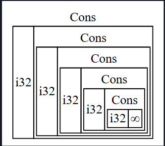
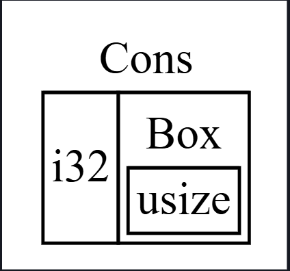

## 📦 Box<T> Kullanarak Veriyi Heap Üzerinde İşaretleme

En basit akıllı işaretçi `Box<T>` türüyle yazılan kutudur (box). Kutular, veriyi yığında (stack) değil heap üzerinde saklamanıza olanak tanır. Yığının üzerinde kalan şey ise heap’teki veriyi işaret eden işaretçidir. Yığın (stack) ile heap arasındaki farkı gözden geçirmek için 4. bölüme bakınız.

Kutuların (boxes) performans açısından ek bir maliyeti yoktur; yalnızca verilerini yığın yerine heap üzerinde saklarlar. Ancak çok fazla ek yetenekleri de yoktur. Onları genellikle şu durumlarda kullanırsınız:

* Türün boyutu derleme zamanında bilinemediğinde ve bu türün değerini tam boyut gerektiren bir bağlamda kullanmak istediğinizde
* Büyük miktarda veriniz olduğunda ve sahipliği devretmek istediğinizde, ancak bunu yaparken verinin kopyalanmadığından emin olmak istediğinizde
* Belirli bir türe ait olmasından ziyade yalnızca belirli bir trait’i uyguluyor olmasına önem verdiğiniz bir değere sahip olmak istediğinizde

İlk durumu “Kutularla Özyinelemeli Türleri (Recursive Types) Etkinleştirme” bölümünde göstereceğiz. İkinci durumda, büyük miktarda verinin sahipliğini devretmek uzun sürebilir çünkü veri yığın üzerinde kopyalanır. Bu durumda performansı artırmak için, büyük miktardaki veriyi bir kutunun içinde heap üzerinde saklayabiliriz. Böylece, yalnızca küçük boyutlu işaretçi verisi yığın üzerinde kopyalanır, işaret ettiği veri ise heap üzerinde tek bir yerde kalır. Üçüncü durum, bir trait nesnesi (trait object) olarak bilinir ve 18. bölümdeki “Farklı Türlerin Değerlerine İzin Veren Trait Nesnelerini Kullanma” konusu tamamen buna ayrılmıştır. Yani burada öğrendiklerinizi orada tekrar uygulayacaksınız!

## 📦 Box<T> Kullanarak Veriyi Heap Üzerinde Saklama

`Box<T>` için heap üzerinde veri saklama kullanım durumunu tartışmadan önce, sözdizimini (syntax) ve bir `Box<T>` içinde saklanan değerlere nasıl erişileceğini ele alacağız.

Aşağıdaki 15-1 numaralı liste, bir kutu (box) kullanarak bir `i32` değerini heap üzerinde nasıl saklayacağınızı göstermektedir.

**Dosya adı: src/main.rs**

```rust
fn main() {
    let b = Box::new(5);
    println!("b = {b}");
}
```

*Liste 15-1: Bir kutu kullanarak bir `i32` değerini heap üzerinde saklama*

Burada `b` değişkenini, heap üzerinde ayrılmış ve değeri `5` olan bir `Box` işaretçisi olarak tanımlıyoruz. Bu program `b = 5` çıktısını verecektir; bu durumda kutu içindeki veriye, sanki yığın (stack) üzerinde saklanıyormuş gibi erişebiliriz. Tıpkı herhangi bir sahipli (owned) değer gibi, bir kutu kapsam (scope) dışına çıktığında — burada `main` fonksiyonunun sonunda `b` değişkeni çıktığında olduğu gibi — bellekten temizlenecektir. Bu bellek temizleme işlemi hem yığın üzerinde saklanan kutu için hem de heap üzerinde saklanan kutunun işaret ettiği veri için gerçekleşir.

Tek bir değeri heap üzerinde saklamak çok faydalı değildir; bu yüzden kutuları tek başlarına bu şekilde kullanmanız pek olası değildir. Çoğu durumda, varsayılan olarak yığın üzerinde saklanan tek bir `i32` gibi değerleri doğrudan yığının üzerinde tutmak daha uygundur. Şimdi, kutuların olmadan tanımlayamayacağımız türleri tanımlamamıza nasıl izin verdiklerine dair bir duruma bakalım.


## 🔄 Kutularla (Box) Özyinelemeli Türleri (recursive types) Etkinleştirme

Bir özyinelemeli türün (recursive type) değeri, kendi türünden başka bir değeri de içinde barındırabilir. Ancak özyinelemeli türler bir sorun oluşturur çünkü Rust, derleme zamanında bir türün ne kadar alan kapladığını bilmek zorundadır. Oysa özyinelemeli türlerdeki değerlerin iç içe geçmesi teorik olarak sonsuza kadar sürebilir; bu nedenle Rust değerin ne kadar alana ihtiyaç duyduğunu bilemez. Kutuların (`Box`) boyutu bilindiğinden, özyinelemeli tür tanımına bir kutu ekleyerek bu türleri mümkün kılabiliriz.

Özyinelemeli bir tür örneği olarak, kons listesine (cons list) bakalım. Bu, fonksiyonel programlama dillerinde yaygın olarak bulunan bir veri türüdür. Tanımlayacağımız kons listesi türü, özyineleme dışında oldukça basittir; bu nedenle burada ele alacağımız kavramlar, özyinelemeli türlerle ilgili daha karmaşık durumlarda da faydalı olacaktır.

### ℹ️ Kons Listesi Hakkında Daha Fazla Bilgi

Kons listesi, Lisp programlama dili ve onun lehçelerinden gelen, iç içe geçmiş çiftlerden oluşan bir veri yapısıdır ve Lisp’in bağlı liste (linked list) karşılığıdır. Adını, iki argümandan yeni bir çift oluşturan `cons` fonksiyonundan (construct function’ın kısaltması) alır. Bir değer ve başka bir çift içeren bir çift üzerinde `cons` çağırarak, özyinelemeli çiftlerden oluşan kons listeleri oluşturabiliriz.

Örneğin, 1, 2, 3 listesini içeren bir kons listesi sözde kodla şu şekilde gösterilebilir:

```
(1, (2, (3, Nil)))
```

Bir kons listesindeki her öğe iki unsur içerir: mevcut öğenin değeri ve sonraki öğe. Listedeki son öğe ise yalnızca bir değer içerir: `Nil`; başka bir sonraki öğe yoktur. Kons listesi, `cons` fonksiyonunun özyinelemeli olarak çağrılmasıyla üretilir. Özyinelemenin temel durumunu (base case) göstermek için kullanılan kanonik ad `Nil`’dir. Bunun 6. bölümde tartışılan “null” ya da “nil” kavramıyla aynı olmadığını, yani geçersiz veya bulunmayan bir değer anlamına gelmediğini unutmayın.

Rust’ta kons listesi yaygın olarak kullanılan bir veri yapısı değildir. Rust’ta öğelerden oluşan bir listeye ihtiyacınız olduğunda çoğunlukla `Vec<T>` daha iyi bir seçimdir. Diğer, daha karmaşık özyinelemeli veri türleri çeşitli durumlarda faydalıdır, ancak bu bölümde kons listesiyle başlayarak kutuların özyinelemeli bir veri türünü tanımlamamıza nasıl izin verdiğini dikkat dağıtmadan keşfedebiliriz.

### ❌ Derlenmeyen İlk Enum Denemesi

15-2 numaralı listede bir kons listesi için `enum` tanımı yer almaktadır. Bu kod henüz derlenmeyecektir çünkü `List` türünün boyutu bilinememektedir; şimdi bunu göstereceğiz.

**Dosya adı: src/main.rs**
*Bu kod derlenmez!*

```rust
enum List {
    Cons(i32, List),
    Nil,
}
```

*Liste 15-2: `i32` değerlerinden oluşan bir kons listesi veri yapısını temsil eden bir `enum` tanımlamaya yönelik ilk deneme*

Not: Bu örnekte yalnızca `i32` değerlerini tutan bir kons listesi uyguluyoruz. 10. bölümde tartıştığımız gibi jenerikler (generics) kullanarak herhangi bir türde değer depolayabilen bir kons listesi türü tanımlayabilirdik.

### ❌ 1, 2, 3 Listesini Saklama Denemesi

`List` türünü kullanarak 1, 2, 3 listesini saklamak, 15-3 numaralı listedeki kod gibi görünecektir.

**Dosya adı: src/main.rs**
*Bu kod derlenmez!*

```rust
use crate::List::{Cons, Nil};

fn main() {
    let list = Cons(1, Cons(2, Cons(3, Nil)));
}
```

*Liste 15-3: `List` enum’unu kullanarak 1, 2, 3 listesini saklama*

İlk `Cons` değeri `1` ve başka bir `List` değeri tutar. Bu `List` değeri, `2` ve başka bir `List` değeri tutan başka bir `Cons` değeridir. Bu `List` değeri, `3` ve son olarak `Nil` (listenin bittiğini belirten özyinelemeli olmayan varyant) tutan başka bir `Cons` değeridir.

### 🚫 Derleme Hatası

Eğer 15-3 numaralı listedeki kodu derlemeyi denersek, 15-4 numaralı listedeki hatayı alırız.

**Dosya adı: output.txt**

```
$ cargo run
   Compiling cons-list v0.1.0 (file:///projects/cons-list)
error[E0072]: recursive type `List` has infinite size
 --> src/main.rs:1:1
  |
1 | enum List {
  | ^^^^^^^^^
2 |     Cons(i32, List),
  |               ---- recursive without indirection
  |
help: insert some indirection (e.g., a `Box`, `Rc`, or `&`) to break the cycle
  |
2 |     Cons(i32, Box<List>),
  |               ++++    +

error[E0391]: cycle detected when computing when `List` needs drop
 --> src/main.rs:1:1
  |
1 | enum List {
  | ^^^^^^^^^
  |
  = note: ...which immediately requires computing when `List` needs drop again
  = note: cycle used when computing whether `List` needs drop
  = note: see https://rustc-dev-guide.rust-lang.org/overview.html#queries and https://rustc-dev-guide.rust-lang.org/query.html for more information

Some errors have detailed explanations: E0072, E0391.
For more information about an error, try `rustc --explain E0072`.
error: could not compile `cons-list` (bin "cons-list") due to 2 previous errors
```

*Liste 15-4: Özyinelemeli bir `enum` tanımlamaya çalışırken alınan hata*

Hata, bu türün “sonsuz boyuta sahip” olduğunu göstermektedir. Bunun nedeni, `List`’i doğrudan kendi türünden başka bir değer içeren özyinelemeli bir varyantla tanımlamış olmamızdır. Bunun sonucunda Rust, bir `List` değerini saklamak için ne kadar alana ihtiyaç olduğunu hesaplayamaz. Şimdi bu hatayı neden aldığımızı adım adım inceleyelim. İlk olarak Rust’ın özyinelemeli olmayan bir türün değerini saklamak için ne kadar alana ihtiyaç duyduğunu nasıl belirlediğine bakalım.

## 📏 Özyinelemeli Olmayan Bir Türün Boyutunu Hesaplama

6. bölümde `enum` tanımlarını tartışırken 6-2 numaralı listede tanımladığımız `Message` enum’unu hatırlayın:

```rust
enum Message {
    Quit,
    Move { x: i32, y: i32 },
    Write(String),
    ChangeColor(i32, i32, i32),
}
```

Bir `Message` değeri için ne kadar alan ayıracağını belirlemek üzere Rust, varyantların her birine bakar ve en fazla alan gerektiren varyantı bulur. Örneğin `Message::Quit` hiçbir alana ihtiyaç duymaz, `Message::Move` iki `i32` değerini saklayacak kadar alana ihtiyaç duyar ve diğerleri de kendi içeriklerine göre alan gerektirir. Çünkü aynı anda yalnızca bir varyant kullanılabilir, bir `Message` değeri için ayrılması gereken en fazla alan, varyantlardan en büyüğünü saklamak için gereken alandır.

Bunu, Rust’ın 15-2 numaralı listede gördüğümüz `List` gibi özyinelemeli bir tür için ne kadar alan gerektiğini hesaplamaya çalışmasıyla karşılaştıralım. Derleyici önce `Cons` varyantına bakar; burada bir `i32` değeri ve bir `List` değeri tutulur. Bu nedenle `Cons`, bir `i32` boyutu + bir `List` boyutu kadar alana ihtiyaç duyar. `List` türünün ne kadar bellek gerektirdiğini bulmak için derleyici tekrar varyantlara bakar ve yine `Cons`’tan başlar. `Cons` ise yine bir `i32` ve bir `List` içerir. Bu süreç sonsuza kadar devam eder, 15-1 numaralı şekilde gösterildiği gibi.

📐 **Sonsuz bir Cons listesi**



*Şekil 15-1: Sonsuz sayıda `Cons` varyantından oluşan sonsuz bir `List`*

## 📦 Box<T> Kullanarak Boyutu Bilinen Özyinelemeli Tür Elde Etme

Rust, özyinelemeli tanımlanmış türler için ne kadar alan ayıracağını hesaplayamadığından, derleyici bize şu yararlı öneriyle birlikte bir hata verir:

```
help: insert some indirection (e.g., a `Box`, `Rc`, or `&`) to break the cycle
  |
2 |     Cons(i32, Box<List>),
  |               ++++    +
```

Buradaki **indirection (dolaylılık)**, değeri doğrudan saklamak yerine, veri yapısını değere işaretçi (pointer) saklayacak şekilde değiştirmemiz gerektiği anlamına gelir.

Bir `Box<T>` bir işaretçi olduğundan, Rust her zaman bir `Box<T>`’nin ne kadar alana ihtiyaç duyacağını bilir: işaretçinin boyutu, işaret ettiği verinin büyüklüğüne bağlı olarak değişmez. Bu da, `Cons` varyantı içine doğrudan başka bir `List` değeri koymak yerine, bir `Box<T>` koyabileceğimiz anlamına gelir. `Box<T>`, heap üzerinde saklanan sonraki `List` değerine işaret eder, `Cons` varyantının içinde doğrudan bulunmaz. Kavramsal olarak hâlâ listeden oluşan bir listeye sahibiz, ancak bu uygulama artık öğelerin birbirinin içine yerleştirilmesi yerine yan yana konulması gibidir.

15-2 numaralı listedeki `List` enum tanımını ve 15-3 numaralı listedeki kullanımını, 15-5 numaralı listedeki koda dönüştürerek derlenebilir hale getirebiliriz.

**Dosya adı: src/main.rs**

```rust
enum List {
    Cons(i32, Box<List>),
    Nil,
}

use crate::List::{Cons, Nil};

fn main() {
    let list = Cons(1, Box::new(Cons(2, Box::new(Cons(3, Box::new(Nil))))));
}
```

*Liste 15-5: Boyutu bilinen bir tür elde etmek için `Box<T>` kullanan `List` tanımı*

Artık `Cons` varyantı, bir `i32` boyutu + kutunun (box) işaretçi verisini saklayacak alan kadar boyuta ihtiyaç duyar. `Nil` varyantı hiçbir değer saklamadığından, `Cons`’tan daha az alana ihtiyaç duyar. Böylece herhangi bir `List` değerinin bir `i32` boyutu + bir kutunun işaretçi boyutu kadar yer kaplayacağını biliyoruz. Kutuyu kullanarak sonsuz özyinelemeli zinciri kırmış olduk, böylece derleyici bir `List` değerini saklamak için ne kadar alana ihtiyaç olduğunu hesaplayabiliyor.



📐 **Şekil 15-2**, `Cons` varyantının artık nasıl göründüğünü göstermektedir.

## 📐 Şekil 15-2: `Cons` İçinde `Box` Bulunduğu İçin Sonsuz Boyutta Olmayan Bir Liste

Kutular (boxes), yalnızca dolaylılık (indirection) ve heap üzerinde bellek ayırma sağlar; diğer akıllı işaretçi türlerinde göreceğimiz özel yeteneklere sahip değildirler. Aynı zamanda bu özel yeteneklerin getirdiği performans maliyetini de taşımazlar. Bu nedenle, yalnızca dolaylılığın gerekli olduğu kons listesi gibi durumlarda oldukça faydalıdırlar. Kutuların daha fazla kullanım durumuna 18. bölümde bakacağız.

`Box<T>` türü bir akıllı işaretçidir çünkü `Deref` trait’ini uygular; bu sayede `Box<T>` değerleri bir başvuru (reference) gibi kullanılabilir. Bir `Box<T>` değeri kapsamdan çıktığında, `Drop` trait’inin uygulanması sayesinde kutunun işaret ettiği heap verisi de temizlenir. Bu iki trait, bu bölümün geri kalanında ele alacağımız diğer akıllı işaretçi türlerinin sunduğu işlevsellik açısından çok daha önemli olacaktır. Şimdi bu iki trait’i daha ayrıntılı olarak inceleyelim.
