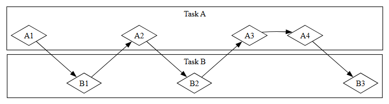
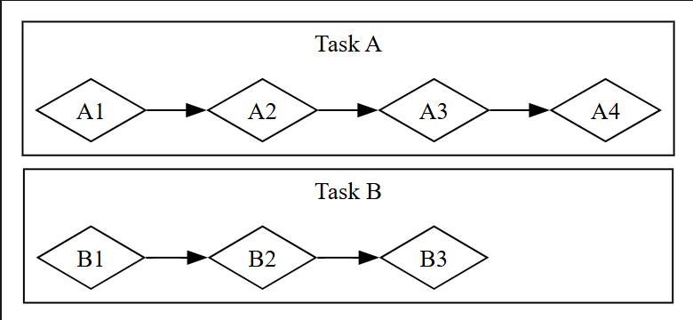
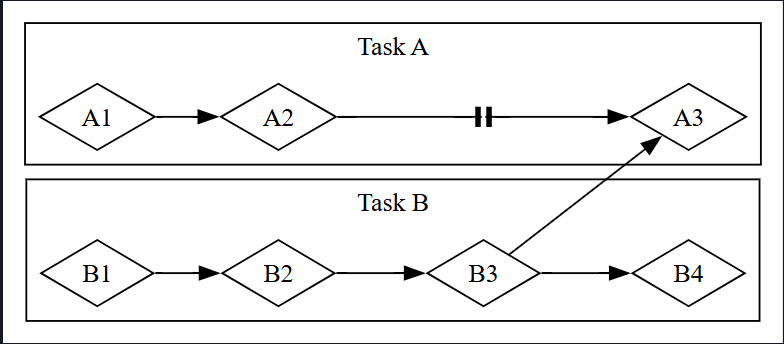

## ⚡ Asenkron Programlamanın Temelleri: Async, Await, Futures ve Streams

Bilgisayardan yapmasını istediğimiz birçok işlem tamamlanması uzun sürebilecek türdendir. Bu uzun süren işlemler tamamlanana kadar başka şeyler yapabilmek hoş olurdu. Modern bilgisayarlar aynı anda birden fazla işlem üzerinde çalışmak için iki teknik sunar: paralellik (parallelism) ve eşzamanlılık (concurrency). Ancak paralel veya eşzamanlı işlemler içeren programlar yazmaya başladığımızda, asenkron (asynchronous) programlamaya özgü yeni zorluklarla karşılaşırız. Burada işlemler başlatıldıkları sırayla bitmeyebilir. Bu bölüm, Bölüm 16’da gördüğümüz paralellik ve eşzamanlılık için iş parçacıklarının (threads) kullanımının üzerine, alternatif bir yaklaşımı tanıtır: Rust’ın Futures (gelecek değerler), Streams (akışlar), bunları destekleyen `async` ve `await` sözdizimi ve asenkron işlemler arasında yönetim ve koordinasyon için kullanılan araçlar.

Bir örnek düşünelim. Diyelim ki bir aile kutlamasına ait hazırladığınız videoyu dışa aktarıyorsunuz; bu işlem dakikalar hatta saatler sürebilir. Video dışa aktarma, olabildiğince fazla CPU ve GPU gücü kullanır. Eğer yalnızca bir CPU çekirdeğiniz olsaydı ve işletim sisteminiz bu dışa aktarma bitene kadar başka hiçbir işleme izin vermeseydi—yani işlemi senkron (synchronous) şekilde çalıştırsaydı—bu süreç boyunca bilgisayarınızda başka hiçbir şey yapamazdınız. Bu oldukça can sıkıcı olurdu. Neyse ki, işletim sisteminiz dışa aktarmayı görünmez bir şekilde yeterince sık keserek aynı anda başka işler yapabilmenize izin verir.

Şimdi başka birinin paylaştığı bir videoyu indirdiğinizi düşünelim. Bu işlem de zaman alabilir, fakat CPU’yu o kadar yormaz. Burada CPU’nun ağdan veri gelmesini beklemesi gerekir. Veri gelmeye başladığında onu okumaya başlayabilirsiniz, ancak tamamının gelmesi zaman alabilir. Tüm veri geldiğinde bile, video oldukça büyükse yüklenmesi birkaç saniye sürebilir. Bu kulağa çok uzun gelmese de, saniyede milyarlarca işlem yapabilen modern bir işlemci için oldukça uzundur. Yine işletim sisteminiz, bu bekleme sırasında CPU’nun başka işler yapabilmesi için programınızı görünmez bir şekilde kesintiye uğratır.

Video dışa aktarma, CPU-sınırlı (CPU-bound ya da compute-bound) bir işleme örnektir. Burada işlem, CPU veya GPU’nun veri işleme kapasitesiyle sınırlıdır. Video indirme ise IO-sınırlı (IO-bound) bir işleme örnektir, çünkü bilgisayarın giriş-çıkış hızına bağlıdır; ağ üzerinden verinin aktarılabildiği hızdan daha hızlı olamaz.

Her iki örnekte de işletim sisteminin görünmez kesintileri bir tür eşzamanlılık sağlar. Ancak bu eşzamanlılık yalnızca tüm program düzeyinde gerçekleşir: işletim sistemi bir programı keserek diğerinin çalışmasına izin verir. Çoğu durumda ise, biz programlarımızı işletim sisteminden daha ince ayrıntılarla bildiğimiz için, işletim sisteminin göremediği eşzamanlılık fırsatlarını fark edebiliriz.

Örneğin, dosya indirmelerini yöneten bir araç geliştiriyorsak, bir indirme başlatıldığında kullanıcı arayüzünün (UI) donmamasını sağlamalıyız ve kullanıcıların aynı anda birden fazla indirme başlatabilmesi mümkün olmalıdır. Ancak birçok işletim sistemi API’si ağ ile etkileşim için engelleyici (blocking) çalışır; yani işlediği veri tamamen hazır olana kadar programın ilerlemesini durdurur.

Not: Çoğu fonksiyon çağrısı aslında bu şekilde çalışır. Ancak `blocking` terimi genellikle dosyalar, ağ veya bilgisayarın diğer kaynakları ile etkileşime giren fonksiyon çağrıları için kullanılır, çünkü bu durumlarda işlemin engelleyici olmaması programın performansı açısından büyük fayda sağlar.

Ana iş parçacığımızı (main thread) engellemekten kaçınmak için her dosya indirmesi için özel bir iş parçacığı (thread) oluşturabiliriz. Ancak iş parçacıkları sayısı arttıkça bu yöntemin yükü sorun haline gelir. Çağrının en baştan engelleyici olmaması daha uygun olurdu. Ayrıca, engelleyici kodda olduğu gibi doğrudan ve okunabilir bir biçimde yazabilmek de iyi olurdu. Örneğin:

Bu kod derlenmez!

```rust
let data = fetch_data_from(url).await;
println!("{data}");
```

👉 Bu örnek, `await` ile beklenen bir fonksiyon çağrısının nasıl görüneceğini gösteriyor. Ancak henüz derlenmez, çünkü `async` yapılandırması eksiktir.

İşte Rust’ın `async` (asynchronous) soyutlaması tam olarak bunu sağlar. Bu bölümde `async` hakkında şunları öğreneceksiniz:

* Rust’ın `async` ve `await` sözdiziminin nasıl kullanılacağı
* `async` modelinin, Bölüm 16’da gördüğümüz zorlukların bazılarını çözmek için nasıl kullanılabileceği
* Çoklu iş parçacığı (multithreading) ile `async` yapısının birbirini tamamlayan çözümler sunması ve birçok durumda birlikte kullanılabilmesi

Ancak `async`’in pratikte nasıl çalıştığını görmeden önce, paralellik (parallelism) ve eşzamanlılık (concurrency) arasındaki farkları tartışmak için kısa bir duraklama yapmamız gerekiyor.


## 🔀 Paralellik ve Eşzamanlılık (Parallelism and Concurrency)

Şimdiye kadar paralellik (parallelism) ve eşzamanlılığı (concurrency) çoğunlukla birbirinin yerine kullanılabilir şekilde ele aldık. Ancak artık onları daha net bir şekilde ayırmamız gerekiyor, çünkü çalışmaya başladıkça aralarındaki farklar ortaya çıkacaktır.

Bir yazılım projesinde ekibin işleri farklı şekillerde bölüştürebileceğini düşünün. Bir üyeye birden fazla görev atayabilir, her üyeye bir görev verebilir ya da bu iki yaklaşımı karıştırabilirsiniz.

Bir kişi, hiçbirini tamamlamadan birden fazla görev üzerinde çalışıyorsa bu eşzamanlılıktır (concurrency). Örneğin, bilgisayarınızda iki farklı projeyi açtığınızı varsayalım; birinde sıkıldığınızda veya takıldığınızda diğerine geçiyorsunuz. Tek kişisiniz, bu yüzden her iki işte aynı anda ilerleme kaydedemezsiniz. Ancak görevler arasında geçiş yaparak çoklu görev (multi-tasking) yapabilirsiniz; yani her seferinde birinde ilerlersiniz (Bkz. Şekil 17-1).



## 📊 Şekil 17-1: Eşzamanlı bir iş akışı (concurrent workflow), Görev A ve Görev B arasında geçiş yapma

Ekip, görev grubunu her üyenin bir görev alıp üzerinde tek başına çalışacağı şekilde böldüğünde bu paralelliktir (parallelism). Ekibin her üyesi aynı anda ilerleme kaydedebilir (Bkz. Şekil 17-2).



## 📊 Şekil 17-2: Paralel bir iş akışı (parallel workflow), Görev A ve Görev B’nin birbirinden bağımsız yürütüldüğü durum

Her iki iş akışında da farklı görevler arasında koordinasyon gerekebilir. Belki bir kişiye verilen görevin tamamen bağımsız olduğunu düşündünüz, fakat aslında önce başka bir ekip üyesinin kendi görevini tamamlaması gerekiyor. İşin bir kısmı paralel yapılabilir, ancak bir kısmı aslında seri (serial) idi: yalnızca bir dizi halinde, yani bir görev bittikten sonra diğerinin başlamasıyla gerçekleşebilirdi (Bkz. Şekil 17-3).




## 📊 Şekil 17-3: Kısmen paralel bir iş akışı (partially parallel workflow), Görev A ve Görev B bağımsız yürütülür, ta ki Görev A3, Görev B3’ün sonuçlarına bağlı kalıp engellenene kadar.

Benzer şekilde, kendi görevlerinizden birinin başka bir görevinize bağlı olduğunu fark edebilirsiniz. Böylece eşzamanlı (concurrency) çalışmanız da seri (serial) hale gelir.

Paralellik (parallelism) ve eşzamanlılık (concurrency) birbirleriyle de kesişebilir. Bir iş arkadaşınızın, sizin bir görevinizi bitirmenize kadar ilerleyemediğini (tıkanmış olduğunu) öğrendiğinizde, muhtemelen tüm dikkatinizi o göreve vererek iş arkadaşınızın “önünü açmaya” (unblock) çalışırsınız. Bu durumda artık iş arkadaşınızla paralel (parallel) çalışamazsınız ve kendi görevleriniz üzerinde de eşzamanlı (concurrent) çalışamaz hale gelirsiniz.

Aynı temel dinamikler yazılım ve donanım için de geçerlidir. Tek bir CPU çekirdeğine (CPU core) sahip bir makinede CPU aynı anda yalnızca bir işlem gerçekleştirebilir, ancak yine de eşzamanlı (concurrent) çalışabilir. İş parçacıkları (threads), süreçler (processes) ve async (async) gibi araçları kullanarak, bilgisayar bir etkinliği duraklatıp diğerlerine geçebilir ve sonunda ilk etkinliğe geri dönebilir. Birden çok CPU çekirdeğine sahip bir makinede ise paralel (parallel) çalışma da mümkündür. Bir çekirdek bir görevi yürütürken diğer bir çekirdek tamamen ilgisiz başka bir görevi yürütebilir ve bu işlemler gerçekten aynı anda gerçekleşir.

Rust’ta async (asynchronous) ile çalışırken her zaman eşzamanlılık (concurrency) ile uğraşırız. Kullandığımız donanıma, işletim sistemine ve async çalışma zamanına (async runtime) bağlı olarak (async çalışma zamanları hakkında az sonra daha fazla bilgi vereceğiz), bu eşzamanlılık perde arkasında paralellikten (parallelism) de yararlanabilir.

Şimdi, Rust’ta asenkron programlamanın gerçekte nasıl çalıştığına dalalım.
