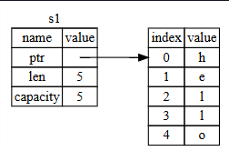
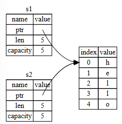
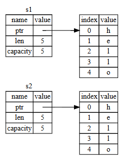
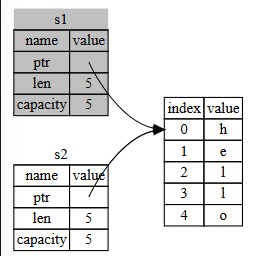
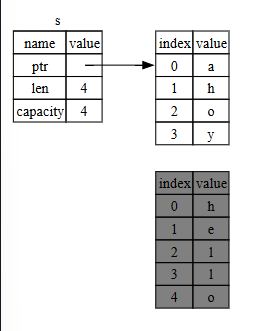

## ❓ Sahiplik Nedir? (What Is Ownership?)

Sahiplik (ownership), bir Rust programının belleği nasıl yönettiğini belirleyen bir dizi kuraldır. Tüm programlar, çalışırken bilgisayarın belleğini nasıl kullandığını yönetmek zorundadır. Bazı dillerde, program çalışırken artık kullanılmayan belleği düzenli olarak arayan bir çöp toplayıcı (garbage collection) vardır; diğer dillerde ise programcının belleği açıkça ayırması ve serbest bırakması gerekir. Rust üçüncü bir yaklaşım kullanır: Bellek, derleyicinin (compiler) kontrol ettiği bir kurallar dizisiyle sahiplik sistemi (ownership system) üzerinden yönetilir. Bu kurallardan herhangi biri ihlal edilirse program derlenmez. Sahiplik özelliklerinin hiçbiri, programınız çalışırken onu yavaşlatmaz.

Sahiplik birçok programcı için yeni bir kavram olduğundan, alışmak biraz zaman alabilir. İyi haber şu ki, Rust ve sahiplik sisteminin kuralları konusunda daha deneyimli hale geldikçe, güvenli ve verimli kod geliştirmeyi doğal bir şekilde daha kolay bulacaksınız. Devam edin!

Sahipliği anladığınızda, Rust’ı benzersiz kılan özellikleri anlamak için sağlam bir temele sahip olacaksınız. Bu bölümde, sahipliği öğrenmek için yaygın bir veri yapısı olan dizeler (strings) üzerinde yoğunlaşan bazı örnekler üzerinde çalışacaksınız.

## 🗂️ Yığın ve Yığın Belleği (The Stack and the Heap)

Birçok programlama dili, yığın (stack) ve yığın belleği (heap) hakkında çok fazla düşünmenizi gerektirmez. Ancak Rust gibi bir sistem programlama dilinde, bir değerin yığında mı yoksa yığın belleğinde mi bulunduğu, dilin nasıl davrandığını ve neden belirli kararlar vermek zorunda olduğunuzu etkiler. Bu bölümün ilerleyen kısımlarında sahipliğin (ownership) bazı bölümleri yığın ve yığın belleği ile ilişkilendirilerek açıklanacaktır, bu yüzden hazırlık olarak burada kısa bir açıklama yer almaktadır.

Hem yığın hem de yığın belleği, çalışma zamanında kodunuzun kullanabileceği bellek bölümleridir, ancak farklı şekillerde yapılandırılmışlardır. Yığın, değerleri aldığı sırayla saklar ve tam tersi sırayla kaldırır. Buna son giren, ilk çıkar (last in, first out) denir. Bir tabak yığını düşünün: daha fazla tabak eklediğinizde bunları üst üste koyarsınız, bir tabağa ihtiyacınız olduğunda ise en üsttekini alırsınız. Ortadan veya alttan tabak almak pek işe yaramaz! Verilerin eklenmesine `push` (yığına itme), çıkarılmasına ise `pop` (yığından çıkarma) denir. Yığında saklanan tüm verilerin bilinen, sabit bir boyutu olmalıdır. Derleme (compile) zamanında boyutu bilinmeyen veya değişebilecek veriler bunun yerine yığın belleğinde saklanmalıdır.

Yığın belleği (heap) daha az organize edilmiştir: Veriyi yığın belleğine koyduğunuzda belirli miktarda alan talep edersiniz. Bellek ayırıcı (allocator), yığın belleğinde yeterince büyük boş bir alan bulur, onu kullanımda olarak işaretler ve size o konumun adresi olan bir işaretçi (pointer) döndürür. Bu işleme `heap allocation` (yığın belleğinde ayırma) denir ve bazen yalnızca `allocation` (ayırma) olarak kısaltılır (yığına veri eklemek ayırma olarak sayılmaz). Yığın belleğine olan işaretçi sabit boyutlu olduğundan, işaretçiyi yığında saklayabilirsiniz; ancak gerçek verilere ulaşmak istediğinizde işaretçiyi takip etmeniz gerekir. Bir restoranda oturtulmayı düşünün: içeri girdiğinizde grubunuzdaki kişi sayısını söylersiniz, görevli herkese yetecek boş bir masa bulur ve sizi oraya götürür. Grubunuzdan biri geç gelirse, sizin hangi masada oturduğunuzu sorarak size ulaşabilir.

Yığına veri eklemek (pushing), yığın belleğinde yer ayırmaktan (allocating) daha hızlıdır çünkü ayırıcı, yeni verileri nereye koyacağını aramak zorunda değildir; konum her zaman yığının en üstündedir. Karşılaştırıldığında, yığın belleğinde alan ayırmak daha fazla iş gerektirir çünkü ayırıcı önce veriyi barındırabilecek kadar büyük bir alan bulmalı ve ardından bir sonraki ayırma için gerekli düzenlemeleri yapmalıdır.

Yığın belleğindeki verilere erişmek, genellikle yığındaki verilere erişmekten daha yavaştır çünkü oraya ulaşmak için bir işaretçiyi takip etmeniz gerekir. Modern işlemciler, bellek içinde daha az sıçrama yaptıklarında daha hızlıdır. Benzetmeye devam edersek, birçok masadan sipariş alan bir garsonu düşünün. En verimlisi, bir masadaki tüm siparişleri aldıktan sonra diğerine geçmesidir. Önce A masası, sonra B masası, tekrar A, sonra tekrar B şeklinde sipariş almak çok daha yavaş olurdu. Aynı şekilde, bir işlemci genellikle, birbirine yakın olan verilerle (yığındaki gibi) çalıştığında işini daha iyi yapar, uzak olanlarla (yığın belleğindeki gibi) çalıştığında ise daha yavaş olur.

Kodunuz bir fonksiyon (function) çağırdığında, fonksiyona geçirilen değerler (yığın belleğindeki verilere işaretçiler dahil) ve fonksiyonun yerel değişkenleri yığına eklenir (push). Fonksiyon sona erdiğinde bu değerler yığından çıkarılır (pop).

Kodunuzun hangi kısımlarının yığın belleğindeki hangi verileri kullandığını takip etmek, yığın belleğinde yinelenen verilerin miktarını en aza indirmek ve kullanılmayan verileri temizleyerek alanın tükenmesini önlemek, sahipliğin (ownership) ele aldığı sorunlardır. Sahipliği anladığınızda, yığın ve yığın belleği hakkında çok sık düşünmeniz gerekmez, ancak sahipliğin temel amacının yığın belleğini yönetmek olduğunu bilmek, neden bu şekilde çalıştığını açıklamaya yardımcı olabilir.

## 📜 Sahiplik Kuralları (Ownership Rules)

Öncelikle sahiplik kurallarına bakalım. Bu kuralları açıklayan örnekler üzerinde çalışırken aklınızda bulundurun:

* Rust’taki her değerin bir sahibi vardır.
* Aynı anda yalnızca bir sahip olabilir.
* Sahip kapsam (scope) dışına çıktığında, değer düşürülür (drop edilir).

## 🗂️ Değişken Kapsamı (Variable Scope)

Artık temel Rust sözdizimini geçtiğimiz için, örneklerde `fn main() {` kodunu tamamen yazmayacağız. Eğer siz de takip ediyorsanız, aşağıdaki örnekleri manuel olarak bir `main` fonksiyonunun içine koyduğunuzdan emin olun. Bu sayede örneklerimiz biraz daha kısa olacak ve ayrıntılara odaklanabileceğiz.

Sahipliğin ilk örneği olarak bazı değişkenlerin kapsamına (scope) bakalım. Kapsam, bir program içinde bir öğenin geçerli olduğu aralığı ifade eder. Aşağıdaki değişkene göz atın:

```rust
let s = "hello";
```

Değişken `s`, dize literaline (string literal) karşılık gelir; dize değeri program metninin içine sabitlenmiştir. Bu değişken, tanımlandığı noktadan itibaren geçerli olur ve mevcut kapsamın sonuna kadar geçerliliğini sürdürür. Listeleme 4-1’de, değişken `s`’nin geçerli olduğu noktaları açıklayan yorumlarla birlikte bir program gösterilmektedir.

```rust
{                      // s burada geçerli değildir, çünkü henüz tanımlanmadı
    let s = "hello";   // s bu noktadan itibaren geçerlidir

    // s ile işlemler yapılabilir
}                      // bu kapsam sona erdi ve s artık geçerli değil
```

*Listeleme 4-1: Bir değişken ve geçerli olduğu kapsam*

Başka bir deyişle, burada iki önemli zaman noktası vardır:

* `s` kapsam içine girdiğinde geçerlidir.
* Kapsamdan çıktığında geçerliliğini yitirir.

Bu noktada kapsamlar ve değişkenlerin ne zaman geçerli olduğu arasındaki ilişki, diğer programlama dillerindekine benzemektedir. Şimdi bu anlayışın üzerine `String` türünü (type) tanıtarak devam edeceğiz.

## 🧵 String Türü (The String Type)

Sahiplik kurallarını (ownership rules) gösterebilmek için, Bölüm 3’teki “Veri Türleri” (Data Types) kısmında ele aldığımızdan daha karmaşık bir veri türüne ihtiyacımız var. Daha önce ele alınan türlerin boyutu bilinir, yığında (stack) saklanabilir, kapsamları (scope) bittiğinde yığından çıkarılabilir ve başka bir kod parçası aynı değeri farklı bir kapsamda kullanmak isterse hızlı ve basit bir şekilde kopyalanarak bağımsız bir örneği oluşturulabilir. Ancak biz yığın belleğinde (heap) saklanan verilere bakmak ve Rust’ın bu verileri ne zaman temizlemesi gerektiğini nasıl bildiğini incelemek istiyoruz; `String` türü bu konuda harika bir örnektir.

Burada `String` türünün sahiplikle (ownership) ilgili kısımlarına odaklanacağız. Bu özellikler, standart kütüphane (standard library) tarafından sağlanan veya sizin oluşturduğunuz diğer karmaşık veri türleri için de geçerlidir. `String` türünü daha ayrıntılı olarak Bölüm 8’de ele alacağız.

Daha önce, dize literalini (string literal) gördük; burada dize değeri programımıza sabitlenmiştir. Dize literalleri kullanışlıdır, ancak metni kullanmak isteyebileceğimiz her durumda uygun değildir. Bunun bir nedeni değiştirilemez (immutable) olmalarıdır. Bir diğer neden ise, yazdığımız sırada her dize değerinin bilinmesinin mümkün olmamasıdır: örneğin, kullanıcı girdisini almak ve saklamak istersek ne olur? Bu tür durumlar için Rust, ikinci bir dize türü olan `String`’i sağlar. Bu tür, yığın belleğinde (heap) ayrılmış verileri yönetir ve bu nedenle derleme zamanında bilinmeyen bir miktarda metni saklayabilir. Bir dize literalinden `from` fonksiyonunu kullanarak bir `String` oluşturabilirsiniz:

```rust
let s = String::from("hello");
```

Çift iki nokta `::` operatörü, bu özel `from` fonksiyonunu `String` türü altında ad alanına (namespace) koymamızı sağlar; `string_from` gibi bir ad kullanmak yerine bu yöntem tercih edilir. Bu sözdizimini (syntax) Bölüm 5’teki “Metot Sözdizimi” (Method Syntax) kısmında ve Bölüm 7’deki “Modül Ağacında Bir Öğeye Başvurma Yolları” (Paths for Referring to an Item in the Module Tree) bölümünde modüllerle ad alanı oluşturmayı tartışırken daha ayrıntılı olarak ele alacağız.

Bu tür bir dize değiştirilebilir (mutable):

```rust
let mut s = String::from("hello");

s.push_str(", world!"); // push_str() bir literal'i String'e ekler

println!("{s}"); // bu `hello, world!` yazdırır
```

Peki, buradaki fark nedir? Neden `String` değiştirilebilirken, literal’ler değiştirilemez? Fark, bu iki türün belleği nasıl yönetmesinde yatmaktadır.

## 🧮 Bellek ve Ayırma (Memory and Allocation)

Bir dize literalinde (string literal), içeriği derleme zamanında biliriz, bu yüzden metin doğrudan son yürütülebilir dosyaya sabitlenir. Bu nedenle dize literalleri hızlı ve verimlidir. Ancak bu özellikler yalnızca dize literalinin değiştirilemezliğinden (immutability) kaynaklanır. Ne yazık ki, derleme zamanında boyutu bilinmeyen ve program çalışırken boyutu değişebilecek her metin parçası için ikili dosyaya sabitlenmiş bir bellek bloğu koyamayız.

`String` türünde, değiştirilebilir (mutable) ve büyüyebilir bir metni desteklemek için, derleme zamanında bilinmeyen bir miktarda belleği yığın belleğinde (heap) ayırmamız gerekir. Bu şu anlama gelir:

* Bellek, çalışma zamanında bellek ayırıcısından (allocator) talep edilmelidir.
* `String` işimiz bittiğinde bu belleği ayırıcıya geri vermenin bir yoluna ihtiyaç vardır.

İlk kısım bize aittir: `String::from` fonksiyonunu çağırdığımızda, onun uygulaması ihtiyaç duyduğu belleği talep eder. Bu, programlama dillerinde oldukça evrensel bir işlemdir.

Ancak ikinci kısım farklıdır. Çöp toplayıcıya (garbage collector - GC) sahip dillerde, GC kullanılmayan belleği takip eder ve temizler, bizim bunu düşünmemize gerek yoktur. GC’ye sahip olmayan çoğu dilde ise, belleğin artık kullanılmadığı zamanı bizim belirlememiz ve tıpkı talep ettiğimiz gibi açıkça serbest bırakmak için kod çağırmamız gerekir. Bunu doğru yapmak, tarihsel olarak zor bir programlama problemidir. Eğer unutursak, bellek boşa harcanır. Çok erken yaparsak, geçersiz bir değişkene sahip oluruz. İki kez yaparsak, bu da bir hatadır. Tam olarak bir `allocate` ile bir `free` eşleştirmemiz gerekir.

Rust farklı bir yol izler: Sahip olan değişken kapsam (scope) dışına çıktığında bellek otomatik olarak geri verilir. İşte Listeleme 4-1’deki kapsam örneğinin, dize literal yerine bir `String` kullanılarak yazılmış hali:

```rust
{
    let s = String::from("hello"); // s bu noktadan itibaren geçerlidir

    // s ile işlemler yapılabilir
}                                  // bu kapsam artık sona erdi ve s artık 
                                   // geçerli değil
```

`String`’in ihtiyaç duyduğu belleği ayırıcıya geri verebileceğimiz doğal bir nokta vardır: `s` kapsam dışına çıktığında. Bir değişken kapsam dışına çıktığında, Rust bizim için özel bir fonksiyon çağırır. Bu fonksiyon `drop` olarak adlandırılır ve burada `String`’in yazarı belleği geri vermek için gerekli kodu koyabilir. Rust, kapanan süslü parantezde `drop` fonksiyonunu otomatik olarak çağırır.

Not: C++’ta, bir öğenin yaşam süresinin sonunda kaynakların serbest bırakılması kalıbına bazen RAII (Resource Acquisition Is Initialization) adı verilir. Rust’taki `drop` fonksiyonu, eğer RAII kalıplarını kullandıysanız size tanıdık gelecektir.

Bu kalıp, Rust kodunun yazılış biçimi üzerinde derin bir etkiye sahiptir. Şu anda basit görünebilir, ancak yığın belleğinde ayırdığımız verileri birden fazla değişkenin kullanmasını istediğimizde, kodun davranışı daha karmaşık durumlarda beklenmedik olabilir. Şimdi bu durumların bazılarını inceleyelim.

## 🔄 Değişkenler ve Verilerin Taşınma ile Etkileşimi (Variables and Data Interacting with Move)

Rust’ta birden fazla değişken, aynı veri ile farklı şekillerde etkileşime girebilir. Listeleme 4-2’deki bir tamsayı örneğine bakalım:

```rust
let x = 5;
let y = x;
```

*Listeleme 4-2: x değişkeninin tamsayı değerini y’ye atama*

Bunun ne yaptığını tahmin edebiliriz: “5 değerini `x`’e bağla; ardından `x`’in değerinin bir kopyasını al ve `y`’ye bağla.” Artık elimizde iki değişken (`x` ve `y`) vardır ve her ikisi de 5’e eşittir. Bu gerçekten de böyle olur, çünkü tamsayılar (integers) boyutu bilinen, sabit değerlerdir ve bu iki `5` değeri yığına (stack) eklenir.

Şimdi `String` sürümüne bakalım:

```rust
let s1 = String::from("hello");
let s2 = s1;
```

Bu oldukça benzer görünüyor, bu yüzden çalışma şeklinin aynı olduğunu varsayabiliriz: yani ikinci satırın `s1` içindeki değerin bir kopyasını oluşturup `s2`’ye bağladığını. Ancak gerçekte olan tam olarak bu değildir.

`String` türünde perde arkasında ne olduğunu görmek için Şekil 4-1’e göz atalım. Bir `String`, solda gösterildiği gibi üç bölümden oluşur: dize içeriğini tutan belleğe bir işaretçi (pointer), uzunluk (length) ve kapasite (capacity). Bu veri grubu yığında (stack) saklanır. Sağ tarafta ise, içeriği tutan yığın belleği (heap) bulunur.


Şekil 4-1: Bellekte, "hello" değerini tutan ve s1’e bağlı olan bir String’in temsili (Representation in memory of a String holding the value "hello" bound to s1)

Şekil 4-1’de, String::from("hello") ile oluşturulan ve s1 değişkenine bağlı olan bir String’in bellek içindeki görünümü gösterilmektedir.

Yığın (stack) tarafında üç bileşen saklanır:

Dize verisini işaret eden bir işaretçi (pointer)

Dizenin uzunluğu (length)

Ayrılmış kapasite (capacity)

Yığın belleği (heap) tarafında ise "hello" içeriği bulunur.

Bu yapı sayesinde, String türü verileri yönetirken yalnızca küçük ve sabit boyutlu metadata bilgisi yığında tutulur; asıl dize verisi yığın belleğinde depolanır.

## 📏 Uzunluk ve Kapasite (Length and Capacity)

`Length` (uzunluk), `String` içeriğinin şu anda kaç bayt bellek kullandığını gösterir. `Capacity` (kapasite) ise `String`’in bellek ayırıcısından (allocator) aldığı toplam bellek miktarını, bayt cinsinden ifade eder. Uzunluk ile kapasite arasındaki fark önemlidir, ancak bu bağlamda gerekli değildir, bu yüzden şimdilik kapasiteyi görmezden gelebiliriz.

`s1`’i `s2`’ye atadığımızda, `String` verisi kopyalanır; yani yığında (stack) bulunan işaretçi (pointer), uzunluk ve kapasite kopyalanır. Ancak işaretçinin gösterdiği yığın belleğindeki veri kopyalanmaz. Başka bir deyişle, bellekteki veri temsili Şekil 4-2’deki gibi görünür.




## 🖼️ Şekil 4-2: `s1`’in işaretçi, uzunluk ve kapasitesinin kopyasını içeren `s2` değişkeninin bellekteki temsili (Representation in memory of the variable `s2` that has a copy of the pointer, length, and capacity of `s1`)

Şekil 4-2’de görüldüğü gibi, `s2`, `s1`’in yığında (stack) tuttuğu işaretçi (pointer), uzunluk (length) ve kapasitenin (capacity) bir kopyasını içerir. Ancak yığın belleğindeki (heap) gerçek veri kopyalanmaz; her iki değişken de aynı veri konumuna işaret eder.

Bellek temsili, Şekil 4-3’teki gibi değildir. Şekil 4-3, Rust’ın yığın belleğindeki veriyi de kopyalaması durumunda belleğin nasıl görüneceğini gösterir. Eğer Rust bunu yapsaydı, `s2 = s1` işlemi, özellikle yığın belleğindeki veri büyükse, çalışma zamanı performansı açısından oldukça maliyetli olurdu.



## 🖼️ Şekil 4-3: Rust, yığın belleğindeki veriyi de kopyalasaydı `s2 = s1` işleminin yapabileceği başka bir olasılık (Another possibility for what `s2 = s1` might do if Rust copied the heap data as well)

Daha önce, bir değişken kapsam (scope) dışına çıktığında Rust’ın otomatik olarak `drop` fonksiyonunu çağırarak o değişkenin yığın belleğini (heap memory) temizlediğini söylemiştik. Ancak Şekil 4-2’de hem `s1` hem `s2`’nin aynı bellek konumunu işaret ettiği görülüyor. Bu bir problemdir: `s1` ve `s2` kapsam dışına çıktığında ikisi de aynı belleği serbest bırakmaya çalışacaktır. Bu duruma **double free error** (çift serbest bırakma hatası) denir ve daha önce bahsettiğimiz bellek güvenliği (memory safety) hatalarından biridir. Belleği iki kez serbest bırakmak bellek bozulmasına (memory corruption) yol açabilir, bu da potansiyel olarak güvenlik açıklarına neden olabilir.

Bellek güvenliğini sağlamak için, `let s2 = s1;` satırından sonra Rust, `s1`’i artık geçerli kabul etmez. Bu nedenle, `s1` kapsam dışına çıktığında Rust’ın serbest bırakması gereken bir şey yoktur. `s2` oluşturulduktan sonra `s1`’i kullanmaya çalışırsanız, bu çalışmaz:

```rust
// Bu kod derlenmez!
let s1 = String::from("hello");
let s2 = s1;

println!("{s1}, world!");
```

Böyle bir hata alırsınız çünkü Rust, geçersiz referansı kullanmanızı engeller:

```
$ cargo run
   Compiling ownership v0.1.0 (file:///projects/ownership)
error[E0382]: borrow of moved value: `s1`
 --> src/main.rs:5:15
  |
2 |     let s1 = String::from("hello");
  |         -- move occurs because `s1` has type `String`, which does not implement the `Copy` trait
3 |     let s2 = s1;
  |              -- value moved here
4 |
5 |     println!("{s1}, world!");
  |               ^^^^ value borrowed here after move
  |
  = note: this error originates in the macro `$crate::format_args_nl` which comes from the expansion of the macro `println` (in Nightly builds, run with -Z macro-backtrace for more info)
help: consider cloning the value if the performance cost is acceptable
  |
3 |     let s2 = s1.clone();
  |                ++++++++
```

Daha fazla bilgi için:

```
rustc --explain E0382
```

Eğer başka dillerde **shallow copy** (yüzeysel kopya) ve **deep copy** (derin kopya) terimlerini duyduysanız, yalnızca işaretçi (pointer), uzunluk (length) ve kapasiteyi (capacity) kopyalayıp veriyi kopyalamamanın yüzeysel kopyaya benzediğini düşünebilirsiniz. Ancak Rust, ilk değişkeni de geçersiz kıldığı için bu işleme yüzeysel kopya denmez; bunun yerine **move** (taşıma) olarak adlandırılır. Bu örnekte `s1`, `s2`’ye **taşındı** deriz.

Yani gerçekte olan şey, Şekil 4-4’te gösterilmiştir.

## 🖼️ Şekil 4-4: `s1` geçersiz kılındıktan sonraki bellek temsili (Representation in memory after `s1` has been invalidated)

Bu yaklaşım sorunumuzu çözer! Artık yalnızca `s2` geçerlidir; kapsam dışına çıktığında belleği yalnızca `s2` serbest bırakır ve işimiz biter.

Buna ek olarak, burada ima edilen bir tasarım tercihi vardır: Rust, hiçbir zaman verilerinizin otomatik olarak **deep copy**’sini (derin kopyasını) oluşturmaz. Bu nedenle, yapılan tüm otomatik kopyalamaların çalışma zamanı performansı açısından ucuz (inexpensive) olduğu varsayılabilir.

## 📌 Kapsam ve Atama (Scope and Assignment)

Bunun tersi de kapsam (scope), sahiplik (ownership) ve belleğin `drop` fonksiyonu ile serbest bırakılması arasındaki ilişki için geçerlidir. Bir değişkene tamamen yeni bir değer atadığınızda, Rust otomatik olarak `drop` çağırır ve orijinal değerin belleğini hemen serbest bırakır. Örneğin:

```rust
let mut s = String::from("hello");
s = String::from("ahoy");

println!("{s}, world!");
```

Öncelikle bir `s` değişkeni bildiririz ve onu `"hello"` değerine sahip bir `String`’e bağlarız. Daha sonra hemen `"ahoy"` değerine sahip yeni bir `String` oluşturur ve `s`’ye atarız. Bu noktada, yığın belleğindeki orijinal değere artık hiçbir şey başvurmamaktadır.


## 🖼️ Şekil 4-5: Başlangıçtaki değerin tamamen değiştirilmesinden sonraki bellek temsili (Representation in memory after the initial value has been replaced in its entirety)

Orijinal dize (string) bu noktada hemen kapsam (scope) dışına çıkar. Rust, üzerinde `drop` fonksiyonunu çalıştırır ve belleği anında serbest bırakır. Programın sonunda değeri yazdırdığımızda, çıktı `"ahoy, world!"` olacaktır.

---

## 📋 Değişkenler ve Verilerin `clone` ile Etkileşimi (Variables and Data Interacting with Clone)

Eğer yalnızca yığındaki (stack) veriyi değil, aynı zamanda yığın belleğindeki (heap) veriyi de derinlemesine kopyalamak istersek, `clone` adı verilen yaygın bir metodu kullanabiliriz. Metot sözdizimini (method syntax) Bölüm 5’te ele alacağız, ancak metotlar birçok programlama dilinde bulunduğundan muhtemelen zaten aşinasınızdır.

`clone` metodunun kullanımına bir örnek:

```rust
let s1 = String::from("hello");
let s2 = s1.clone();

println!("s1 = {s1}, s2 = {s2}");
```

Bu örnek gayet düzgün çalışır ve Şekil 4-3’te gösterilen davranışı açıkça üretir; yani yığın belleğindeki veri gerçekten kopyalanır.

Bir `clone` çağrısı gördüğünüzde, bunun aslında keyfi bir kod çalıştırdığını ve bu kodun maliyetli olabileceğini bilirsiniz. Bu, farklı bir şeyin gerçekleştiğini görsel olarak belli eden bir işarettir.

---

## 📦 Yalnızca Yığında Olan Veriler: `Copy` (Stack-Only Data: Copy)

Henüz konuşmadığımız bir nokta daha var. Tamsayılar ile yazılan ve Listeleme 4-2’de kısmen gördüğümüz şu kod geçerlidir:

```rust
let x = 5;
let y = x;

println!("x = {x}, y = {y}");
```

Ama bu kod, az önce öğrendiğimiz şeyle çelişiyor gibi görünüyor: Burada `clone` çağrısı yok, ama `x` hâlâ geçerli ve `y`’ye taşınmış (move) değil.

Bunun nedeni, tamsayılar gibi derleme zamanında boyutu bilinen türlerin tamamen yığında saklanmasıdır. Bu nedenle gerçek değerlerin kopyalarını oluşturmak hızlıdır. Yani `y` değişkenini oluşturduktan sonra `x`’i geçersiz kılmaya gerek yoktur. Başka bir deyişle, burada derin (deep) veya yüzeysel (shallow) kopya arasında bir fark yoktur; bu yüzden `clone` çağrısı yapmak, normal kopyalamadan farklı bir şey yapmaz ve gereksizdir.

Rust, yalnızca yığında saklanan türler için kullanılabilecek özel bir açıklamaya sahiptir: `Copy` özelliği (trait). Eğer bir tür `Copy` trait’ini uygularsa, bu türü kullanan değişkenler taşınmaz (move olmaz), bunun yerine basitçe kopyalanır ve başka bir değişkene atandıktan sonra da hâlâ geçerli olur.

Rust, bir tür veya onun herhangi bir parçası `Drop` trait’ini uygularsa o türü `Copy` olarak işaretlememize izin vermez. Eğer türün kapsam dışına çıktığında özel bir işlem yapılması gerekiyorsa ve biz ona `Copy` eklemeye çalışırsak, derleme zamanı hatası alırız. Kendi türünüze `Copy` ekleyerek bu özelliği uygulamayı öğrenmek için Ek C’deki “Türetilebilir Özellikler” (Derivable Traits) bölümüne bakabilirsiniz.

Peki hangi türler `Copy` trait’ini uygular? Bunu kesin olarak öğrenmek için ilgili türün dokümantasyonunu inceleyebilirsiniz, ancak genel kural olarak:

* Basit skaler (scalar) değerlerden oluşan tüm gruplar `Copy` olabilir.
* Ayrılmış bellek (allocation) gerektiren hiçbir şey veya herhangi bir türde kaynak (resource) `Copy` olamaz.

`Copy` özelliğini uygulayan bazı türler şunlardır:

* Tüm tamsayı türleri (ör. `u32`)
* Boolean türü `bool` (`true` ve `false` değerleriyle)
* Tüm kayan nokta türleri (ör. `f64`)
* Karakter türü `char`
* Yalnızca `Copy` olan türleri içeren tuple’lar. Örneğin, `(i32, i32)` `Copy` uygular, ancak `(i32, String)` uygulamaz.

## 🛠️ Sahiplik ve Fonksiyonlar (Ownership and Functions)

Bir değeri bir fonksiyona geçirmek, bir değişkene atamaya benzer şekilde çalışır. Bir değişkeni fonksiyona geçirmek, tıpkı atama gibi ya taşır (move) ya da kopyalar (copy). Listeleme 4-3’te, değişkenlerin kapsama (scope) nasıl girip çıktığını gösteren açıklamalı bir örnek bulunmaktadır.

**Dosya adı: src/main.rs**

```rust
fn main() {
    let s = String::from("hello");  // s kapsam içine girer

    takes_ownership(s);             // s'nin değeri fonksiyona taşınır...
                                    // ... ve artık burada geçerli değildir

    let x = 5;                      // x kapsam içine girer

    makes_copy(x);                  // i32, Copy özelliğini uyguladığı için
                                    // x fonksiyona taşınmaz,
                                    // bu yüzden x sonrasında da kullanılabilir.

} // Burada önce x, sonra s kapsam dışına çıkar. Ancak s'nin değeri taşındığı
  // için özel bir şey olmaz.

fn takes_ownership(some_string: String) { // some_string kapsam içine girer
    println!("{some_string}");
} // Burada some_string kapsam dışına çıkar ve `drop` çağrılır. 
  // Yığın belleği serbest bırakılır.

fn makes_copy(some_integer: i32) { // some_integer kapsam içine girer
    println!("{some_integer}");
} // Burada some_integer kapsam dışına çıkar. Özel bir şey olmaz.
```

*Listeleme 4-3: Sahiplik ve kapsam açıklamalı fonksiyonlar*

Eğer `takes_ownership` çağrısından sonra `s`’yi kullanmaya çalışırsak, Rust derleme zamanı hatası verecektir. Bu statik kontroller bizi hatalardan korur. `main` fonksiyonuna `s` ve `x`’i kullanan kodlar ekleyerek, onları nerede kullanabileceğinizi ve sahiplik kurallarının nerede izin vermediğini görebilirsiniz.

---

## 🔄 Dönüş Değerleri ve Kapsam (Return Values and Scope)

Değerleri döndürmek de sahipliği aktarabilir. Listeleme 4-4, dönüş değeri sağlayan bir fonksiyon örneğini, Listeleme 4-3’teki gibi açıklamalarla göstermektedir.

**Dosya adı: src/main.rs**

```rust
fn main() {
    let s1 = gives_ownership();        // gives_ownership, dönüş değerini
                                       // s1'e taşır

    let s2 = String::from("hello");    // s2 kapsam içine girer

    let s3 = takes_and_gives_back(s2); // s2, takes_and_gives_back'e taşınır,
                                       // fonksiyon dönüş değerini s3'e taşır
} // Burada s3 kapsam dışına çıkar ve drop edilir. 
  // s2 taşındığı için hiçbir şey olmaz. 
  // s1 kapsam dışına çıkar ve drop edilir.

fn gives_ownership() -> String {       // dönüş değerini çağıran fonksiyona taşır
    let some_string = String::from("yours"); // some_string kapsam içine girer

    some_string                        // some_string döndürülür ve çağırana taşınır
}

// Bu fonksiyon bir String alır ve bir String döndürür.
fn takes_and_gives_back(a_string: String) -> String {
    // a_string kapsam içine girer

    a_string  // a_string döndürülür ve çağırana taşınır
}
```

*Listeleme 4-4: Dönüş değerlerinin sahipliğinin aktarılması*

Bir değişkenin sahipliği her zaman aynı modeli izler: başka bir değişkene atandığında taşınır. Yığın belleğinde veri içeren bir değişken kapsam dışına çıktığında, eğer sahiplik başka bir değişkene aktarılmadıysa `drop` ile temizlenir.

Bu yöntem işe yarasa da, her fonksiyon çağrısında sahipliği almak ve sonra geri vermek oldukça zahmetlidir. Eğer bir fonksiyonun bir değeri kullanmasını ama sahipliğini almamasını istersek ne olur? Gönderdiğimiz her şeyi geri almak zorunda olmak — üstelik fonksiyon gövdesinde üretilen dönüş verilerine ek olarak — can sıkıcı olabilir.

Rust bu soruna çözüm olarak, tuple kullanarak birden fazla değer döndürmeye izin verir. Listeleme 4-5’te bu gösterilmektedir.

**Dosya adı: src/main.rs**

```rust
fn main() {
    let s1 = String::from("hello");

    let (s2, len) = calculate_length(s1);

    println!("The length of '{s2}' is {len}.");
}

fn calculate_length(s: String) -> (String, usize) {
    let length = s.len(); // len() bir String'in uzunluğunu döndürür

    (s, length)
}
```

*Listeleme 4-5: Parametrelerin sahipliğini döndürme*

Ama bu yöntem de fazla karmaşık ve aslında sık kullanılacak bir konsept için oldukça zahmetli. Neyse ki, Rust bize sahipliği aktarmadan bir değeri kullanmayı sağlayan bir özellik sunar: **referanslar (references)**.
