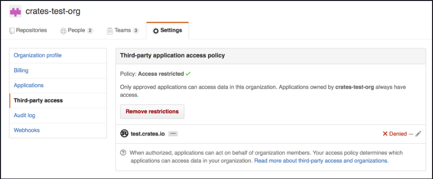
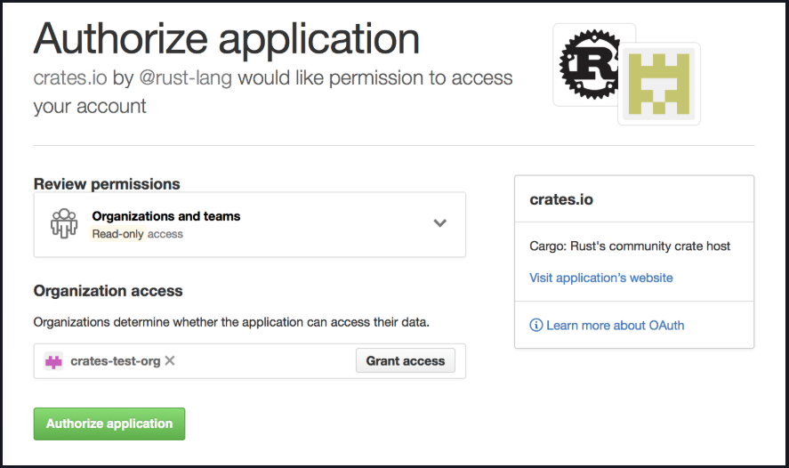

## 🚀 crates.io Üzerinde Yayınlama (Publishing on crates.io)

Kütüphanenizi dünyayla paylaşmak istediğinizde, onu **crates.io** üzerinde yayınlama zamanı gelmiştir! Bir crate yayınlamak, belirli bir sürümün crates.io üzerinde barındırılmak üzere yüklenmesi demektir.

⚠️ Yayınlama kalıcıdır: Bir sürüm asla üzerine yazılamaz, kod silinemez. Ancak istediğiniz kadar yeni sürüm yayınlayabilirsiniz.

---

### 📝 İlk Yayın Öncesi (Before your first publish)

1. **Hesap oluşturun**: crates.io üzerinde bir hesap açın ve bir **API token** alın. Bunun için:

   * GitHub hesabınızla giriş yapın (zorunludur).
   * E-posta adresinizi doğrulayın.
   * **Account Settings** sayfasından bir API token oluşturun (kaydetmeyi unutmayın, sayfadan ayrıldıktan sonra tekrar göremezsiniz).

2. **cargo login** komutunu çalıştırın:

```
$ cargo login
```

👉 Prompt geldiğinde aldığınız token’ı girin:

```
please paste the API Token found on https://crates.io/me below
abcdefghijklmnopqrstuvwxyz012345
```

Bu token `~/.cargo/credentials.toml` içine kaydedilir. Bu bilgiyi kimseyle paylaşmayın; sızarsa hemen iptal edin.

* Token silmek için: `cargo logout`

---

### 📝 Yeni Bir Crate Yayınlamadan Önce (Before publishing a new crate)

* Crate isimleri **ilk gelen alır** mantığıyla dağıtılır; bir isim alındıysa tekrar kullanılamaz.
* `Cargo.toml` içindeki metadata’yı doldurun:

  * `license` veya `license-file`
  * `description`
  * `homepage`
  * `repository`
  * `readme`
* Anahtar kelimeler ve kategoriler eklemek de bulunabilirliğinizi artırır.
* Bir kütüphane yayınlıyorsanız **Rust API Guidelines** belgelerine göz atın.

---

### 📦 Bir Crate Paketlemek (Packaging a crate)

Crate’i paketleyip yüklemek için `cargo publish` alt komutunu kullanın. Bu komut şunları yapar:

1. Paketiniz üzerinde doğrulama kontrolleri çalıştırır.
2. Kaynak kodunuzu `.crate` dosyasına sıkıştırır.
3. `.crate` dosyasını açıp derlenebilirliğini kontrol eder.
4. Dosyayı crates.io’ya yükler.

👉 Yayınlamadan önce `cargo publish --dry-run` ya da eşdeğeri `cargo package` komutunu çalıştırmanız önerilir:

```
$ cargo publish --dry-run
```

* Üretilen `.crate` dosyasını `target/package` içinde görebilirsiniz.
* Boyut sınırı **10MB**’tır. Gereksiz dosyaların (test verileri, belgeler, büyük varlıklar) dahil olmadığından emin olun.
* Dahil edilen dosyaları listelemek için:

```
$ cargo package --list
```

* Gereksiz dosyaları hariç tutmak için `exclude` kullanabilirsiniz:

```toml
[package]
exclude = [
    "public/assets/*",
    "videos/*",
]
```

* Yalnızca belirli dosyaları dahil etmek için `include` kullanabilirsiniz:

```toml
[package]
include = [
    "**/*.rs",
]
```

---

### ⬆️ Crate Yüklemek (Uploading the crate)

Yayınlamaya hazır olduğunuzda:

```
$ cargo publish
```

👉 Tebrikler, artık ilk crate’inizi yayınladınız! 🎉

---

### 🔄 Yeni Sürüm Yayınlamak (Publishing a new version)

* `Cargo.toml` içindeki `version` alanını güncelleyin.
* **SemVer** kurallarına uyun (uyumluluk kuralları).
* Ardından yine `cargo publish` çalıştırın.

💡 Öneri: Yayın sürecini otomatikleştirin. Her sürüm için:

* **Changelog** kaydı (tercihen elle hazırlanmış)
* Yayınlanan commit’e işaret eden bir **git tag**

Kullanılabilecek üçüncü taraf araçlar:

* `cargo-release`
* `cargo-smart-release`
* `release-plz`

---

### 🛠️ crates.io Tabanlı Bir Crate Yönetmek (Managing a crates.io-based crate)

Yönetim çoğunlukla **cargo komutları** ile yapılır.

#### 🔹 `cargo yank`

Yanlışlıkla hatalı bir sürüm yayınlarsanız (eksik dosya, sentaks hatası, vb.), sürümü tamamen silemezsiniz ama **yank** edebilirsiniz:

```
$ cargo yank --version 1.0.1
$ cargo yank --version 1.0.1 --undo
```

* Yank silme değildir.
* Bu sürüme karşı yeni bağımlılıklar oluşturulamaz, ama mevcut bağımlılıklar çalışmaya devam eder.
* Bu, crates.io’nun **kalıcı arşiv** olma amacına uygundur.

---

#### 🔹 `cargo owner`

Bir crate genelde birden fazla kişi tarafından geliştirilir. Sadece **sahip (owner)** yeni sürüm yayınlayabilir, ama sahipler başkalarını ekleyebilir.

```
$ cargo owner --add github-handle
$ cargo owner --remove github-handle
$ cargo owner --add github:rust-lang:owners
$ cargo owner --remove github:rust-lang:owners
```

* `--add` ile eklenen kullanıcılar **named owner** olur ve tam yetkiye sahiptir.
* `--add` ile eklenen takımlar **team owner** olur; yayınlayabilir ve yank edebilir ama yeni sahip ekleyemez/silemez.
* Takım sözdizimi: `github:org:team`

👉 Güvenmediğiniz kişileri asla **named owner** yapmayın.

## 🔑 GitHub İzinleri (GitHub permissions)

GitHub, takım üyeliklerini (team membership) basit şekilde herkese açık erişime sunmaz. Bu nedenle şu mesajla karşılaşmanız olasıdır:

```
It looks like you don’t have permission to query a necessary property from GitHub to complete this request. You may need to re-authenticate on crates.io to grant permission to read GitHub org memberships.
```

👉 Bu mesaj aslında şu anlama gelir: Bir takımı sorgulamaya çalıştınız, fakat **beş farklı erişim kontrol seviyesinden biri** tarafından reddedildiniz. GitHub’ın takım erişim kontrol desteği gerçekten **kurumsal seviyededir (Enterprise Grade)**.

---

### 📌 En Olası Sebep

* Muhtemelen bu özelliğin eklenmesinden **önce giriş yapmışsınızdır**.
* Başlangıçta crates.io, GitHub’dan **hiçbir izin istemiyordu** çünkü kullanıcı token’ı sadece oturum açmak için kullanılıyordu.
* Ancak takım üyeliklerini sizin adınıza sorgulayabilmek için artık `read:org` kapsamına ihtiyaç var.

---

### 📌 İzin Vermek ya da Vermemek

* Bu kapsamı vermek **zorunlu değildir**.
* Reddetseniz bile takımlar eklenmeden önce çalışan her şey çalışmaya devam eder.
* Ancak:

  * Bir takımı **sahip (owner)** olarak ekleyemezsiniz.
  * Bir crate’i **takım sahibi** olarak yayınlayamazsınız.
  * Bunu yapmaya çalışırsanız yukarıdaki hatayı alırsınız.
* Ayrıca, sahibi olmadığınız ama bir takıma bağlı bir crate yayınlamaya çalışırsanız da bu hata görünebilir.

---

### 📌 Çözüm

* Fikriniz değişirse veya crates.io’nun yeterli izne sahip olup olmadığından emin değilseniz, [crates.io](https://crates.io/) üzerinden tekrar kimlik doğrulaması (re-authenticate) yapabilirsiniz.
* Bu durumda crates.io sizden gerekli izinleri (scopes) talep edecektir.

---

### 📌 Ekstra Bariyer: Organizasyon Politikaları

Bir diğer engel de organizasyonun üçüncü taraf erişimini aktif olarak engellemesi olabilir.
Bunu kontrol etmek için şu adrese gidin:

```
https://github.com/organizations/:org/settings/oauth_application_policy
```

👉 Burada `:org`, organizasyon adıdır (örneğin `rust-lang`).

Orada şu tür ayarlar görebilirsiniz:

* Üçüncü taraf uygulamalara erişimin kısıtlanması
* Yalnızca belirli uygulamalara izin verilmesi




## ⚙️ GitHub Organizasyon Ayarları (Organization Settings)

Bir organizasyonun OAuth ayarlarında, crates.io’nun erişimine izin vermek için şu seçenekler vardır:

* Organizasyonunuzun **kara listesinden (blacklist)** crates.io’yu açıkça kaldırabilirsiniz.
* Veya **“Remove Restrictions”** düğmesine basarak tüm üçüncü taraf uygulamaların bu verilere erişmesine izin verebilirsiniz.

---

### 📌 Alternatif Yol

crates.io sizden `read:org` iznini talep ettiğinde, ilgili organizasyon için sorgulama yapmasına izin verecek şekilde crates.io’yu beyaz listeye (whitelist) alabilirsiniz.

👉 Bunun için organizasyon ayarlarında crates.io’nun yanında bulunan **“Grant Access”** düğmesine basmanız yeterlidir.




## 🛠️ GitHub Takım Erişim Hatalarını Giderme (Troubleshooting GitHub team access errors)

Bir GitHub takımını crate sahibi olarak eklemeye çalışırken şu hatayla karşılaşabilirsiniz:

```
error: failed to invite owners to crate <crate_name>: api errors (status 200 OK): could not find the github team org/repo
```

👉 Bu durumda şu adımları izleyin:

1. GitHub **Application settings** sayfasına gidin.
2. **Authorized OAuth Apps** sekmesinde crates.io’nun listelenip listelenmediğini kontrol edin.

   * Eğer listelenmiyorsa, [crates.io](https://crates.io/) adresine gidin ve yetkilendirme (authorize) işlemini gerçekleştirin.
3. Daha sonra GitHub’daki **Application Settings** sayfasına geri dönün, listede **crates.io** uygulamasına tıklayın.
4. **Organization access** bölümünde sizin ya da organizasyonunuzun **yeşil onay işareti** ile göründüğünden emin olun.
5. Eğer **Grant** veya **Request** düğmesi varsa:

   * **Grant** → erişimi kendiniz onaylayın.
   * **Request** → organizasyon sahibinden erişimi onaylamasını isteyin.
