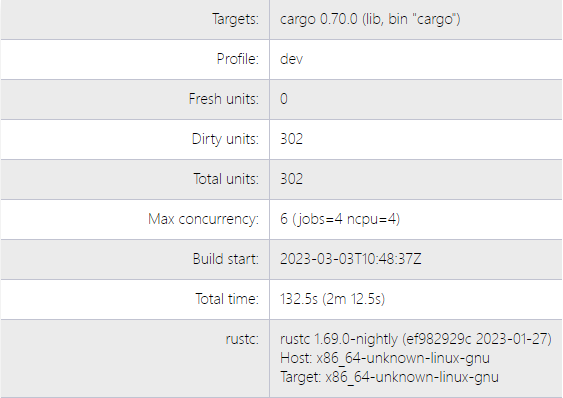
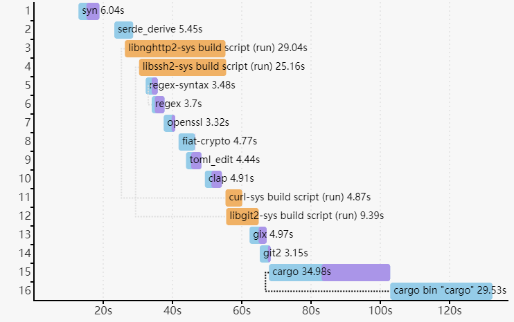
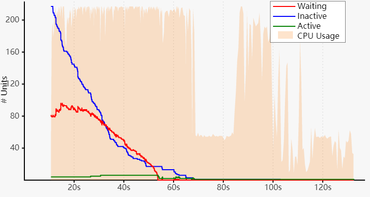

## ⏱️ Derleme Zamanlarının Raporlanması (reporting build timings)

`--timings` seçeneği, her derlemenin (compilation) ne kadar sürdüğü hakkında bilgi verir ve zaman içinde eşzamanlılık (concurrency) bilgilerini takip eder.

```
cargo build --timings
```

Bu komut, `target/cargo-timings/cargo-timing.html` içinde bir **HTML raporu** oluşturur. Ayrıca, eski çalışmaları incelemek isteyenler için aynı dizine zaman damgası içeren dosya adıyla bir kopya daha kaydedilir.

---

## 📊 Grafiklerin Okunması (reading the graphs)

Çıktıda iki tablo ve iki grafik bulunur.

* İlk tablo, projenin derleme bilgilerini gösterir. Bu bilgiler arasında şunlar vardır:

  * oluşturulan birimlerin (units) sayısı,
  * maksimum eşzamanlılık (concurrency),
  * derleme süresi,
  * kullanılan derleyicinin (compiler) sürüm bilgisi.




## 📈 Birim Grafiği (unit graph)

“Unit” grafiği, her birimin (unit) zaman içindeki süresini gösterir. **Birim (unit)**, tek bir derleyici çağrısıdır (compiler invocation).

* Grafikte, bir birim tamamlandığında hangi ek birimlerin “kilidinin açıldığını” (unlocked) gösteren çizgiler bulunur.
* Yani, tüm bağımlılıkları tamamlandığı için artık çalışmasına izin verilen yeni birimler gösterilir.
* Fareyi birimin üzerine getirdiğinizde bu çizgiler vurgulanır. Bu, bağımlılıkların kritik yolunu (critical path) görselleştirmeye yardımcı olur.
* Bu yol çalıştırmalar arasında değişebilir çünkü birimler farklı sıralarda tamamlanabilir.

---

## 🎨 Codegen Zamanları (codegen times)

“Codegen” süreleri **lavanta renginde** vurgulanır.

* Bazı durumlarda, derleme boru hattı (build pipelining), bağımlılıkları kod üretimi (code generation) yaparken birimlerin başlamasına izin verir.
* Bu bilgi her zaman gösterilmez (örneğin, ikili (binary) birimlerde kod üretiminin ne zaman başladığı gösterilmez).

---

## 🛠️ Özel Derleme Birimleri (custom build units)

“Custom build” birimleri, **build.rs** betikleridir (scripts).

* Çalıştırıldıklarında **turuncu** renkle vurgulanırlar.




## 📊 İkinci Grafik: Eşzamanlılık (concurrency)

İkinci grafik, Cargo’nun zaman içindeki **eşzamanlılık (concurrency)** durumunu gösterir. Arka plan CPU kullanımını belirtir.

Grafikte üç çizgi bulunur:

* **“Waiting” (kırmızı)** — Bir CPU yuvasının (slot) açılmasını bekleyen birimlerin sayısıdır.
* **“Inactive” (mavi)** — Bağımlılıklarının tamamlanmasını bekleyen birimlerin sayısıdır.
* **“Active” (yeşil)** — Hâlihazırda çalışan birimlerin sayısıdır.



## ⚠️ Not: Derleyici İçindeki Eşzamanlılık (concurrency in compiler)

Bu grafik, derleyicinin (compiler) kendi içindeki eşzamanlılığını göstermez.
`rustc`, eşzamanlılık sınırını aşmamak için Cargo ile **“job server”** üzerinden koordinasyon sağlar.
Bu durum özellikle **kod üretimi (code generation)** aşamasında geçerlidir.

---

## 💡 Derleme Sürelerini Azaltmak İçin İpuçları (tips for addressing compile times)

* Yavaş bağımlılıkları belirleyin.
* Bu bağımlılıkların devre dışı bırakabileceğiniz özellikleri (features) olup olmadığını kontrol edin.
* Bağımlılığı tamamen kaldırmayı düşünün.
* Aynı `crate`’in farklı sürümlerle birden fazla kez derlenip derlenmediğini kontrol edin. Eski sürümleri bağımlılık grafiğinden çıkarmaya çalışın.
* Büyük `crate`’leri daha küçük parçalara bölün.
* Çok sayıda `crate` tek bir `crate` üzerinde darboğaza giriyorsa, paralelliği artırmak için özellikle o `crate`’i iyileştirmeye odaklanın.

---

## 📋 Son Tablo (last table)

Son tablo, her birim için:

* toplam süreyi,
* “codegen” süresini,
* ve derleme sırasında etkinleştirilmiş özellikleri (features) listeler.
