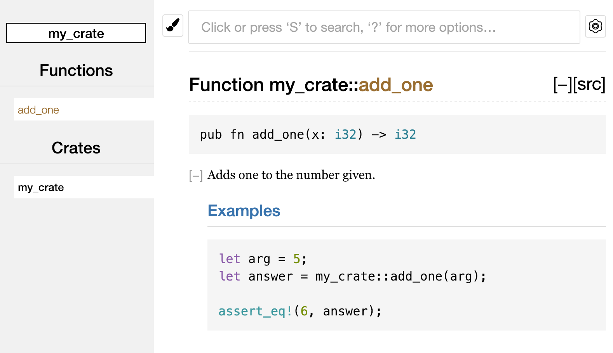
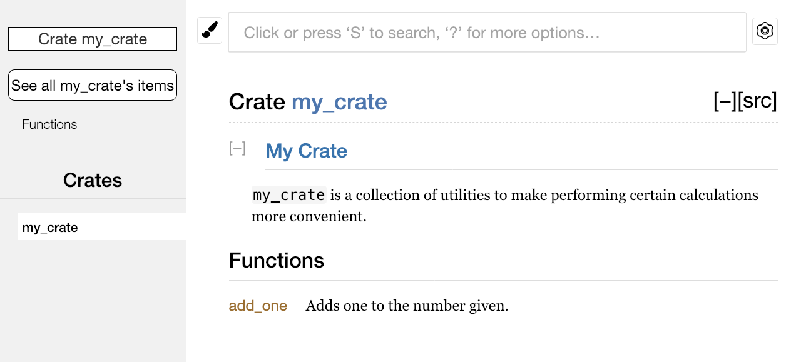
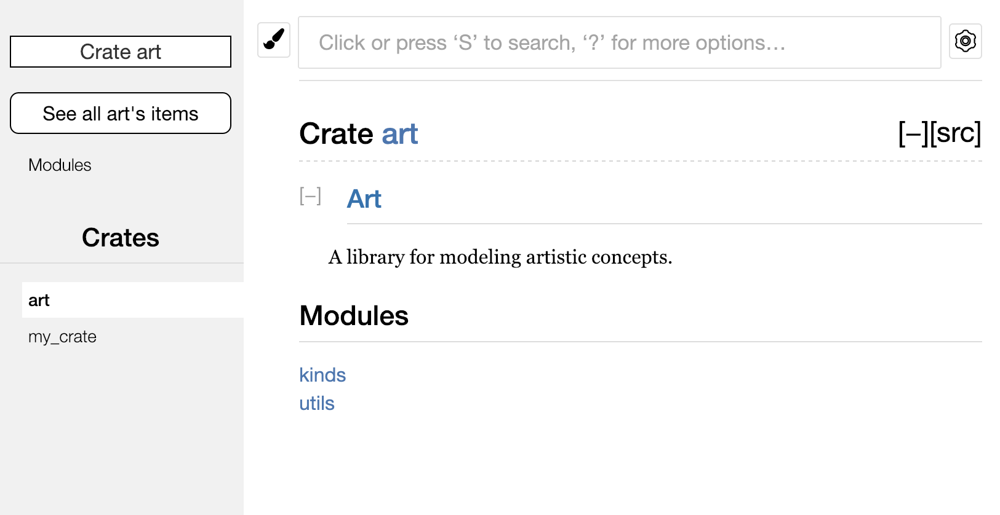
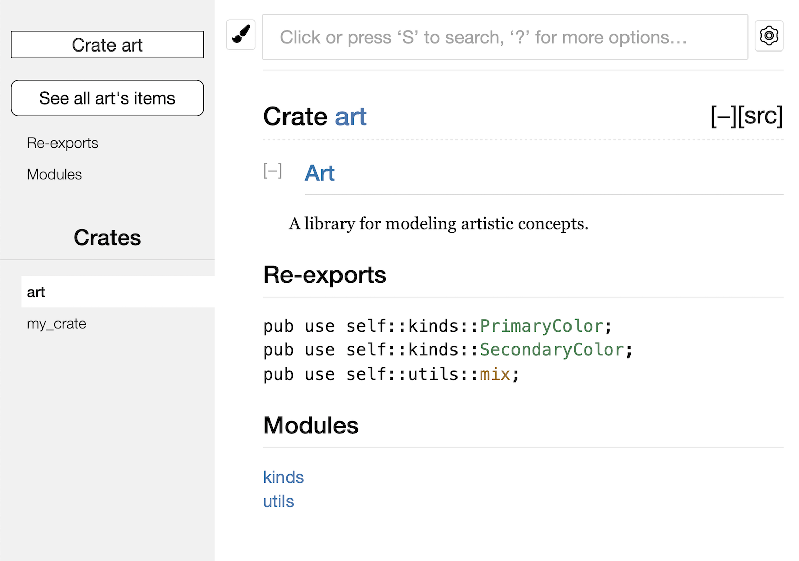

## 🚀 Bir Crate’i Crates.io’ya Yayınlama (Publishing a Crate to Crates.io)

Projelerimizde `crates.io` üzerindeki paketleri bağımlılık (dependency) olarak kullandık, ancak kodunuzu kendi paketlerinizi yayınlayarak başkalarıyla da paylaşabilirsiniz. `crates.io` üzerindeki crate kayıt sistemi (crate registry), paketlerinizin kaynak kodunu dağıtır. Bu nedenle, esas olarak açık kaynak (open source) kodları barındırır.

Rust ve Cargo, yayınladığınız paketin başkaları tarafından daha kolay bulunmasını ve kullanılmasını sağlayan özelliklere sahiptir. Şimdi bu özelliklerden bazılarını ele alacağız ve ardından bir paketin nasıl yayınlanacağını açıklayacağız.

---

## 📖 Faydalı Dokümantasyon Yorumları Yazma (Making Useful Documentation Comments)

Paketlerinizi doğru şekilde belgelendirmek (documenting), diğer kullanıcıların onları nasıl ve ne zaman kullanacaklarını anlamalarına yardımcı olur. Bu nedenle dokümantasyon yazmaya zaman ayırmaya değer. Bölüm 3’te, Rust kodunu `//` ile yorum satırı ekleyerek açıklamayı tartışmıştık. Rust ayrıca özel bir yorum türüne sahiptir: `documentation comment` (dokümantasyon yorumu). Bu tür yorumlar HTML dokümantasyonu oluşturur. Oluşturulan HTML, crate’inizin nasıl kullanıldığını bilmek isteyen programcılara yönelik genel API öğeleri için dokümantasyon yorumlarının içeriğini gösterir; crate’inizin nasıl uygulandığını değil.

Dokümantasyon yorumları, iki yerine üç eğik çizgi (`///`) kullanır ve metni biçimlendirmek için Markdown notasyonunu destekler. Yorum, belgelenen öğeden hemen önce yerleştirilir. Aşağıdaki Liste 14-1, `my_crate` adında bir crate içindeki `add_one` fonksiyonu için dokümantasyon yorumlarını göstermektedir.

Dosya adı: `src/lib.rs`

````
/// Adds one to the number given.
///
/// # Examples
///
/// ```
/// let arg = 5;
/// let answer = my_crate::add_one(arg);
///
/// assert_eq!(6, answer);
/// ```
pub fn add_one(x: i32) -> i32 {
    x + 1
}
````

Liste 14-1: Bir fonksiyon için dokümantasyon yorumu

Burada `add_one` fonksiyonunun ne yaptığını açıklıyoruz, ardından `Examples` (örnekler) başlığı ile bir bölüm açıyor ve fonksiyonun nasıl kullanılacağını gösteren kod sağlıyoruz. Bu dokümantasyon yorumundan HTML dokümantasyonu üretmek için şu komutu çalıştırabiliriz:

```
cargo doc
```

👉 Bu komut, Rust ile dağıtılan `rustdoc` aracını çalıştırır ve üretilen HTML dokümantasyonunu `target/doc` dizinine koyar.

Kolaylık olması açısından şu komutu kullanabilirsiniz:

```
cargo doc --open
```

👉 Bu komut, yalnızca mevcut crate’inizin değil, aynı zamanda tüm bağımlılıklarının dokümantasyonunu da HTML olarak oluşturur ve sonucu bir web tarayıcısında açar. `add_one` fonksiyonuna giderek dokümantasyon yorumlarındaki metnin nasıl işlendiğini görebilirsiniz.




## 📑 add\_one Fonksiyonu için HTML Dokümantasyonu (HTML documentation for the add\_one function)

---

## 📂 Yaygın Olarak Kullanılan Bölümler (Commonly Used Sections)

Liste 14-1’de `# Examples` Markdown başlığını kullanarak HTML’de “Examples” (Örnekler) başlıklı bir bölüm oluşturduk. İşte crate yazarlarının dokümantasyonlarında yaygın olarak kullandıkları bazı diğer bölümler:

* **Panics**: Dokümante edilen fonksiyonun hangi senaryolarda `panic` oluşturabileceği. Programlarının panik yapmasını istemeyen kullanıcılar, bu durumlarda fonksiyonu çağırmamalıdır.
* **Errors**: Eğer fonksiyon bir `Result` döndürüyorsa, oluşabilecek hata türlerini ve bu hataların hangi koşullarda dönebileceğini açıklamak, kullanıcıların farklı hata türlerini farklı şekillerde ele alabilmesi için faydalıdır.
* **Safety**: Eğer fonksiyonun çağrılması `unsafe` ise (bu konuyu Bölüm 20’de tartışacağız), neden güvensiz olduğunu açıklayan ve fonksiyonun çağıranlardan beklediği kuralları (invariants) kapsayan bir bölüm olmalıdır.

Çoğu dokümantasyon yorumu bu bölümlerin hepsini gerektirmez, ancak bu liste, kullanıcıların bilmek isteyeceği önemli yönleri hatırlamanız için iyi bir kontrol listesidir.

---

## 🧪 Dokümantasyon Yorumlarını Test Olarak Çalıştırma (Documentation Comments as Tests)

Dokümantasyon yorumlarınıza örnek kod blokları eklemek, kütüphanenizin nasıl kullanılacağını göstermek için faydalıdır ve bunun ekstra bir avantajı vardır:

`cargo test` çalıştırıldığında, dokümantasyondaki kod örnekleri test olarak çalıştırılır!

Çalışan örnekler içeren dokümantasyondan daha iyisi yoktur. Ama kod değiştiği için artık çalışmayan örneklerden daha kötüsü de yoktur. Eğer Liste 14-1’deki `add_one` fonksiyonunun dokümantasyonuyla birlikte `cargo test` çalıştırırsak, test sonuçlarında şöyle bir bölüm göreceğiz:

```
   Doc-tests my_crate

running 1 test
test src/lib.rs - add_one (line 5) ... ok

test result: ok. 1 passed; 0 failed; 0 ignored; 0 measured; 0 filtered out; finished in 0.27s
```

Şimdi, eğer fonksiyonu veya örneği değiştirip `assert_eq!` panik oluşturacak hale getirirsek ve `cargo test` tekrar çalıştırırsak, doc test’ler örnek ile kodun artık uyumlu olmadığını yakalayacaktır!

---

## 📝 İçerilen Öğeleri Yorumlama (Commenting Contained Items)

`//!` biçimindeki doc yorumları, kendilerinden sonra gelen öğeleri değil, bulundukları öğeyi belgelendirir. Genellikle bu yorumlar crate kök dosyasında (`src/lib.rs` varsayılan olarak) veya bir modülün içinde, crate’in veya modülün tamamını belgelendirmek için kullanılır.

Örneğin, `add_one` fonksiyonunu içeren `my_crate` crate’inin amacını açıklayan bir dokümantasyon eklemek istersek, `src/lib.rs` dosyasının başına `//!` ile başlayan yorumlar ekleriz. Bu durum Liste 14-2’de gösterilmiştir:

Dosya adı: `src/lib.rs`

```rust
//! # My Crate
//!
//! `my_crate` is a collection of utilities to make performing certain
//! calculations more convenient.

/// Adds one to the number given.
// --snip--
```

Liste 14-2: `my_crate` crate’inin tamamı için dokümantasyon

Dikkat ederseniz, `//!` ile başlayan son satırdan sonra herhangi bir kod yoktur. Çünkü yorumları `///` yerine `//!` ile başlattık; bu nedenle, bu yorumlar kendisinden sonraki öğeyi değil, içinde bulundukları öğeyi belgelendirir. Bu durumda öğe, crate kökü olan `src/lib.rs` dosyasıdır. Bu yorumlar tüm crate’i açıklar.

`cargo doc --open` çalıştırdığımızda, bu yorumlar crate’in dokümantasyonunun ön sayfasında, crate içindeki genel öğelerin listesinin üstünde görüntülenecektir (Şekil 14-2’de gösterildiği gibi).



## 📘 Crate ve Modülleri Açıklamak için Dokümantasyon Yorumları (Documentation Comments within Items)

Öğeler (items) içindeki dokümantasyon yorumları, özellikle crate’leri ve modülleri açıklamak için faydalıdır. Bunları, kapsayıcının (container) genel amacını açıklamak ve kullanıcıların crate’in organizasyonunu anlamalarına yardımcı olmak için kullanın.

---

## 🌐 pub use ile Kullanışlı Bir Genel API Dışa Aktarma (Exporting a Convenient Public API with pub use)

Bir crate yayınlarken genel API’nizin (public API) yapısı önemli bir konudur. Crate’inizi kullanan kişiler, sizden daha az yapıya hâkim oldukları için, crate’inizde büyük bir modül hiyerarşisi varsa aradıkları öğeleri bulmakta zorlanabilirler.

Bölüm 7’de `pub` anahtar sözcüğüyle öğeleri nasıl genel (public) yapacağımızı ve `use` anahtar sözcüğüyle öğeleri kapsam (scope) içine almayı öğrenmiştik. Ancak, bir crate geliştirirken size mantıklı gelen yapı, kullanıcılar için her zaman uygun olmayabilir. Örneğin, `struct`’larınızı çok katmanlı bir hiyerarşiyle organize etmek isteyebilirsiniz, ancak sizin derinlerde tanımladığınız bir türü (type) kullanmak isteyen kişiler bunun varlığını bulmakta zorlanabilir. Ayrıca, şu ifadeyi yazmak zorunda kalmak da kullanıcılar için can sıkıcı olabilir:

```
use my_crate::some_module::another_module::UsefulType;
```

Bunun yerine şu şekilde olmasını isteyebilirler:

```
use my_crate::UsefulType;
```

İyi haber şu ki, başkalarının kullanması açısından yapınız uygun değilse bile iç organizasyonunuzu değiştirmek zorunda değilsiniz. Bunun yerine, `pub use` kullanarak öğeleri yeniden dışa aktarabilirsiniz (re-export). Yeniden dışa aktarma, bir konumda bulunan genel (public) bir öğeyi başka bir konumda da genel hale getirir; sanki o öğe orada tanımlanmış gibi görünür.

---

## 🎨 Örnek: Sanatsal Kavramlar için Bir Kütüphane (Example: A Library for Artistic Concepts)

Diyelim ki sanatsal kavramları modellemek için `art` adında bir kütüphane yaptık. Bu kütüphanede iki modül vardır:

* `kinds` modülü: `PrimaryColor` ve `SecondaryColor` adında iki `enum` içerir.
* `utils` modülü: `mix` adında bir fonksiyon içerir.

Aşağıdaki Liste 14-3 bu yapıyı göstermektedir:

Dosya adı: `src/lib.rs`

```rust
//! # Art
//!
//! A library for modeling artistic concepts.

pub mod kinds {
    /// The primary colors according to the RYB color model.
    pub enum PrimaryColor {
        Red,
        Yellow,
        Blue,
    }

    /// The secondary colors according to the RYB color model.
    pub enum SecondaryColor {
        Orange,
        Green,
        Purple,
    }
}

pub mod utils {
    use crate::kinds::*;

    /// Combines two primary colors in equal amounts to create
    /// a secondary color.
    pub fn mix(c1: PrimaryColor, c2: PrimaryColor) -> SecondaryColor {
        // --snip--
    }
}
```

Liste 14-3: `kinds` ve `utils` modüllerine organize edilmiş öğelerle bir `art` kütüphanesi

`cargo doc` ile bu crate için oluşturulan dokümantasyonun ön sayfası Şekil 14-3’te gösterilmektedir.



## 📄 art Crate’in Dokümantasyonunun Ön Sayfası (Front page of the documentation for art)

`art` crate’inin dokümantasyonunun ön sayfasında, `PrimaryColor` ve `SecondaryColor` türleri ya da `mix` fonksiyonu listelenmez. Bunları görmek için `kinds` ve `utils` modüllerine tıklamamız gerekir.

Bu kütüphaneye bağımlı olan başka bir crate, `art` içindeki öğeleri kapsama (scope) almak için `use` ifadelerinde mevcut modül yapısını belirtmek zorundadır. Liste 14-4, `art` crate’inden `PrimaryColor` ve `mix` öğelerini kullanan bir crate örneğini göstermektedir:

---

### 📂 Örnek: art Crate’in Öğelerini Kullanma (Using the art crate’s items)

Dosya adı: `src/main.rs`

```rust
use art::kinds::PrimaryColor;
use art::utils::mix;

fn main() {
    let red = PrimaryColor::Red;
    let yellow = PrimaryColor::Yellow;
    mix(red, yellow);
}
```

Liste 14-4: `art` crate’inin iç yapısıyla dışa aktarılan öğeleri kullanan bir crate

---

Liste 14-4’teki kodun yazarı, `PrimaryColor`’ın `kinds` modülünde, `mix` fonksiyonunun ise `utils` modülünde olduğunu çözmek zorunda kaldı. Ancak `art` crate’inin iç modül yapısı, `art` üzerinde çalışan geliştiriciler için daha anlamlıdır; `art` crate’ini kullananlar içinse kafa karıştırıcı olabilir. Kullanıcılar öğelerin nerede olduğunu bulmak için uğraşmak zorunda kalır ve `use` ifadelerinde modül adlarını belirtmeleri gerekir.

---

## 🔄 pub use ile İç Organizasyonu Gizleme (Removing Internal Organization with pub use)

İç organizasyonu genel API’den kaldırmak için, Liste 14-3’teki `art` crate kodunu değiştirerek, öğeleri en üst düzeyden yeniden dışa aktaran (`re-export`) `pub use` ifadeleri ekleyebiliriz. Bu değişiklik Liste 14-5’te gösterilmektedir:

Dosya adı: `src/lib.rs`

```rust
//! # Art
//!
//! A library for modeling artistic concepts.

pub use self::kinds::PrimaryColor;
pub use self::kinds::SecondaryColor;
pub use self::utils::mix;

pub mod kinds {
    // --snip--
}

pub mod utils {
    // --snip--
}
```

Liste 14-5: Öğeleri yeniden dışa aktarmak için `pub use` ifadeleri ekleme

---

Artık `cargo doc` tarafından oluşturulan API dokümantasyonu, ön sayfada bu yeniden dışa aktarılan öğeleri listeler ve bağlantılar ekler. Böylece `PrimaryColor`, `SecondaryColor` türleri ve `mix` fonksiyonu kullanıcılar için daha kolay bulunabilir hale gelir (Şekil 14-4’te gösterildiği gibi).




## 📋 art Crate Kullanıcıları için Daha Kolay API (More Convenient API for art Crate Users)

`art` crate kullanıcıları hâlâ Liste 14-3’teki iç yapıyı (Liste 14-4’te gösterildiği gibi) kullanabilir veya Liste 14-5’te yeniden dışa aktarılan (`pub use`) öğelerle sağlanan daha kullanışlı yapıyı tercih edebilirler. Bu, Liste 14-6’da gösterilmektedir:

Dosya adı: `src/main.rs`

```rust
use art::PrimaryColor;
use art::mix;

fn main() {
    // --snip--
}
```

Liste 14-6: `art` crate’inden yeniden dışa aktarılan öğeleri kullanan bir program

Eğer çok sayıda iç içe geçmiş modül varsa, türleri en üst seviyeden `pub use` ile yeniden dışa aktarmak, crate kullanıcılarının deneyiminde büyük fark yaratabilir. `pub use`’un diğer yaygın bir kullanım alanı da, bağımlılıklarınızdan (dependency) aldığınız tanımları yeniden dışa aktararak, bu tanımları crate’inizin genel API’sinin (public API) bir parçası yapmaktır.

Kullanışlı bir genel API yapısı oluşturmak, bilimden çok sanattır; kullanıcılarınız için en iyi çalışan API’yi bulmak için denemeler yapabilirsiniz. `pub use` kullanmak, crate’inizi dahili olarak nasıl yapılandırdığınız konusunda size esneklik sağlar ve bu iç yapıyı kullanıcılarınıza sunduğunuz API’den ayırır. Yüklediğiniz bazı crate’lerin kodlarını inceleyin; iç yapılarının, genel API’lerinden farklı olduğunu göreceksiniz.

---

## 👤 Crates.io Hesabı Kurma (Setting Up a Crates.io Account)

Herhangi bir crate yayınlamadan önce, `crates.io` üzerinde bir hesap oluşturmanız ve bir API anahtarı (token) almanız gerekir. Bunun için `crates.io` ana sayfasına gidin ve GitHub hesabınızla giriş yapın. (Şu an için GitHub hesabı gereklidir, ancak gelecekte başka yöntemler de desteklenebilir.) Giriş yaptıktan sonra, [https://crates.io/me/](https://crates.io/me/) adresinden API anahtarınızı alın. Ardından şu komutu çalıştırın ve istendiğinde anahtarınızı yapıştırın:

```
$ cargo login
abcdefghijklmnopqrstuvwxyz012345
```

👉 Bu komut, Cargo’ya API anahtarınızı bildirir ve onu yerel olarak `~/.cargo/credentials` dosyasında saklar. Bu anahtar gizlidir: kimseyle paylaşmayın. Bir nedenle paylaşırsanız, onu iptal etmeli ve `crates.io` üzerinden yeni bir anahtar oluşturmalısınız.

---

## 🏷️ Yeni Bir Crate’e Metadata Ekleme (Adding Metadata to a New Crate)

Diyelim ki yayınlamak istediğiniz bir crate’iniz var. Yayınlamadan önce, `Cargo.toml` dosyasının `[package]` bölümüne bazı metadata eklemeniz gerekir.

Crate’inizin benzersiz bir ada sahip olması gerekir. Yerel geliştirme sırasında crate’inize istediğiniz adı verebilirsiniz. Ancak `crates.io` üzerindeki crate adları “ilk gelen alır” prensibiyle dağıtılır. Bir ad alındığında, başka hiç kimse o adla crate yayınlayamaz. Yayınlamadan önce kullanmak istediğiniz adı aratın. Eğer ad alınmışsa, yeni bir ad bulmanız ve `Cargo.toml` içindeki `[package]` bölümündeki `name` alanını değiştirmeniz gerekir. Örneğin:

Dosya adı: `Cargo.toml`

```toml
[package]
name = "guessing_game"
```

Benzersiz bir ad seçmiş olsanız bile, bu noktada `cargo publish` çalıştırırsanız şu uyarı ve hata iletisini alırsınız:

```
$ cargo publish
    Updating crates.io index
warning: manifest has no description, license, license-file, documentation, homepage or repository.
See https://doc.rust-lang.org/cargo/reference/manifest.html#package-metadata for more info.
--snip--
error: failed to publish to registry at https://crates.io

Caused by:
  the remote server responded with an error (status 400 Bad Request): missing or empty metadata fields: description, license. Please see https://doc.rust-lang.org/cargo/reference/manifest.html for more information on configuring these fields
```

👉 Bu hata, bazı kritik bilgilerin eksik olmasından kaynaklanır: özellikle `description` (açıklama) ve `license` (lisans) alanları zorunludur. Kullanıcıların crate’inizin ne işe yaradığını ve hangi şartlar altında kullanılabileceğini bilmeleri için bu bilgiler gereklidir.

* `description`: Birkaç cümleden oluşmalı, çünkü crate’iniz arama sonuçlarında bu metinle listelenecektir.
* `license`: Geçerli bir lisans tanımlayıcı (identifier) içermelidir. Linux Foundation’ın **SPDX** listesinde bu değerler bulunabilir. Örneğin, crate’inizin MIT Lisansı ile lisanslandığını belirtmek için şu şekilde ayarlayabilirsiniz:

Dosya adı: `Cargo.toml`

```toml
[package]
name = "guessing_game"
license = "MIT"
```

Eğer kullanmak istediğiniz lisans **SPDX** listesinde yoksa, lisans metnini bir dosyaya koymalı, bu dosyayı projenize eklemeli ve `license` anahtarını kullanmak yerine `license-file` ile bu dosyanın adını belirtmelisiniz.

Hangi lisansın uygun olduğu bu kitabın kapsamı dışında olsa da, Rust topluluğunda birçok kişi, Rust’ın kendisi gibi `MIT OR Apache-2.0` ikili lisansını kullanır. Bu yaklaşım, birden fazla lisans tanımlayıcısını `OR` ile ayırarak projenizi birden fazla lisans altında sunabileceğinizi de gösterir.

---

## 📦 Yayına Hazır Bir Cargo.toml Örneği (A Cargo.toml Example Ready for Publishing)

Benzersiz bir ad, sürüm (`version`), açıklama (`description`) ve lisans (`license`) ekledikten sonra, yayınlamaya hazır bir projenin `Cargo.toml` dosyası şu şekilde görünebilir:

Dosya adı: `Cargo.toml`

```toml
[package]
name = "guessing_game"
version = "0.1.0"
edition = "2024"
description = "A fun game where you guess what number the computer has chosen."
license = "MIT OR Apache-2.0"

[dependencies]
```

👉 Cargo’nun belgeleri, crate’inizin diğer kullanıcılar tarafından daha kolay keşfedilmesini ve kullanılmasını sağlamak için ekleyebileceğiniz diğer metadata alanlarını açıklar.


## 📤 Crates.io’ya Yayınlama (Publishing to Crates.io)

Artık bir hesap oluşturduğunuza, API anahtarınızı kaydettiğinize, crate’iniz için bir ad seçtiğinize ve gerekli metadata’yı belirttiğinize göre yayınlamaya hazırsınız! Bir crate yayınlamak, belirli bir sürümü `crates.io` üzerine yükler ve başkalarının kullanımına açar.

Dikkatli olun, çünkü bir yayın kalıcıdır. Bir sürüm asla üzerine yazılamaz ve kod silinemez. `crates.io`’nun ana hedeflerinden biri, kalıcı bir kod arşivi olarak hareket etmektir; böylece `crates.io`’daki crate’lere bağımlı tüm projelerin derlemeleri çalışmaya devam eder. Sürüm silmeye izin vermek bu hedefi imkânsız hale getirirdi. Ancak, yayınlayabileceğiniz sürüm sayısında herhangi bir sınırlama yoktur.

Yeniden `cargo publish` komutunu çalıştırın. Artık başarılı olmalıdır:

```
$ cargo publish
    Updating crates.io index
   Packaging guessing_game v0.1.0 (file:///projects/guessing_game)
   Verifying guessing_game v0.1.0 (file:///projects/guessing_game)
   Compiling guessing_game v0.1.0
(file:///projects/guessing_game/target/package/guessing_game-0.1.0)
    Finished `dev` profile [unoptimized + debuginfo] target(s) in 0.19s
   Uploading guessing_game v0.1.0 (file:///projects/guessing_game)
```

🎉 Tebrikler! Artık kodunuzu Rust topluluğuyla paylaştınız ve herkes projesine crate’inizi bağımlılık olarak kolayca ekleyebilir.

---

## 🔄 Mevcut Bir Crate’in Yeni Sürümünü Yayınlama (Publishing a New Version of an Existing Crate)

Crate’inizde değişiklikler yaptığınızda ve yeni bir sürümü yayınlamaya hazır olduğunuzda, `Cargo.toml` dosyanızdaki `version` değerini değiştirin ve tekrar yayınlayın.

Yaptığınız değişikliklere göre uygun bir sonraki sürüm numarasını belirlemek için **Semantic Versioning** kurallarını kullanın. Ardından, yeni sürümü yüklemek için `cargo publish` çalıştırın.

---

## 🚫 Sürüm Kullanımdan Kaldırma: cargo yank (Deprecating Versions from Crates.io with cargo yank)

Önceki sürümleri silemeseniz de, onların yeni projelere bağımlılık olarak eklenmesini engelleyebilirsiniz. Bu, bir crate sürümü herhangi bir nedenle bozulduğunda yararlıdır. Bu gibi durumlarda Cargo, bir crate sürümünü **yank** (kullanımdan kaldırma) işlemini destekler.

* Yank işlemi, yeni projelerin bu sürüme bağımlı olmasını engeller.
* Ancak mevcut projeler, bağımlılıkları korunarak çalışmaya devam eder.
* Yani `Cargo.lock` dosyası olan projeler bozulmaz; ancak yeni oluşturulacak `Cargo.lock` dosyaları artık yanked sürümü kullanmaz.

Bir crate sürümünü yank etmek için, daha önce yayınladığınız crate’in dizininde şu komutu çalıştırın ve yank etmek istediğiniz sürümü belirtin. Örneğin, `guessing_game` adında 1.0.1 sürümünü yayınladıysak ve bu sürümü yank etmek istiyorsak:

```
$ cargo yank --vers 1.0.1
    Updating crates.io index
        Yank guessing_game@1.0.1
```

Bir sürümü tekrar kullanılabilir hale getirmek için komuta `--undo` ekleyebilirsiniz:

```
$ cargo yank --vers 1.0.1 --undo
    Updating crates.io index
      Unyank guessing_game@1.0.1
```

👉 Yank işlemi herhangi bir kodu **silmez**. Örneğin yanlışlıkla yüklenmiş gizli anahtarları (secrets) silemez. Böyle bir durum yaşanırsa, bu gizli anahtarları derhal sıfırlamanız gerekir.
