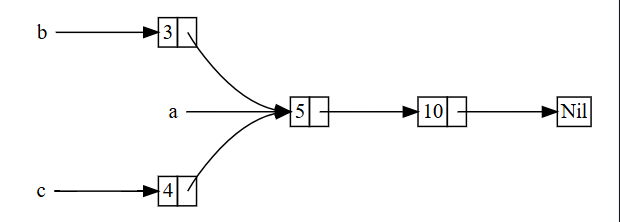

## 📦 Rc<T>, Referans Sayımlı Akıllı İşaretçi (reference counted smart pointer)

Çoğu durumda sahiplik (ownership) açıktır: belirli bir değere hangi değişkenin sahip olduğunu tam olarak bilirsiniz. Ancak, tek bir değerin birden fazla sahibi olabileceği durumlar vardır. Örneğin, grafik (graph) veri yapılarında birden fazla kenar (edge) aynı düğümü (node) işaret edebilir ve bu düğüm, ona işaret eden tüm kenarların kavramsal olarak sahibidir. Bir düğüm, yalnızca ona işaret eden hiçbir kenar kalmadığında ve dolayısıyla hiçbir sahibi olmadığında temizlenmelidir.

Çoklu sahipliği açıkça etkinleştirmek için Rust türü `Rc<T>` kullanılır; bu, referans sayımı (reference counting) kısaltmasıdır. `Rc<T>` türü, bir değere kaç referans olduğunu takip ederek değerin hâlâ kullanımda olup olmadığını belirler. Bir değere sıfır referans kaldığında, değer artık kullanılmadığı için temizlenebilir ve hiçbir referans geçersiz hale gelmez.

`Rc<T>`’yi bir aile odasındaki televizyon gibi düşünebilirsiniz. Bir kişi televizyon izlemek için odaya girdiğinde televizyonu açar. Başkaları da odaya girip televizyon izleyebilir. Son kişi odadan çıktığında televizyon kapatılır çünkü artık kullanılmamaktadır. Eğer birisi, hâlâ izleyenler varken televizyonu kapatırsa, odada kalanlardan tepki alırdı!

`Rc<T>` türünü, programımızın birden fazla bölümünün okuyacağı verileri heap üzerinde ayırmak istediğimizde ve derleme zamanında (compile time) hangi bölümün veriyi en son kullanmayı bitireceğini belirleyemediğimizde kullanırız. Eğer hangi bölümün en son bitireceğini bilseydik, sadece o bölümü verinin sahibi yapabilir ve derleme zamanında uygulanan normal sahiplik kurallarını kullanabilirdik.

`Rc<T>`’nin yalnızca tek iş parçacıklı (single-threaded) senaryolarda kullanıldığını unutmayın. Eşzamanlılık (concurrency) konusunu 16. bölümde tartıştığımızda, çok iş parçacıklı programlarda referans sayımının nasıl yapılacağını ele alacağız.

## 🔄 Rc<T> Kullanarak Verileri Paylaşma (using Rc<T> to share data)

15-5 numaralı listede verilen cons listesi (cons list) örneğine geri dönelim. Hatırlarsanız, onu `Box<T>` kullanarak tanımlamıştık. Bu sefer, her ikisi de üçüncü bir listenin sahipliğini paylaşan iki liste oluşturacağız. Kavramsal olarak bu, Şekil 15-3’e benzemektedir.




## 📑 Şekil 15-3: İki listenin (b ve c), üçüncü bir listenin (a) sahipliğini paylaşması

İlk olarak 5 ve ardından 10 içeren bir `a` listesi oluşturacağız. Daha sonra, 3 ile başlayan `b` ve 4 ile başlayan `c` listelerini yapacağız. Hem `b` hem de `c` listeleri, 5 ve 10 içeren ilk `a` listesine bağlanacak. Başka bir deyişle, her iki liste de 5 ve 10 içeren ilk listeyi paylaşacak.

Bu senaryoyu, `Box<T>` kullanan `List` tanımımız ile uygulamaya çalışmak işe yaramaz; bu durum 15-17 numaralı listede gösterilmiştir:

```
Filename: src/main.rs
This code does not compile!
enum List {
    Cons(i32, Box<List>),
    Nil,
}

use crate::List::{Cons, Nil};

fn main() {
    let a = Cons(5, Box::new(Cons(10, Box::new(Nil))));
    let b = Cons(3, Box::new(a));
    let c = Cons(4, Box::new(a));
}
```

Listing 15-17: `Box<T>` kullanarak üçüncü bir listenin sahipliğini paylaşmaya çalışan iki listeye izin verilmediğini gösteren örnek

Bu kodu derlediğimizde şu hatayı alırız:

```
$ cargo run
   Compiling cons-list v0.1.0 (file:///projects/cons-list)
error[E0382]: use of moved value: `a`
  --> src/main.rs:11:30
   |
9  |     let a = Cons(5, Box::new(Cons(10, Box::new(Nil))));
   |         - move occurs because `a` has type `List`, which does not implement the `Copy` trait
10 |     let b = Cons(3, Box::new(a));
   |                              - value moved here
11 |     let c = Cons(4, Box::new(a));
   |                              ^ value used here after move
```

`Cons` varyantları, tuttukları verilerin sahibidir. Bu yüzden `b` listesini oluşturduğumuzda, `a` `b`’ye taşınır (move) ve `b`, `a`’nın sahibi olur. Daha sonra `c` oluştururken `a`’yı tekrar kullanmaya çalıştığımızda, `a` daha önce taşındığı için buna izin verilmez.

Elbette `Cons` tanımını referanslar tutacak şekilde değiştirebilirdik, fakat bu durumda ömür (lifetime) parametreleri belirtmemiz gerekirdi. Ömür parametreleri belirtmek, listedeki her elemanın listenin tamamı kadar uzun yaşayacağını ifade ederdi. Bu, 15-17 numaralı listede geçerlidir, ancak her senaryoda böyle olmak zorunda değildir.

Bunun yerine, `List` tanımımızı `Box<T>` yerine `Rc<T>` kullanacak şekilde değiştireceğiz; bu, 15-18 numaralı listede gösterilmiştir. Her `Cons` varyantı artık bir değer ve bir `List`’e işaret eden bir `Rc<T>` tutacak. `b`’yi oluştururken, `a`’nın sahipliğini almak yerine, `a`’nın tuttuğu `Rc<List>`’i klonlayacağız; bu da referans sayısını birden ikiye çıkarır ve hem `a` hem de `b`’nin `Rc<List>` içindeki verilerin sahibi olmasına izin verir. `c`’yi oluştururken de `a`’yı klonlayacağız ve referans sayısı iki’den üç’e çıkacak. `Rc::clone` her çağrıldığında, `Rc<List>` içindeki veriye olan referans sayısı artar ve veriler yalnızca ona sıfır referans kaldığında temizlenir.

```
Filename: src/main.rs
enum List {
    Cons(i32, Rc<List>),
    Nil,
}

use crate::List::{Cons, Nil};
use std::rc::Rc;

fn main() {
    let a = Rc::new(Cons(5, Rc::new(Cons(10, Rc::new(Nil)))));
    let b = Cons(3, Rc::clone(&a));
    let c = Cons(4, Rc::clone(&a));
}
```

Listing 15-18: `Rc<T>` kullanan `List` tanımı

`Rc<T>` öntanımlı (prelude) olarak gelmediği için, onu kapsama alanına (`scope`) almak amacıyla bir `use` deyimi eklememiz gerekir. `main` içinde, 5 ve 10 içeren listeyi oluşturur ve onu yeni bir `Rc<List>` içine koyarak `a`’ya atarız. Daha sonra `b` ve `c`’yi oluştururken, `Rc::clone` fonksiyonunu çağırırız ve argüman olarak `a`’daki `Rc<List>`’in bir referansını geçiririz.

Aslında `a.clone()` da çağırabilirdik, ancak Rust’ın konvansiyonu bu durumda `Rc::clone` kullanmaktır. `Rc::clone`’un implementasyonu, çoğu türdeki `clone` gibi tüm verilerin derin kopyasını (deep copy) yapmaz. `Rc::clone` çağrısı yalnızca referans sayısını artırır ve bu fazla zaman almaz. Verilerin derin kopyalarını yapmak ise oldukça zaman alıcı olabilir. Bu yüzden, referans sayımı için `Rc::clone` kullanarak derin kopya yapan `clone` türleri ile sadece referans sayısını artıran `clone` türlerini görsel olarak ayırt edebiliriz. Böylece, kodda performans sorunlarını araştırırken yalnızca derin kopya `clone`’larını dikkate almamız yeterli olur, `Rc::clone` çağrılarını göz ardı edebiliriz.


## 📈 Rc<T>'yi Klonlamak Referans Sayısını Artırır (cloning an Rc<T> increases the reference count)

15-18 numaralı listedeki çalışan örneğimizi, `a` içindeki `Rc<List>`’e yönelik referanslar oluşturup bıraktıkça referans sayılarının (reference count) nasıl değiştiğini görebilmemiz için değiştirelim.

15-19 numaralı listede, `main` fonksiyonunu `c` listesi etrafında bir iç kapsam (inner scope) olacak şekilde değiştireceğiz; böylece `c` kapsam dışına çıktığında (goes out of scope) referans sayısının nasıl değiştiğini görebileceğiz.

```
Filename: src/main.rs
fn main() {
    let a = Rc::new(Cons(5, Rc::new(Cons(10, Rc::new(Nil)))));
    println!("count after creating a = {}", Rc::strong_count(&a));
    let b = Cons(3, Rc::clone(&a));
    println!("count after creating b = {}", Rc::strong_count(&a));
    {
        let c = Cons(4, Rc::clone(&a));
        println!("count after creating c = {}", Rc::strong_count(&a));
    }
    println!("count after c goes out of scope = {}", Rc::strong_count(&a));
}
```

Listing 15-19: Referans sayısını yazdırma

Programda referans sayısının değiştiği her noktada, `Rc::strong_count` fonksiyonunu (Rc::strong\_count function) çağırarak elde ettiğimiz referans sayısını yazdırıyoruz. Bu fonksiyonun adının `count` yerine `strong_count` olmasının nedeni, `Rc<T>` türünün (Rc<T> type) ayrıca bir `weak_count`’a (weak\_count) sahip olmasıdır; `weak_count`’un ne için kullanıldığını “Weak<T> Kullanarak Referans Döngülerini Önleme (preventing reference cycles using Weak<T>)” bölümünde göreceğiz.

Bu kod aşağıdakileri yazdırır:

```
$ cargo run
   Compiling cons-list v0.1.0 (file:///projects/cons-list)
    Finished `dev` profile [unoptimized + debuginfo] target(s) in 0.45s
     Running `target/debug/cons-list`
count after creating a = 1
count after creating b = 2
count after creating c = 3
count after c goes out of scope = 2
```

`a` içindeki `Rc<List>`’in başlangıç referans sayısının 1 olduğunu görüyoruz; sonra her `clone` çağrısında sayı 1 artıyor. `c` kapsam dışına çıktığında sayı 1 azalıyor. Referans sayısını artırmak için `Rc::clone` çağırmamız gerektiği gibi, referans sayısını azaltmak için bir fonksiyon çağırmamız gerekmez: `Drop` özelliğinin (Drop trait) uygulaması, bir `Rc<T>` değeri kapsam dışına çıktığında referans sayısını otomatik olarak azaltır.

Bu örnekte göremediğimiz şey, `main`’in sonunda önce `b` sonra `a` kapsam dışına çıktığında sayının 0 olması ve `Rc<List>`’in tamamen temizlenmesidir. `Rc<T>` kullanmak, tek bir değerin birden çok sahibinin olmasına olanak tanır ve sayı, sahiplerden herhangi biri hâlâ var olduğu sürece değerin geçerli kalmasını sağlar.

Salt okunur referanslar (immutable references) aracılığıyla, `Rc<T>` programınızın birden fazla bölümü arasında verileri yalnızca okumak için paylaşmanıza izin verir. Eğer `Rc<T>` aynı yere birden fazla değiştirilebilir referansa (mutable references) da izin verseydi, 4. bölümde tartışılan ödünç alma kurallarından (borrowing rules) birini ihlal edebilirdiniz: aynı yere birden fazla değiştirilebilir ödünç, veri yarışlarına (data races) ve tutarsızlıklara neden olabilir. Ancak verileri değiştirebilmek çok yararlıdır! Bir sonraki bölümde, içsel değiştirilebilirlik deseni (interior mutability pattern) ve bu değiştirilemezlik kısıtlamasıyla `Rc<T>` ile birlikte çalışmak için kullanabileceğiniz `RefCell<T>` türünü (RefCell<T> type) tartışacağız.

