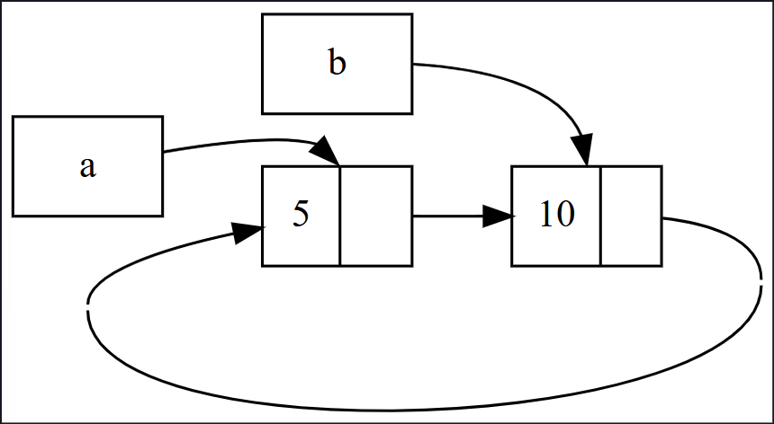

## ♻️ Referans Döngüleri Bellek Sızıntısına Yol Açabilir (reference cycles can leak memory)

Rust’ın bellek güvenliği garantileri, yanlışlıkla temizlenmeyen (hiçbir zaman serbest bırakılmayan) bellek oluşturmayı zorlaştırır, fakat imkânsız kılmaz. Bu durum **bellek sızıntısı** (memory leak) olarak bilinir. Rust’ın garantilerinden biri bellek sızıntılarını tamamen önlemek değildir; yani bellek sızıntıları Rust’ta bellek açısından güvenlidir (memory safe). Ancak, `Rc<T>` ve `RefCell<T>` kullanarak Rust’ın bellek sızıntılarına izin verdiğini görebiliriz: öğelerin birbirine döngüsel olarak referans verdiği durumlar oluşturmak mümkündür. Bu da bellek sızıntısına yol açar, çünkü döngüdeki her öğenin referans sayısı hiçbir zaman 0’a ulaşmaz ve değerler hiçbir zaman bırakılmaz (dropped).

---

## 🔗 Referans Döngüsü Oluşturma (creating a reference cycle)

Bir referans döngüsünün nasıl meydana gelebileceğine ve bunu nasıl önleyebileceğimize bakalım. 15-25 numaralı listede `List` enum’unun tanımı ve bir `tail` metoduyla başlıyoruz:

```
Filename: src/main.rs
use crate::List::{Cons, Nil};
use std::cell::RefCell;
use std::rc::Rc;

#[derive(Debug)]
enum List {
    Cons(i32, RefCell<Rc<List>>),
    Nil,
}

impl List {
    fn tail(&self) -> Option<&RefCell<Rc<List>>> {
        match self {
            Cons(_, item) => Some(item),
            Nil => None,
        }
    }
}

fn main() {}
```

Listing 15-25: Bir `Cons` varyantının işaret ettiği şeyi değiştirebilmek için `RefCell<T>` tutan cons listesi tanımı

Burada 15-5 numaralı listedeki `List` tanımının başka bir varyasyonunu kullanıyoruz. `Cons` varyantındaki ikinci eleman artık `RefCell<Rc<List>>`. Yani 15-24’te yaptığımız gibi yalnızca `i32` değerini değiştirmek yerine, bir `Cons` varyantının işaret ettiği `List` değerini değiştirmek istiyoruz. Ayrıca, eğer elimizde bir `Cons` varyantı varsa ikinci elemana kolayca erişebilmek için bir `tail` metodu ekliyoruz.

15-26 numaralı listede, 15-25’teki tanımları kullanan bir `main` fonksiyonu ekliyoruz. Bu kod, `a` değişkeninde bir liste ve `b` değişkeninde `a`’yı işaret eden başka bir liste oluşturuyor. Daha sonra `a` listesini `b`’yi işaret edecek şekilde değiştiriyoruz ve böylece bir **referans döngüsü** oluşturuyoruz. Sürecin farklı noktalarındaki referans sayılarını görmek için `println!` ifadeleri kullanıyoruz.

```
Filename: src/main.rs
fn main() {
    let a = Rc::new(Cons(5, RefCell::new(Rc::new(Nil))));

    println!("a initial rc count = {}", Rc::strong_count(&a));
    println!("a next item = {:?}", a.tail());

    let b = Rc::new(Cons(10, RefCell::new(Rc::clone(&a))));

    println!("a rc count after b creation = {}", Rc::strong_count(&a));
    println!("b initial rc count = {}", Rc::strong_count(&b));
    println!("b next item = {:?}", b.tail());

    if let Some(link) = a.tail() {
        *link.borrow_mut() = Rc::clone(&b);
    }

    println!("b rc count after changing a = {}", Rc::strong_count(&b));
    println!("a rc count after changing a = {}", Rc::strong_count(&a));

    // Döngüyü görmek için aşağıdaki satırı açabilirsiniz;
    // ancak stack overflow hatasına yol açacaktır.
    // println!("a next item = {:?}", a.tail());
}
```

Listing 15-26: Birbirini işaret eden iki `List` değeriyle referans döngüsü oluşturma

Bu örnekte, `a` değişkeninde `Rc<List>` örneği oluştururuz ve içinde `5, Nil` olan bir `List` değeri bulunur. Ardından, `b` değişkeninde başka bir `Rc<List>` örneği oluştururuz; bu örnek `10` değerini içerir ve `a`’daki listeyi işaret eder.

Daha sonra `a` listesini, `Nil` yerine `b`’yi işaret edecek şekilde değiştiririz. Bunu yapmak için `a`’daki `RefCell<Rc<List>>` referansını almak amacıyla `tail` metodunu kullanırız ve bu referansı `link` değişkenine atarız. Ardından `borrow_mut` çağırarak içteki değeri değiştiririz: artık `Nil` yerine `b`’deki `Rc<List>` değerini tutar.

Bu kodu çalıştırdığımızda (sondaki `println!` yorum satırına alınmış haldeyken) şu çıktıyı alırız:

```
$ cargo run
a initial rc count = 1
a next item = Some(RefCell { value: Nil })
a rc count after b creation = 2
b initial rc count = 1
b next item = Some(RefCell { value: Cons(5, RefCell { value: Nil }) })
b rc count after changing a = 2
a rc count after changing a = 2
```

`a` ve `b` içindeki `Rc<List>` örneklerinin referans sayıları, `a` listesini `b`’yi işaret edecek şekilde değiştirdikten sonra 2’ye çıkar. `main` sonunda Rust, `b` değişkenini bırakır, bu da `b`’deki `Rc<List>` örneğinin referans sayısını 2’den 1’e düşürür. Ancak bu bellek temizlenmez çünkü referans sayısı 0 değildir. Daha sonra Rust `a`’yı bırakır ve bu da `a`’daki `Rc<List>` örneğinin referans sayısını 2’den 1’e düşürür. Fakat bu bellek de temizlenemez çünkü diğer `Rc<List>` hâlâ ona referans vermektedir. Bu nedenle, liste için ayrılan bellek sonsuza kadar serbest bırakılmamış şekilde kalır.

Bu referans döngüsünü görselleştirmek için Şekil 15-4 oluşturulmuştur.




## 🔁 Şekil 15-4: Birbirini İşaret Eden a ve b Listelerinin Referans Döngüsü (a reference cycle of lists a and b pointing to each other)

Son `println!` satırının yorumunu kaldırıp programı çalıştırırsanız, Rust bu döngüyü yazdırmaya çalışacaktır: `a`, `b`’yi işaret eder, `b` tekrar `a`’yı işaret eder ve bu böyle sonsuza kadar devam eder. Sonuç olarak stack taşması (stack overflow) meydana gelir.

Gerçek bir programla kıyaslandığında, bu örnekte referans döngüsü oluşturmanın sonuçları çok ciddi değildir: referans döngüsünü oluşturduktan hemen sonra program sona erer. Ancak daha karmaşık bir program, çok miktarda belleği döngü içinde ayırır ve uzun süre elinde tutarsa, program gereğinden fazla bellek kullanabilir ve sistemi zorlayarak kullanılabilir belleğin tükenmesine neden olabilir.

Referans döngüleri oluşturmak kolay değildir, fakat imkânsız da değildir. Eğer `RefCell<T>` değerlerinin içinde `Rc<T>` değerleri varsa veya içsel değiştirilebilirlik (interior mutability) ile referans sayımını (reference counting) birleştiren benzer tür kombinasyonları varsa, döngü yaratmadığınızdan emin olmalısınız; Rust’ın bunu yakalamasına güvenemezsiniz. Referans döngüsü oluşturmak, programınızda bir mantık hatası (logic bug) olur ve bunu en aza indirmek için otomatik testler, kod incelemeleri ve diğer yazılım geliştirme uygulamalarını kullanmalısınız.

Referans döngülerinden kaçınmanın başka bir çözümü de veri yapılarınızı yeniden düzenlemektir; böylece bazı referanslar sahipliği (ownership) ifade ederken bazıları etmez. Sonuç olarak, sahiplik ilişkilerinden ve sahiplik dışı ilişkilerden oluşan döngüler olabilir, ancak yalnızca sahiplik ilişkileri bir değerin bırakılıp (dropped) bırakılmayacağını etkiler. 15-25 numaralı listede, `Cons` varyantlarının her zaman listelerinin sahibi olmasını istediğimiz için veri yapısını yeniden düzenlemek mümkün değildir. Bunun yerine, ebeveyn düğümler (parent nodes) ve çocuk düğümlerden (child nodes) oluşan grafikler örneğine bakalım; burada sahiplik dışı ilişkiler, referans döngülerini önlemek için uygun bir yöntem olabilir.


## 🛡️ Weak<T> Kullanarak Referans Döngülerini Önleme (preventing reference cycles using Weak<T>)

Şimdiye kadar, `Rc::clone` çağrısının bir `Rc<T>` örneğinin `strong_count` değerini artırdığını ve bir `Rc<T>` örneğinin yalnızca `strong_count` değeri 0 olduğunda temizlendiğini (dropped) gösterdik. Ayrıca, bir `Rc<T>` örneğinin değerine **zayıf bir referans** (weak reference) oluşturabilirsiniz. Bunun için `Rc::downgrade` çağırıp `Rc<T>`’ye bir referans geçmeniz yeterlidir.

* **Güçlü referanslar (strong references)** → `Rc<T>` örneğinin sahipliğini paylaşır.
* **Zayıf referanslar (weak references)** → sahiplik ilişkisi ifade etmez ve sayıları `Rc<T>` örneğinin ne zaman temizleneceğini etkilemez.

Dolayısıyla, bazı zayıf referansların yer aldığı herhangi bir döngü, değerlerin `strong_count` değeri 0 olduğunda kırılır ve bellek serbest bırakılır.

`Rc::downgrade` çağırdığınızda `Weak<T>` türünde bir akıllı işaretçi alırsınız. Bu çağrı, `strong_count`’u 1 artırmak yerine `weak_count`’u 1 artırır. `Rc<T>` tipi, tıpkı `strong_count` gibi, kaç tane `Weak<T>` referansının olduğunu takip etmek için `weak_count` kullanır. Ancak fark şudur: Bir `Rc<T>` örneğinin temizlenmesi için `weak_count`’un 0 olması gerekmez.

`Weak<T>`’nin işaret ettiği değer temizlenmiş olabileceği için, `Weak<T>` ile işaret edilen değer üzerinde bir şey yapmak istediğinizde önce o değerin hâlâ mevcut olduğundan emin olmanız gerekir. Bunun için `Weak<T>` örneği üzerinde `upgrade` metodunu çağırırsınız. Bu metod size bir `Option<Rc<T>>` döndürür:

* Eğer `Rc<T>` değeri henüz bırakılmamışsa `Some(Rc<T>)`,
* Eğer bırakılmışsa `None` alırsınız.

Çünkü `upgrade` size bir `Option<Rc<T>>` döndürür, Rust her iki durumu (`Some` ve `None`) da ele almanızı garanti eder. Böylece hiçbir zaman geçersiz işaretçi (dangling pointer) oluşmaz.

---

## 🌳 Bir Ağaç Veri Yapısı Oluşturma: Çocuk Düğümlere Sahip Bir Düğüm (creating a tree data structure: a node with child nodes)

Başlangıç olarak, kendi `i32` değerini ve çocuk düğümlerine (`children`) referansları tutan bir `Node` yapısı (struct) oluşturacağız:

```
Filename: src/main.rs

use std::cell::RefCell;
use std::rc::Rc;

#[derive(Debug)]
struct Node {
    value: i32,
    children: RefCell<Vec<Rc<Node>>>,
}
```

Burada:

* Bir `Node`, çocuklarının sahibi (owner) olmalıdır.
* Bu sahipliği `Rc<Node>` kullanarak değişkenlerle paylaşmak istiyoruz; böylece ağaçtaki her düğüme doğrudan erişebiliriz.
* Hangi düğümlerin başka bir düğümün çocuğu olduğunu değiştirmek istediğimiz için `children` alanını `RefCell<T>` ile sarmalayarak içini mutasyona uğratabiliriz.

Şimdi bu tanımı kullanarak, `leaf` (yaprak) ve `branch` (dal) adında iki `Node` örneği oluşturalım. `leaf`’in değeri `3` ve hiç çocuğu yoktur. `branch`’in değeri `5` ve çocuklarından biri `leaf` olacaktır. Bu durum 15-27 numaralı listede gösterilmektedir:

```
Filename: src/main.rs
fn main() {
    let leaf = Rc::new(Node {
        value: 3,
        children: RefCell::new(vec![]),
    });

    let branch = Rc::new(Node {
        value: 5,
        children: RefCell::new(vec![Rc::clone(&leaf)]),
    });
}
```

Listing 15-27: Hiç çocuğu olmayan bir `leaf` düğümü ve çocuğu `leaf` olan bir `branch` düğümü oluşturma

Burada `leaf`’teki `Rc<Node>`’yi klonladık ve `branch` içine koyduk. Bu, `leaf` içindeki `Node`’un artık iki sahibi olduğu anlamına gelir: `leaf` ve `branch`.

`branch.children` üzerinden `branch` → `leaf` yönünde ilerleyebiliriz. Ancak `leaf`’ten `branch`’e gitmenin bir yolu yoktur, çünkü `leaf`’in `branch` hakkında hiçbir referansı yoktur ve ilişkili olduklarını bilmez. Bizim istediğimiz, `leaf`’in `branch`’in ebeveyni (parent) olduğunu bilmesidir. Bunu bir sonraki adımda yapacağız.

## 🧬 Bir Çocuktan Ebeveyne Referans Eklemek (adding a reference from a child to its parent)

Çocuk düğümün ebeveyninden haberdar olmasını sağlamak için `Node` yapısı (struct) tanımımıza bir `parent` alanı eklememiz gerekir. Sorun, `parent` alanının türünün ne olacağına karar vermektir. Bunun `Rc<T>` olamayacağını biliyoruz; çünkü bu durumda `leaf.parent` `branch`’i, `branch.children` ise `leaf`’i işaret eder ve böylece bir referans döngüsü oluşur, `strong_count` değerleri asla 0’a düşmez.

İlişkilere başka bir açıdan bakarsak, bir ebeveyn düğüm çocuklarının sahibi olmalıdır: bir ebeveyn düğüm bırakıldığında (dropped), çocuk düğümler de bırakılmalıdır. Ancak bir çocuk ebeveyninin sahibi olmamalıdır: bir çocuk düğüm bırakıldığında, ebeveyn hâlâ var olmalıdır. Bu, **zayıf referanslar (weak references)** için uygun bir durumdur!

Bu nedenle `Rc<T>` yerine `parent` alanını `Weak<T>` yapacağız; özelde `RefCell<Weak<Node>>`. Artık `Node` yapısı tanımımız şu şekildedir:

```
Filename: src/main.rs

use std::cell::RefCell;
use std::rc::{Rc, Weak};

#[derive(Debug)]
struct Node {
    value: i32,
    parent: RefCell<Weak<Node>>,
    children: RefCell<Vec<Rc<Node>>>,
}
```

Bir düğüm, ebeveyn düğümüne işaret edebilecek fakat onun sahibi olmayacaktır. 15-28 numaralı listede, bu yeni tanımı kullanacak şekilde `main`i güncelliyoruz; böylece `leaf` düğümünün ebeveyni `branch`e referans vermesini sağlıyoruz.

```
Filename: src/main.rs
fn main() {
    let leaf = Rc::new(Node {
        value: 3,
        parent: RefCell::new(Weak::new()),
        children: RefCell::new(vec![]),
    });

    println!("leaf parent = {:?}", leaf.parent.borrow().upgrade());

    let branch = Rc::new(Node {
        value: 5,
        parent: RefCell::new(Weak::new()),
        children: RefCell::new(vec![Rc::clone(&leaf)]),
    });

    *leaf.parent.borrow_mut() = Rc::downgrade(&branch);

    println!("leaf parent = {:?}", leaf.parent.borrow().upgrade());
}
```

Listing 15-28: Ebeveyni `branch` olan `leaf` düğümünde zayıf referans (weak reference) kullanımı

`leaf` düğümünü oluşturma, `parent` alanı istisna olmak üzere 15-27’ye benzer görünür: `leaf` başlangıçta bir ebeveyne sahip olmadığından, yeni ve boş bir `Weak<Node>` referans örneği oluştururuz.

Bu noktada, `leaf`’in ebeveynine `upgrade` yöntemi (upgrade method) ile erişmeye çalıştığımızda `None` alırız. Bunu ilk `println!` çıktısında görürüz:

```
leaf parent = None
```

`branch` düğümünü oluşturduğumuzda, `branch`’in de bir ebeveyni olmadığından `parent` alanında yeni bir `Weak<Node>` olacaktır. `leaf` hâlâ `branch`’in çocuklarından biridir. `branch` içindeki `Node` örneğine sahip olduktan sonra, `leaf`’i ebeveynine zayıf bir referans (`Weak<Node>`) verecek şekilde değiştirebiliriz. Bunun için `leaf`’in `parent` alanındaki `RefCell<Weak<Node>>` üzerinde `borrow_mut` kullanır ve `branch` içindeki `Rc<Node>`’dan `Rc::downgrade` (Rc::downgrade) fonksiyonuyla `branch`e bir `Weak<Node>` referansı oluştururuz.

`leaf`’in ebeveynini tekrar yazdırdığımızda, bu kez `Some` (Some) varyantı içinde `branch` elde ederiz: artık `leaf` ebeveynine erişebilir! `leaf`’i yazdırdığımızda, 15-26’daki gibi stack overflow’a yol açan döngü de oluşmaz; `Weak<Node>` referansları `(Weak)` olarak yazdırılır:

```
leaf parent = Some(Node { value: 5, parent: RefCell { value: (Weak) },
children: RefCell { value: [Node { value: 3, parent: RefCell { value: (Weak) },
children: RefCell { value: [] } }] } })
```

Sonsuz çıktı olmaması, bu kodun referans döngüsü oluşturmadığını gösterir. Bunu ayrıca `Rc::strong_count` (Rc::strong\_count) ve `Rc::weak_count` (Rc::weak\_count) çağrılarından elde ettiğimiz değerlerle de anlayabiliriz.


## 📊 strong\_count ve weak\_count Değerlerindeki Değişiklikleri Görselleştirme (visualizing changes to strong\_count and weak\_count)

`Rc<Node>` örneklerinin `strong_count` (strong\_count) ve `weak_count` (weak\_count) değerlerinin nasıl değiştiğini görmek için yeni bir iç kapsam (inner scope) oluşturalım ve `branch` oluşturmayı bu kapsamın içine taşıyalım. Böylece `branch` oluşturulduğunda ve kapsam dışına çıktığında (dropped) neler olduğunu görebiliriz. Değişiklikler 15-29 numaralı listede gösterilmektedir.

```
Filename: src/main.rs
fn main() {
    let leaf = Rc::new(Node {
        value: 3,
        parent: RefCell::new(Weak::new()),
        children: RefCell::new(vec![]),
    });

    println!(
        "leaf strong = {}, weak = {}",
        Rc::strong_count(&leaf),
        Rc::weak_count(&leaf),
    );

    {
        let branch = Rc::new(Node {
            value: 5,
            parent: RefCell::new(Weak::new()),
            children: RefCell::new(vec![Rc::clone(&leaf)]),
        });

        *leaf.parent.borrow_mut() = Rc::downgrade(&branch);

        println!(
            "branch strong = {}, weak = {}",
            Rc::strong_count(&branch),
            Rc::weak_count(&branch),
        );

        println!(
            "leaf strong = {}, weak = {}",
            Rc::strong_count(&leaf),
            Rc::weak_count(&leaf),
        );
    }

    println!("leaf parent = {:?}", leaf.parent.borrow().upgrade());
    println!(
        "leaf strong = {}, weak = {}",
        Rc::strong_count(&leaf),
        Rc::weak_count(&leaf),
    );
}
```

Listing 15-29: `branch`’i bir iç kapsamda oluşturma ve güçlü/zayıf referans sayılarını inceleme

`leaf` oluşturulduktan sonra, onun `Rc<Node>`’unun güçlü sayacı 1, zayıf sayacı 0’dır. İç kapsamda `branch`’i oluşturup `leaf` ile ilişkilendirdiğimizde, sayaçları yazdırdığımız anda `branch` içindeki `Rc<Node>`’un güçlü sayacı 1 ve zayıf sayacı 1 olacaktır (`leaf.parent`’ın `Weak<Node>` (weak reference) ile `branch`’i işaret etmesi nedeniyle). `leaf` tarafında sayaçları yazdırdığımızda, `branch.children` içinde `leaf`’in `Rc<Node>` klonu bulunduğu için güçlü sayacın 2’ye çıktığını; ancak zayıf sayacın hâlâ 0 olduğunu görürüz.

İç kapsam sona erdiğinde `branch` kapsam dışına çıkar ve `Rc<Node>`’un güçlü sayacı 0’a düştüğü için ilgili `Node` bırakılır (dropped). `leaf.parent`’tan gelen zayıf sayacın 1 olması, `Node`’un bırakılıp bırakılmamasını etkilemez; bu nedenle bellek sızıntısı (memory leak) oluşmaz!

Kapsamın bitiminden sonra `leaf`’in ebeveynine erişmeye çalışırsak yine `None` elde ederiz. Programın sonunda, `leaf` içindeki `Rc<Node>`’un güçlü sayacı 1 ve zayıf sayacı 0’dır; çünkü artık `Rc<Node>`’a referans veren tek değişken `leaf`’tir.

Sayaçları ve değerin bırakılmasını yöneten mantığın tamamı `Rc<T>` ve `Weak<T>` (Weak<T>) içinde ve bunların `Drop` özelliği (Drop trait) implementasyonlarında yer alır. `Node` tanımında, çocuktan ebeveyne ilişkinin `Weak<T>` referansı olarak belirtilmesi sayesinde, ebeveyn düğümler çocuk düğümleri işaret edebilir ve tersi de mümkün olur; üstelik bir referans döngüsü (reference cycle) ve bellek sızıntısı oluşmadan.

## 🧾 Özet (summary)

Bu bölüm, akıllı işaretçileri (smart pointers) kullanarak Rust’ın normal referanslarla varsayılan olarak sunduğundan farklı garantiler ve ödünleşimler (trade-offs) elde etmeyi ele aldı. `Box<T>` türü bilinen bir boyuta sahiptir ve yığıt dışında (heap) ayrılmış veriyi işaret eder. `Rc<T>` türü, yığıttaki veriye yapılan referansların sayısını takip ederek verinin birden çok sahibi olmasına olanak tanır. İçsel değiştirilebilirliği (interior mutability) ile `RefCell<T>` türü, değiştirilemez bir türe ihtiyaç duyduğumuz hâlde bu türün iç değerini değiştirmemiz gerektiğinde kullanabileceğimiz bir tür sağlar; ayrıca ödünç alma kurallarını (borrowing rules) derleme zamanı yerine çalışma zamanında zorlar.

Ayrıca, akıllı işaretçilerin pek çok işlevini mümkün kılan `Deref` ve `Drop` özellikleri (traits) tartışıldı. Bellek sızıntısına yol açabilen referans döngülerini (reference cycles) ve bunların `Weak<T>` kullanılarak nasıl önleneceğini inceledik.

Bu bölüm ilginizi çektiyse ve kendi akıllı işaretçilerinizi uygulamak istiyorsanız, daha fazla faydalı bilgi için “The Rustonomicon”a göz atın.

Sırada, Rust’ta eşzamanlılık (concurrency) konusunu konuşacağız. Hatta birkaç yeni akıllı işaretçiyle de tanışacaksınız.
