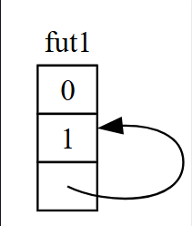
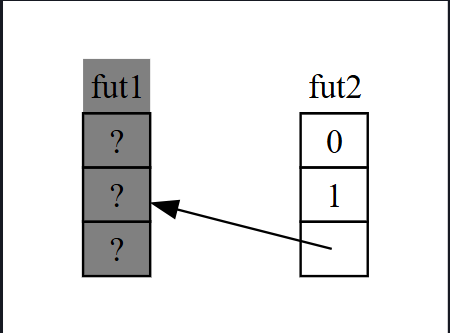
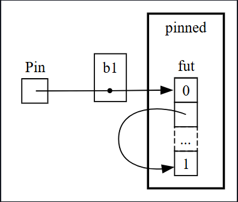
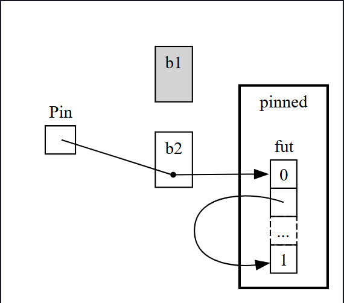
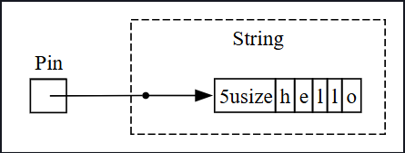
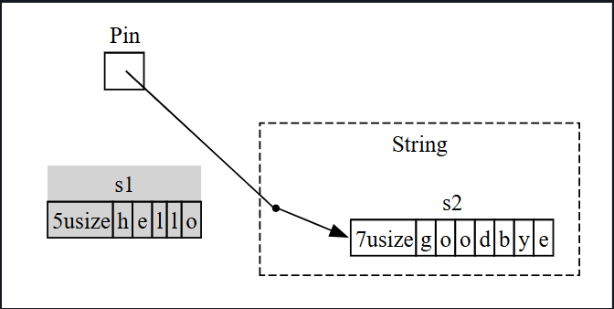

## 🔎 Asenkron Trait’lere Daha Yakından Bakış

Bu bölüm boyunca `Future`, `Pin`, `Unpin`, `Stream` ve `StreamExt` trait’lerini çeşitli şekillerde kullandık. Ancak şimdiye kadar bunların nasıl çalıştığına veya birbirleriyle nasıl ilişkilendiğine fazla girmedik. Çoğu zaman günlük Rust çalışmalarında buna gerek yoktur. Ama bazen bu detayları biraz daha bilmeniz gerekir. Bu bölümde, bu durumlarda işinize yarayacak kadar derinleşeceğiz; daha ayrıntılı kısımlar için ise başka belgeler bulunmaktadır.

---

## ⏳ Future Trait’i

Önce `Future` trait’inin nasıl çalıştığına daha yakından bakalım. Rust bunu şöyle tanımlar:

```rust
use std::pin::Pin;
use std::task::{Context, Poll};

pub trait Future {
    type Output;

    fn poll(self: Pin<&mut Self>, cx: &mut Context<'_>) -> Poll<Self::Output>;
}
```

Bu tanımda yeni türler ve alışılmadık bir sözdizimi görüyoruz. Gelin adım adım inceleyelim.

* `Future`’ın `Output` adlı ilişkili türü (associated type), future’un hangi değere çözümleneceğini belirtir. Bu, `Iterator` trait’inde bulunan `Item` türüne benzer.
* `Future` ayrıca `poll` metoduna sahiptir. Bu metot, `self` parametresi için özel bir `Pin` referansı ve bir `Context` tipine mutable referans alır, `Poll<Self::Output>` döndürür.

Önce dönüş tipine, yani `Poll`’a odaklanalım:

```rust
enum Poll<T> {
    Ready(T),
    Pending,
}
```

Bu `Poll` tipi, `Option`’a benzer: bir değeri olan `Ready(T)` varyantı vardır, bir de değeri olmayan `Pending` varyantı. Ama anlamı farklıdır!

* `Pending`, future’un hâlâ işi olduğu anlamına gelir, yani çağıranın daha sonra tekrar yoklaması gerekir.
* `Ready(T)`, future’un işini bitirdiğini ve değerin mevcut olduğunu gösterir.

Not: Çoğu future için `Ready` döndükten sonra `poll` tekrar çağrılmamalıdır. Böyle yapılırsa panic oluşabilir. Yeniden `poll` edilmeye güvenli olan future’lar, belgelerinde bunu açıkça belirtir. Bu, `Iterator::next` davranışına benzer.

---

## ⚙️ await ve poll İlişkisi

Kodda `await` gördüğünüzde, Rust bunu perde arkasında `poll` çağrısı yapan koda dönüştürür. Örneğin, Listing 17-4’te bir URL’nin sayfa başlığını yazdırırken Rust bunu aşağıdaki gibi bir şeye dönüştürür (tam olarak değil ama benzeri):

```rust
match page_title(url).poll() {
    Ready(page_title) => match page_title {
        Some(title) => println!("The title for {url} was {title}"),
        None => println!("{url} had no title"),
    }
    Pending => {
        // Ama burada ne yapılacak?
    }
}
```

Peki `Pending` dönerse ne yapmalıyız? Future hazır olana kadar tekrar tekrar denememiz gerekir. Yani bir döngüye ihtiyacımız vardır:

```rust
let mut page_title_fut = page_title(url);
loop {
    match page_title_fut.poll() {
        Ready(value) => match page_title {
            Some(title) => println!("The title for {url} was {title}"),
            None => println!("{url} had no title"),
        }
        Pending => {
            // devam et
        }
    }
}
```

Eğer Rust `await`’i tam olarak böyle derleseydi, her `await` engelleyici (blocking) olurdu — tam da istemediğimiz şey! Bunun yerine Rust, bu döngünün kontrolü başka future’lara devredebilmesini sağlar. İşte bu noktada devreye **async runtime** girer. Runtime’ın ana görevlerinden biri, future’ların çalışmasını planlamak ve koordine etmektir.

---

## 📩 Örnek: recv Çağrısı

Bölümün başlarında `rx.recv` üzerinde beklemeyi (await) anlatmıştık. `recv` çağrısı bir future döndürür ve bu future üzerinde beklemek, onu `poll` etmektir. Runtime, future hazır olana kadar onu bekletir: ya `Some(message)` döner ya da kanal kapandığında `None`.

`Future::poll` hakkında öğrendiklerimiz sayesinde bu işleyişi görebiliyoruz:

* Future `Poll::Pending` döndürdüğünde runtime onun hazır olmadığını anlar.
* Future `Poll::Ready(Some(message))` veya `Poll::Ready(None)` döndürdüğünde, runtime onun hazır olduğunu bilir ve ilerletir.

Bir runtime’ın bunu tam olarak nasıl yaptığı bu kitabın kapsamı dışındadır. Ama önemli olan şudur: **runtime, sorumlu olduğu future’ları yoklar (`poll`), future hazır değilse uykuya geri yatırır.**


## 📌 Pin ve Unpin Trait’leri

Listing 17-16’da pin kavramını tanıttığımızda, oldukça karmaşık bir hata mesajıyla karşılaşmıştık. İşte ilgili kısmı tekrar:

```
error[E0277]: `{async block@src/main.rs:10:23: 10:33}` cannot be unpinned
  --> src/main.rs:48:33
   |
48 |         trpl::join_all(futures).await;
   |                                 ^^^^^ the trait `Unpin` is not implemented for `{async block@src/main.rs:10:23: 10:33}`
   |
   = note: consider using the `pin!` macro
           consider using `Box::pin` if you need to access the pinned value outside of the current scope
   = note: required for `Box<{async block@src/main.rs:10:23: 10:33}>` to implement `Future`
note: required by a bound in `futures_util::future::join_all::JoinAll`
```

Bu hata mesajı, yalnızca future’ları pin’lememiz gerektiğini değil, aynı zamanda neden gerektiğini de söylüyor. `trpl::join_all` fonksiyonu `JoinAll` adında bir struct döndürür. Bu struct, `F` adında bir generic tür üzerinde tanımlıdır ve bu türün `Future` trait’ini uygulaması gerekir.

Bir future’u doğrudan `await` ile beklediğimizde, future otomatik olarak pin’lenir. Bu yüzden future’ları her yerde `pin!` ile sarmamız gerekmez.

Ama burada bir future’u doğrudan `await` etmiyoruz. Bunun yerine, `join_all` fonksiyonuna bir future koleksiyonu geçirip yeni bir `JoinAll` future’u oluşturuyoruz. `join_all`’un imzası, koleksiyondaki her öğenin `Future` trait’ini uygulamasını zorunlu kılar. `Box<T>`, yalnızca `T` bir future olup `Unpin` trait’ini uyguluyorsa `Future`’ı uygular.

Bu noktada işler karmaşıklaşıyor. Bunu anlamak için `Future` trait’inin nasıl çalıştığını biraz daha derinlemesine inceleyelim, özellikle de pin’leme etrafında.

---

## ⏳ Future Trait’inin Tanımı

```rust
use std::pin::Pin;
use std::task::{Context, Poll};

pub trait Future {
    type Output;

    // Gerekli metot
    fn poll(self: Pin<&mut Self>, cx: &mut Context<'_>) -> Poll<Self::Output>;
}
```

Burada `cx` parametresi ve `Context` türü, runtime’ın future’ları nasıl tembel bir şekilde kontrol ettiğinin anahtarıdır. Bunun detayları bu bölümün kapsamı dışında kalıyor; genelde yalnızca kendi `Future` implementasyonunuzu yazarken bunları düşünmeniz gerekir. Biz bunun yerine `self` parametresinin türüne odaklanalım.

`self` için tür açıklaması, diğer fonksiyon parametrelerindeki tür açıklamalarına benzer, ama iki önemli fark vardır:

1. Rust’a, metodun çağrılabilmesi için `self`’in hangi tür olması gerektiğini söyler.
2. Herhangi bir tür olamaz. Sadece metodun implement edildiği tipin kendisi, bu tipe referans ya da akıllı işaretçi (ör. `Box`, `Rc`) ya da bu referansı `Pin` ile sarmalanmış hali olabilir.

Daha fazla sözdizimi detayını 18. bölümde göreceğiz. Şimdilik bilmeniz gereken şu: Bir future’un hazır (Ready) mı yoksa beklemede (Pending) mi olduğunu anlamak için, türün `Pin` ile sarmalanmış mutable referansına ihtiyacımız vardır.

---

## 📦 Pin Nedir?

`Pin`, `&`, `&mut`, `Box`, `Rc` gibi işaretçi-benzeri türleri saran bir yapıdır. (Teknik olarak, `Deref` veya `DerefMut` trait’ini uygulayan türlerle çalışır, ama bu esasen yalnızca işaretçilerle çalışmaya eşdeğerdir.)

`Pin`, kendi başına bir işaretçi değildir ve `Rc` veya `Arc` gibi referans sayımı gibi özel bir davranışı yoktur. Sadece, derleyicinin işaretçi kullanımında belirli kısıtlamaları zorunlu kılabilmesi için kullanılan bir araçtır.

---

## 📍 Pin ve Unpin İlişkisi

`await`’in aslında `poll` çağrılarına dönüştüğünü hatırlamak, önceki hata mesajını açıklamaya başlıyor. Ama hata mesajında `Unpin` vardı, `Pin` değil. Peki `Pin` ile `Unpin` tam olarak nasıl ilişkilidir ve neden `Future::poll`, `self` için `Pin` türünü gerektirir?

Bu sorunun cevabı Rust’ın `async` blokları derlerken yaptığı şeyde saklıdır.

Bir future, `await` noktaları serisine dönüştürülürken derleyici, bu future’u bir durum makinesine (state machine) çevirir. Bu durum makinesi Rust’ın güvenlik kurallarına (borrowing, ownership) uymalıdır. Derleyici, bir `await` noktasından diğerine kadar hangi verilere ihtiyaç olduğunu belirler ve bu verilere erişimi sağlayan durum varyantlarını oluşturur.

Şimdiye kadar sorun yok: Eğer bir `async` blok içinde sahiplik ya da referanslarla ilgili hata yaparsak, borrow checker bize söyler. Ama bu future’u taşıdığımızda — örneğin, `join_all`’a geçirmek için bir `Vec` içine koyduğumuzda veya bir fonksiyondan döndürdüğümüzde — işler karmaşıklaşır.

Bir future’u taşımak, aslında derleyicinin oluşturduğu durum makinesini taşımaktır. Ve Rust’ın `async` bloklarından oluşturduğu future’lar, çoğu diğer türden farklı olarak, kendi içlerindeki varyant alanlarında kendilerine referans verebilir. Bunu, Şekil 17-4’teki basitleştirilmiş çizimde göreceğiz.



## 🌀 Şekil 17-4: Kendine Referans Veren Bir Veri Tipi

Varsayılan olarak, kendine referans veren herhangi bir nesnenin taşınması (move) güvenli değildir. Çünkü referanslar, her zaman işaret ettikleri şeyin **gerçek bellek adresini** gösterir (bkz. Şekil 17-5).

Eğer veri yapısını taşırsanız, içteki bu referanslar hâlâ **eski bellek konumunu** göstermeye devam eder. Ancak bu bellek konumu artık geçersizdir:

* Birincisi, bu yapıda değişiklik yaptığınızda eski bellek adresindeki değer güncellenmez.
* Daha da önemlisi, bilgisayar bu eski bellek alanını başka işler için yeniden kullanmakta özgürdür!

Sonuç olarak, daha sonra tamamen alakasız verileri okumanız söz konusu olabilir.




## ⚠️ Şekil 17-5: Kendine Referans Veren Bir Veri Tipini Taşımanın Güvensiz Sonucu

Teorik olarak, Rust derleyicisi bir nesne taşındığında (move) ona ait tüm referansları güncellemeyi deneyebilirdi. Ancak bu, özellikle karmaşık bir referans ağı söz konusu olduğunda, ciddi bir performans yükü getirirdi.

Bunun yerine, ilgili veri yapısının bellekte **taşınmadığından emin olabilsek**, referansların güncellenmesine gerek kalmazdı. Zaten Rust’ın borrow checker mekanizması da güvenli kodda bunu garanti eder: aktif bir referans varken herhangi bir nesnenin taşınmasına izin vermez.

**Pin** işte bu noktada devreye girer ve ihtiyacımız olan kesin garantiyi sağlar. Bir değere işaret eden bir işaretçiyi (`Box`, `&mut`, `Rc` gibi) `Pin` ile sardığımızda, artık o değer taşınamaz hale gelir. Yani elinizde `Pin<Box<SomeType>>` varsa, aslında pin’lenen şey `Box` işaretçisi değil, doğrudan içindeki `SomeType` değeridir.

Şekil 17-6 bu süreci görselleştirir.




## 📌 Şekil 17-6: Kendine Referans Veren Bir Future Türüne İşaret Eden `Box`’ı Pin’lemek

Aslında, `Box` işaretçisinin kendisi hâlâ serbestçe taşınabilir. Burada önemli olan, **nihayetinde referans verilen verinin bellekte sabit kalmasıdır**.

Eğer işaretçi (`Box`) hareket ederse ama işaret ettiği veri aynı yerde kalmaya devam ederse — Şekil 17-7’de olduğu gibi — ortada bir sorun yoktur.

(Bağımsız bir alıştırma olarak, ilgili türlerin dokümantasyonuna ve `std::pin` modülüne bakarak, `Pin`’in bir `Box`’ı nasıl sardığını kendiniz inceleyin.)

Buradaki kritik nokta şudur: **kendine referans veren türün kendisi hareket edemez**, çünkü pinlenmiş (pinned) durumdadır.




## 📦 Şekil 17-7: Kendine Referans Veren Bir Future Türüne İşaret Eden `Box`’ı Taşımak

Çoğu tür aslında **Pin** içinde olsa bile taşınması tamamen güvenlidir. Pin hakkında düşünmemiz yalnızca türlerin **içsel referansları** olduğunda gerekir.

* İlkel değerler (örn. sayılar, `bool`) güvenlidir, çünkü içlerinde referans tutmazlar.
* Rust’ta genellikle çalıştığımız türlerin çoğu da güvenlidir.
* Örneğin `Vec`’i (`Vec<String>` gibi) serbestçe taşıyabiliriz, çünkü içinde başka referans yoksa sorun olmaz.

Ancak şu ana kadar gördüklerimize dayanarak, eğer elimizde `Pin<Vec<String>>` varsa, **sadece Pin’in sağladığı güvenli ama kısıtlayıcı API’leri** kullanabilirdik. Halbuki `Vec<String>` her zaman güvenle taşınabilir.

İşte tam bu noktada **`Unpin`** devreye girer.

---

### 🔖 `Unpin` Özelliği

* `Unpin`, **işaretçi özelliği (marker trait)**’dir. Yani kendi başına herhangi bir fonksiyonellik sağlamaz.
* Bu özellik, derleyiciye bir türün **güvenli bir şekilde taşınabileceğini** söyler.
* Çoğu tür için Rust derleyicisi **`Unpin`’i otomatik olarak uygular**.

Tıpkı **`Send`** ve **`Sync`**’te olduğu gibi, özel bir durum vardır:
Eğer bir tür güvenli taşınabilirliğe sahip değilse, derleyici **`impl !Unpin for SomeType`** yazar.

* `!Unpin`, yani “Unpin uygulanmıyor”, bu türün Pin içinde sabit kalması gerektiğini belirtir.

---

### 📌 Pin ve Unpin İlişkisi

1. **`Unpin` normal durumdur**, `!Unpin` özel durumdur.
2. Bir türün `Unpin` veya `!Unpin` olup olmaması, **yalnızca Pin ile kullanıldığında önemlidir** (örn. `Pin<&mut SomeType>`).

---

### 📝 Örnek: `String`

`String`, uzunluk (`len`) ve onu oluşturan Unicode karakterlerinden oluşur.

* Bir `String`’i `Pin` içine sarabiliriz (`Pin<String>`).
* Ama `String` otomatik olarak `Unpin` uygular.
* Dolayısıyla `String`’i güvenle taşıyabiliriz; Pin, burada aslında ekstra bir güvenlik getirmez.

---

👉 İstersen sana **Şekil 17-8’deki `String` örneğini** de açıklayayım mı?




## 📝 Şekil 17-8: Bir `String`’i Pin’lemek

Kesikli çizgi, `String` türünün **`Unpin` trait**’ini uyguladığını ve bu nedenle gerçekten pinlenmediğini gösterir.

Bunun sonucu olarak, `String` **eğer `!Unpin` olsaydı yasak olacak** şeyleri yapabiliriz.

Örneğin:

* Bellekte aynı konumda bulunan bir `String`’i başka bir `String` ile değiştirmek mümkündür (Şekil 17-9’da gösterildiği gibi).

Bu işlem **Pin sözleşmesini (Pin contract)** ihlal etmez, çünkü `String` içinde onu taşımayı güvensiz kılacak **içsel referanslar yoktur**.
İşte tam da bu nedenle `String`, `!Unpin` yerine **`Unpin`** uygular.




## 🔄 Figure 17-9: Bir `String`’in tamamen farklı bir `String` ile bellekte değiştirilmesi

Artık, **Listing 17-17**’deki `join_all` çağrısında neden hata aldığımızı anlayacak kadar bilgiye sahibiz.
Başta, `async` bloklardan üretilen `Future`’ları bir `Vec<Box<dyn Future<Output = ()>>>` içine taşımayı denedik.

Ama gördüğümüz gibi, bu `Future`’ların **içsel referansları olabilir**, bu nedenle `Unpin` uygulamazlar.
Bu yüzden:

* Önce `Future`’ları **pinlememiz gerekir**,
* Sonrasında bunları `Pin` türü olarak `Vec` içine koyabiliriz.

Böylece, `Future`’ların altında yatan verinin **taşınmayacağını garanti etmiş oluruz**.

`Pin` ve `Unpin`, çoğunlukla **düşük seviyeli kütüphaneler** ya da doğrudan **runtime geliştirme** yaparken önemlidir. Günlük Rust kodlarında çok sık düşünmeniz gerekmez. Ama bu trait’leri hata mesajlarında gördüğünüzde artık hatayı nasıl düzelteceğinizi daha iyi bileceksiniz.

Not: `Pin` ve `Unpin` kombinasyonu, Rust’ta **öz-referanslı (self-referential)** yapıları güvenli şekilde uygulamayı mümkün kılar. Pin gerektiren türler, en çok **async Rust** içinde karşımıza çıkar, ama nadiren de olsa başka bağlamlarda da görülebilir.

📚 Daha fazla ayrıntı için:

* `std::pin` API dokümantasyonu
* *Asynchronous Programming in Rust* kitabının 2. ve 4. bölümleri

---

## ⏩ Stream Trait

Artık `Future`, `Pin` ve `Unpin`’i kavradığımıza göre, şimdi sırada **Stream trait** var.

Hatırlarsan, **stream**’ler asenkron iteratörlere benzer. Ama `Iterator` ve `Future`’dan farklı olarak, `Stream` henüz **standart kütüphane**de tanımlı değil. Bunun yerine, ekosistemde en yaygın kullanılan tanım `futures` crate’inde mevcut.

Önce `Iterator` ve `Future` tanımlarını tekrar hatırlayalım:

* `Iterator::next` → bize `Option<Self::Item>` döner → bir **dizi/ardışık eleman** fikrini temsil eder.
* `Future::poll` → bize `Poll<Self::Output>` döner → bir **zaman içinde hazır olma** fikrini temsil eder.

Bu ikisini birleştirerek, zaman içinde hazır hale gelen bir **öğe dizisi** tanımlamak için `Stream` trait’i şöyle yazılabilir:

```rust
use std::pin::Pin;
use std::task::{Context, Poll};

trait Stream {
    type Item;

    fn poll_next(
        self: Pin<&mut Self>,
        cx: &mut Context<'_>
    ) -> Poll<Option<Self::Item>>;
}
```

📌 Açıklamalar:

* `type Item;` → stream’in üreteceği eleman türü.
* `Poll<Option<Self::Item>>` →

  * Dıştaki `Poll` → geleceğe hazır mı (Pending / Ready)?
  * İçteki `Option` → hâlâ yeni eleman var mı (`Some`) yoksa stream bitti mi (`None`)?

---

## 🔧 StreamExt Trait

Ama biz örneklerde `poll_next` kullanmadık; onun yerine `next` ve `StreamExt` kullandık.

Neden? Çünkü `poll_next` ile çalışmak demek, elle stream state machine yazmak olurdu (tıpkı `Future::poll` ile doğrudan çalışmak gibi). Bunun yerine, `await` daha güzel bir soyutlama sağlıyor.

`StreamExt` trait işte bu kolaylığı sağlıyor:

```rust
trait StreamExt: Stream {
    async fn next(&mut self) -> Option<Self::Item>
    where
        Self: Unpin;

    // diğer yardımcı metodlar...
}
```

> Not: Rust’ın önceki sürümlerinde trait içi `async fn` desteklenmediği için tanım biraz farklı görünür.
> Orada `next` fonksiyonu, `Future` döndüren bir `Next<'_, Self>` struct’ı kullanır.

⚡ Önemli nokta:

* `StreamExt`, **her `Stream` için otomatik uygulanır**.
* Böylece, kendi `Stream` türünü yazsan bile, kullanıcılar `StreamExt` metodlarını doğrudan kullanabilir.
* Örneğin `next()`, `timeout()`, `merge()`, `throttle()` gibi tüm pratik yardımcı metodlar buradan gelir.

---

👉 Şimdi sana sorayım: İstersen `Stream` ve `StreamExt`’in nasıl çalıştığını **küçük bir kendi stream implementasyonu** yazarak (örneğin sayaç stream’i) göstereyim mi?
