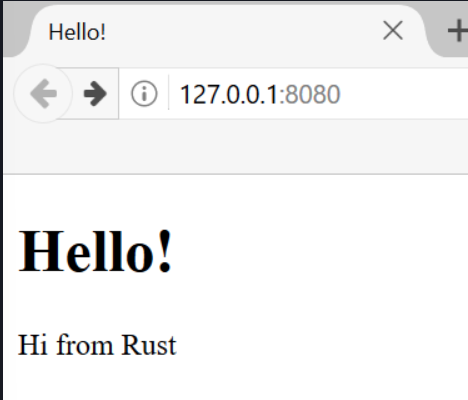

## 🧵🌐 Final Proje: Çok İş Parçacıklı Bir Web Sunucusu (web server) Oluşturma

Uzun bir yolculuk oldu, ancak kitabın sonuna ulaştık. Bu bölümde, son bölümlerde ele aldığımız bazı kavramları göstermek ve önceki dersleri özetlemek için birlikte bir proje daha inşa edeceğiz.

Son projemizde, bir web tarayıcısında Şekil 21-1’e benzeyen ve “hello” diyen bir web sunucusu (web server) yapacağız.

hello from rust

Şekil 21-1: Ortak final projemiz

İşte web sunucusunu oluşturmak için planımız:

* TCP ve HTTP hakkında biraz bilgi edinmek.
* Bir soket (socket) üzerinden TCP bağlantılarını dinlemek.
* Az sayıda HTTP isteğini (HTTP request) ayrıştırmak.
* Uygun bir HTTP yanıtı (HTTP response) oluşturmak.
* Sunucumuzun verimliliğini bir iş parçacığı havuzuyla (thread pool) artırmak.

Başlamadan önce iki ayrıntıdan bahsetmeliyiz. İlk olarak, kullanacağımız yöntem Rust ile bir web sunucusu oluşturmanın en iyi yolu olmayacaktır. Topluluk üyeleri, crates.io’da bulabileceğiniz ve bu bölümde oluşturacağımızdan daha kapsamlı web sunucusu ve iş parçacığı havuzu uygulamaları sağlayan birçok üretim için hazır (production-ready) paket (crate) yayımladı. Ancak, bu bölümdeki amacımız kolay yolu seçmek değil, öğrenmenize yardımcı olmaktır. Rust bir sistem programlama dili (systems programming language) olduğundan, çalışmak istediğimiz soyutlama (abstraction) düzeyini seçebilir ve diğer dillerde mümkün olandan daha düşük bir düzeye inebiliriz.

İkinci olarak, burada async ve await’i (async and await) kullanmayacağız. Bir iş parçacığı havuzu oluşturmak, bir async çalışma zamanı (runtime) oluşturmadan bile başlı başına yeterince büyük bir meydan okumadır! Yine de, bu bölümde göreceğimiz bazı sorunlara async ve await’in nasıl uygulanabileceğine değineceğiz. Sonuçta, Bölüm 17’de belirttiğimiz gibi, birçok async çalışma zamanı (runtime) çalışmalarını yönetmek için iş parçacığı havuzları (thread pools) kullanır.

Bu nedenle, ileride kullanabileceğiniz paketlerin (crates) arkasındaki genel fikirleri ve teknikleri öğrenebilmeniz için temel HTTP sunucusunu ve iş parçacığı havuzunu (thread pool) elle yazacağız.
