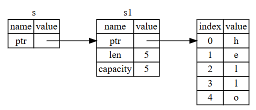

## 🔗 Referanslar ve Ödünç Alma (references and borrowing)

Listing 4-5’teki tuple (demet) kodundaki sorun, `String` değerini `calculate_length` fonksiyonuna gönderdikten sonra da onu kullanabilmek için `String`’i çağıran fonksiyona geri döndürmek zorunda olmamızdır, çünkü `String` değeri `calculate_length` içine taşınmıştır (move). Bunun yerine, `String` değerine bir **referans (reference)** sağlayabiliriz.

Bir referans, bir pointer (işaretçi) gibidir; çünkü o da bellekteki bir adrese işaret eder ve o adresteki veriye erişmemizi sağlar. Ancak, o veri başka bir değişkene aittir. Pointer’dan farklı olarak, bir referans, o referansın ömrü boyunca her zaman belirli bir türün geçerli (valid) bir değerine işaret edeceği garantisini verir.

Aşağıda, değerin sahipliğini almak yerine bir nesneye referans parametre olarak alan ve kullanan `calculate_length` fonksiyonunun nasıl tanımlanacağı ve kullanılacağı gösterilmektedir:

**Filename: src/main.rs**

```rust
fn main() {
    let s1 = String::from("hello");

    let len = calculate_length(&s1);

    println!("The length of '{s1}' is {len}.");
}

fn calculate_length(s: &String) -> usize {
    s.len()
}
```

👉 Bu örnekte, `s1` değişkeni `calculate_length` fonksiyonuna `&s1` şeklinde **referans** olarak aktarılır. Fonksiyon tanımında da `String` yerine `&String` kullanılır.

Öncelikle dikkat edin ki, değişken tanımlamasındaki tuple (demet) kodu ve fonksiyonun dönüş değeri artık yoktur. Ayrıca, `calculate_length` fonksiyonuna `&s1` gönderiyoruz ve fonksiyonun tanımında `String` yerine `&String` alıyoruz. Buradaki `&` işaretleri referansları temsil eder ve bir değere onun sahipliğini almadan erişmemizi sağlar.

Şekil 4-6 bu kavramı göstermektedir.



## 📊 Şekil 4-6: \&String s’nin String s1’e işaret etmesi diyagramı

Not: `&` kullanarak referans vermenin (referencing) tersi **dereferanslama (dereferencing)** işlemidir ve bu, `*` dereferans operatörü ile yapılır. Dereferans operatörünün bazı kullanımlarını Bölüm 8’de göreceğiz ve ayrıntılarını Bölüm 15’te tartışacağız.

Şimdi buradaki fonksiyon çağrısına biraz daha yakından bakalım:

```rust
let s1 = String::from("hello");

let len = calculate_length(&s1);
```

`&s1` sözdizimi, `s1`’in değerine işaret eden fakat ona sahip olmayan bir referans oluşturur. Referans sahip olmadığı için, referans kullanım dışı kaldığında işaret ettiği değer düşürülmez (drop edilmez).

Aynı şekilde, fonksiyon imzası `&` kullanarak parametre `s`’nin bir referans olduğunu belirtir. Hadi bazı açıklayıcı notlar ekleyelim:

```rust
fn calculate_length(s: &String) -> usize { // s bir String referansıdır
    s.len()
} // Burada, s scope dışına çıkar. Ancak s, işaret ettiği değerin sahipliğine
  // sahip olmadığı için String düşürülmez.
```

Değişken `s`’nin geçerli olduğu scope, herhangi bir fonksiyon parametresinin scope’u ile aynıdır; fakat `s` sadece bir referans olduğu için işaret ettiği değer, `s` kullanımdan çıktığında düşürülmez. Fonksiyonlar parametre olarak değerlerin kendisi yerine referans aldığında, sahipliği geri vermek için değerleri döndürmemize gerek kalmaz; çünkü zaten sahipliği hiç almamışızdır.

Bir referans oluşturma işlemine **ödünç alma (borrowing)** denir. Gerçek hayatta olduğu gibi, eğer bir kişi bir şeye sahipse, onu ödünç alabilirsiniz. İşiniz bittiğinde geri vermeniz gerekir. Siz ona sahip olmazsınız.

Peki, ödünç aldığımız bir şeyi değiştirmeye çalışırsak ne olur? Listing 4-6’daki kodu deneyelim. Sürpriz: Çalışmıyor!

**Filename: src/main.rs**
**Bu kod derlenmez!**

```rust
fn main() {
    let s = String::from("hello");

    change(&s);
}

fn change(some_string: &String) {
    some_string.push_str(", world");
}
```

👉 Bu kodda, `change` fonksiyonuna `&String` referansı gönderiyoruz ve `push_str` ile değiştirmeye çalışıyoruz. Ancak bu mümkün değildir.

**Listing 4-6: Ödünç alınmış bir değeri değiştirmeye çalışma**

İşte hata çıktısı:

```
$ cargo run
   Compiling ownership v0.1.0 (file:///projects/ownership)
error[E0596]: cannot borrow `*some_string` as mutable, as it is behind a `&` reference
 --> src/main.rs:8:5
  |
8 |     some_string.push_str(", world");
  |     ^^^^^^^^^^^ `some_string` is a `&` reference, so the data it refers to cannot be borrowed as mutable
  |
help: consider changing this to be a mutable reference
  |
7 | fn change(some_string: &mut String) {
  |                         +++
```

```
For more information about this error, try `rustc --explain E0596`.
error: could not compile `ownership` (bin "ownership") due to 1 previous error
```

Değişkenler varsayılan olarak nasıl **değiştirilemez (immutable)** ise, referanslar da varsayılan olarak öyledir. Yani, sahip olmadığımız bir referans üzerinden değeri değiştirmemize izin verilmez.

## 🔄 Değiştirilebilir Referanslar (mutable references)

Listing 4-6’daki kodu, ödünç alınmış bir değeri değiştirmemize izin verecek şekilde yalnızca birkaç küçük ayarla düzeltebiliriz; bunun yerine **değiştirilebilir referans (mutable reference)** kullanırız:

**Filename: src/main.rs**

```rust
fn main() {
    let mut s = String::from("hello");

    change(&mut s);
}

fn change(some_string: &mut String) {
    some_string.push_str(", world");
}
```

Önce `s`’yi `mut` olacak şekilde değiştiriyoruz. Ardından `change` fonksiyonunu çağırdığımız yerde `&mut s` ile bir **değiştirilebilir referans (mutable reference)** oluşturuyor ve fonksiyon imzasını (signature) `some_string: &mut String` olacak şekilde, değiştirilebilir bir referans kabul edecek biçimde güncelliyoruz. Bu, `change` fonksiyonunun ödünç aldığı değeri değiştireceğini çok net biçimde ortaya koyar.

Değiştirilebilir referansların büyük bir kısıtlaması vardır: Bir değere değiştirilebilir bir referansınız (mutable reference) varsa, o değere başka hiçbir referansa sahip olamazsınız. Aşağıda `s` için iki değiştirilebilir referans oluşturmaya çalışan kod başarısız olacaktır:

**Filename: src/main.rs**
**Bu kod derlenmez!**

```rust
    let mut s = String::from("hello");

    let r1 = &mut s;
    let r2 = &mut s;

    println!("{r1}, {r2}");
```

İşte hata:

```
$ cargo run
   Compiling ownership v0.1.0 (file:///projects/ownership)
error[E0499]: cannot borrow `s` as mutable more than once at a time
 --> src/main.rs:5:14
  |
4 |     let r1 = &mut s;
  |              ------ first mutable borrow occurs here
5 |     let r2 = &mut s;
  |              ^^^^^^ second mutable borrow occurs here
6 |
7 |     println!("{r1}, {r2}");
  |               ---- first borrow later used here

For more information about this error, try `rustc --explain E0499`.
error: could not compile `ownership` (bin "ownership") due to 1 previous error
```

Bu hata, aynı anda birden fazla kez `s`’yi değiştirilebilir olarak ödünç alamayacağımız için bu kodun geçersiz olduğunu söyler. İlk değiştirilebilir ödünç alma `r1`’dedir ve `println!` içinde kullanılana kadar sürmelidir; ancak bu değiştirilebilir referansın oluşturulması ile onun kullanımı arasında, aynı veriyi `r1` gibi ödünç alan başka bir değiştirilebilir referansı `r2`’de oluşturmaya çalıştık.

Aynı anda aynı veriye birden fazla değiştirilebilir referansı engelleyen bu kısıtlama, değişikliğe izin verir fakat bunu çok kontrollü bir şekilde yapar. Bu durum, çoğu dilde istediğiniz zaman değişiklik yapabildiğiniz için yeni Rustacean’ların zorlandığı bir noktadır. Bu kısıtlamanın faydası, Rust’ın **veri yarışı (data race)**’nı derleme zamanında (compile time) engelleyebilmesidir. Bir veri yarışı, **yarış durumu (race condition)**’na benzer ve şu üç davranış gerçekleştiğinde olur:

* İki veya daha fazla işaretçi (pointer) aynı anda aynı veriye erişir.
* İşaretçilerden en az biri veriye yazmak için kullanılır.
* Veriye erişimi eşzamanlamak (synchronize) için herhangi bir mekanizma kullanılmamaktadır.

Veri yarışları tanımsız davranışa (undefined behavior) yol açar ve çalışma zamanında (runtime) peşine düşüp düzeltmeye çalıştığınızda teşhis edilmesi zor olabilir; Rust bu sorunu, veri yarışı içeren kodu derlemeyi reddederek engeller!

Her zamanki gibi, süslü parantezleri kullanarak yeni bir **kapsam (scope)** oluşturabilir, böylece birden çok değiştirilebilir referansa izin verebiliriz; ancak bunlar eşzamanlı (simultaneous) olmayacaktır:

```rust
    let mut s = String::from("hello");

    {
        let r1 = &mut s;
    } // r1 burada kapsamdan çıkar, bu yüzden yeni bir referans oluşturmakta sorun yoktur.

    let r2 = &mut s;
```

Rust, değiştirilebilir ve değiştirilemez referansları (immutable references) birleştirme konusunda da benzer bir kural uygular. Aşağıdaki kod bir hatayla sonuçlanır:

**Bu kod derlenmez!**

```rust
    let mut s = String::from("hello");

    let r1 = &s; // sorun yok
    let r2 = &s; // sorun yok
    let r3 = &mut s; // BÜYÜK SORUN

    println!("{r1}, {r2}, and {r3}");
```

İşte hata:

```
$ cargo run
   Compiling ownership v0.1.0 (file:///projects/ownership)
error[E0502]: cannot borrow `s` as mutable because it is also borrowed as immutable
 --> src/main.rs:6:14
  |
4 |     let r1 = &s; // no problem
  |              -- immutable borrow occurs here
5 |     let r2 = &s; // no problem
6 |     let r3 = &mut s; // BIG PROBLEM
  |              ^^^^^^ mutable borrow occurs here
7 |
8 |     println!("{r1}, {r2}, and {r3}");
  |               ---- immutable borrow later used here

For more information about this error, try `rustc --explain E0502`.
error: could not compile `ownership` (bin "ownership") due to 1 previous error
```

Vay canına! Aynı değere ilişkin değiştirilemez bir referansımız (immutable reference) varken, değiştirilebilir bir referansa sahip olamayız.

Değiştirilemez bir referansın kullanıcıları, değerin bir anda ellerinden kayıp değişmesini beklemezler! Ancak, birden çok değiştirilemez referansına izin verilir; çünkü yalnızca veriyi okuyan hiç kimse başkalarının okumasını etkileyemez.

Bir referansın kapsamının (scope) nerede tanıtıldığı yerden başlayıp, o referansın son kez kullanıldığı ana kadar devam ettiğine dikkat edin. Örneğin, aşağıdaki kod derlenir; çünkü değiştirilemez referansların son kullanımı `println!` içindedir ve bu kullanım, değiştirilebilir referansın tanıtılmasından öncedir:

```rust
    let mut s = String::from("hello");

    let r1 = &s; // sorun yok
    let r2 = &s; // sorun yok
    println!("{r1} and {r2}");
    // r1 ve r2 değişkenleri bu noktadan sonra kullanılmayacaktır.

    let r3 = &mut s; // sorun yok
    println!("{r3}");
```

Değiştirilemez referanslar `r1` ve `r2`’nin kapsamları, son kez kullanıldıkları `println!` satırından sonra sona erer; bu da değiştirilebilir referans `r3` oluşturulmadan öncedir. Bu kapsamlar çakışmaz, bu yüzden bu koda izin verilir: derleyici, referansın kapsamın sonundan önce artık kullanılmadığını anlayabilir.

Ödünç alma (borrowing) hataları zaman zaman can sıkıcı olsa da, bunun Rust derleyicisinin olası bir hatayı erken (çalışma zamanı yerine derleme zamanında) işaret etmesi ve sorunun tam yerini göstermesi olduğunu unutmayın. Böylece verinizin neden beklediğiniz gibi olmadığını sonradan iz sürerek bulmak zorunda kalmazsınız.


## ⚠️ Asılı (Dangling) Referanslar

İşaretçilerin (pointers) bulunduğu dillerde, yanlışlıkla **asılı işaretçi (dangling pointer)** oluşturmak kolaydır. Bu, bellekte bir konuma işaret eden fakat o bellek başka birine verilmiş olabilecek bir işaretçidir; yani belleği serbest bırakırken (free) o belleğe işaret eden işaretçi korunur. Rust’ta ise bunun tam tersi geçerlidir: Derleyici, referansların asla asılı olmayacağını garanti eder. Eğer bir veriye referansınız varsa, derleyici o verinin, referansın scope’u bitmeden scope dışına çıkmayacağını garanti eder.

Hadi, Rust’ın bunu nasıl derleme zamanı hatasıyla engellediğini görmek için bir asılı referans oluşturmaya çalışalım:

**Filename: src/main.rs**
**Bu kod derlenmez!**

```rust
fn main() {
    let reference_to_nothing = dangle();
}

fn dangle() -> &String {
    let s = String::from("hello");

    &s
}
```

İşte hata çıktısı:

```
$ cargo run
   Compiling ownership v0.1.0 (file:///projects/ownership)
error[E0106]: missing lifetime specifier
 --> src/main.rs:5:16
  |
5 | fn dangle() -> &String {
  |                ^ expected named lifetime parameter
  |
  = help: this function's return type contains a borrowed value, but there is no value for it to be borrowed from
help: consider using the `'static` lifetime, but this is uncommon unless you're returning a borrowed value from a `const` or a `static`
  |
5 | fn dangle() -> &'static String {
  |                 +++++++
help: instead, you are more likely to want to return an owned value
  |
5 - fn dangle() -> &String {
5 + fn dangle() -> String {
  |

error[E0515]: cannot return reference to local variable `s`
 --> src/main.rs:8:5
  |
8 |     &s
  |     ^^ returns a reference to data owned by the current function

Some errors have detailed explanations: E0106, E0515.
For more information about an error, try `rustc --explain E0106`.
error: could not compile `ownership` (bin "ownership") due to 2 previous errors
```

Bu hata mesajı, henüz ele almadığımız bir özelliğe işaret eder: **ömürler (lifetimes)**. Bu konuyu Bölüm 10’da ayrıntılı olarak tartışacağız. Fakat ömürlerle ilgili kısımları göz ardı edersek, mesajın neden bu kodun sorunlu olduğuna dair kilit bilgiyi verdiğini görebiliriz:

```
this function's return type contains a borrowed value, but there is no value
for it to be borrowed from
```

Şimdi, `dangle` kodumuzun her aşamasında tam olarak neler olduğuna bakalım:

**Filename: src/main.rs**
**Bu kod derlenmez!**

```rust
fn dangle() -> &String { // dangle bir String referansı döndürür

    let s = String::from("hello"); // s yeni bir String’dir

    &s // String s’ye bir referans döndürmeye çalışıyoruz
} // Burada, s scope dışına çıkar ve düşürülür (drop edilir),
  // yani belleği serbest bırakılır. Tehlike!
```

Çünkü `s` `dangle` içinde oluşturulmuştur; `dangle` fonksiyonunun kodu tamamlandığında `s` serbest bırakılır. Fakat biz ona bir referans döndürmeye çalıştık. Bu, geçersiz bir `String`’e işaret eden bir referans olurdu. Bu kabul edilemez! Rust buna izin vermez.

Buradaki çözüm, `String`’i doğrudan döndürmektir:

```rust
fn no_dangle() -> String {
    let s = String::from("hello");

    s
}
```

Bu hiçbir sorun olmadan çalışır. Sahiplik (ownership) dışarıya taşınır ve hiçbir şey serbest bırakılmaz.

---

## 📜 Referansların Kuralları (rules of references)

Özetle, referanslar hakkında şunları konuştuk:

* Aynı anda ya **bir değiştirilebilir referansa** ya da **sınırsız sayıda değiştirilemez referansa** sahip olabilirsiniz.
* Referanslar her zaman **geçerli (valid)** olmalıdır.

Bir sonraki bölümde, farklı bir referans türüne bakacağız: **dilimler (slices)**.
