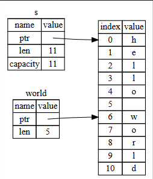

## 🧩 Dilim Türü (slice type)

Dilimler (slice), bir koleksiyondaki ardışık elemanların bir kısmına başvuru yapmanıza izin verir. Bir dilim bir çeşit referanstır (reference), bu nedenle sahiplik (ownership) içermez.

Küçük bir programlama problemi: Boşluklarla ayrılmış kelimelerden oluşan bir dize (string) alan ve bu dizide bulduğu ilk kelimeyi döndüren bir fonksiyon yazın. Eğer fonksiyon dizide boşluk bulamazsa, tüm dize tek bir kelime olacağından, tüm dizenin döndürülmesi gerekir.

Not: Dize dilimlerini (string slices) tanıtmak amacıyla, bu bölümde yalnızca ASCII varsayılmaktadır; UTF-8 işlemenin daha kapsamlı tartışması 8. bölümdeki “UTF-8 Kodlu Metinleri String’lerde Saklamak” başlıklı bölümde yer almaktadır.

Şimdi, dilimleri kullanmadan bu fonksiyonun imzasını nasıl yazacağımızı görelim; böylece dilimlerin çözüm getireceği problemi anlayalım:

```rust
fn first_word(s: &String) -> ?
```

`first_word` fonksiyonu, `&String` türünde bir parametreye sahiptir. Sahipliğe ihtiyacımız yok, bu nedenle bu yeterlidir. (Rust’ta yerleşik kullanımda (idiomatic Rust), fonksiyonlar yalnızca ihtiyaç duyduklarında argümanlarının sahipliğini alır; bu nedenin açıkça görüleceği noktaya ileride geleceğiz.) Peki ama ne döndürmeliyiz? Gerçekten bir dizenin yalnızca bir parçasından bahsetmenin bir yolu yok. Ancak, kelimenin bittiği yeri belirten bir indeks döndürebiliriz; bu da boşluk karakteriyle gösterilebilir. Bunu deneyelim; 4-7 numaralı listede gösterildiği gibi:

### 📂 Dosya adı: src/main.rs

```rust
fn first_word(s: &String) -> usize {
    let bytes = s.as_bytes();

    for (i, &item) in bytes.iter().enumerate() {
        if item == b' ' {
            return i;
        }
    }

    s.len()
}
```

Liste 4-7: `String` parametresindeki bayt (byte) indeksini döndüren `first_word` fonksiyonu
## 🔎 Neden Bayt Dizisine Çeviriyoruz?

Dizedeki (`String`) her elemanı tek tek kontrol etmemiz ve değerinin boşluk (space) olup olmadığını görmemiz gerektiğinden, `as_bytes` metodu ile `String`’i bayt dizisine (array of bytes) çeviriyoruz:

```rust
let bytes = s.as_bytes();
```

Sonrasında, `iter` metodu ile bayt dizisi üzerinde bir yineleyici (iterator) oluşturuyoruz:

```rust
for (i, &item) in bytes.iter().enumerate() {
```

Yineleyiciler (iterators) hakkında daha detaylı bilgiyi 13. bölümde göreceğiz. Şimdilik bilmemiz gereken şey, `iter` metodunun koleksiyondaki her bir elemanı döndürdüğü ve `enumerate` fonksiyonunun `iter` sonucunu sararak her elemanı bir tuple (ikili) olarak döndürdüğüdür. Bu tuple’ın ilk elemanı indeks (index), ikinci elemanı ise o elemana bir referanstır (reference). Bu yöntem, indeksi kendimiz hesaplamaktan daha pratiktir.

`enumerate` metodu bir tuple döndürdüğünden, bu tuple’ı yapı desenleri (pattern) kullanarak parçalayabiliriz (destructure). Yapı desenlerini 6. bölümde daha ayrıntılı inceleyeceğiz. Döngüde (for loop) kullandığımız desen şudur: tuple’daki indeks için `i`, tek bir bayt için ise `&item`. Çünkü `.iter().enumerate()` bize elemana bir referans verdiğinden, desende `&` kullanmamız gerekir.

Döngünün içinde, bayt literal (byte literal) sözdizimini kullanarak boşluğu temsil eden baytı arıyoruz. Eğer boşluk bulursak, pozisyonunu döndürüyoruz. Bulamazsak, dizenin uzunluğunu `s.len()` ile döndürüyoruz:

```rust
if item == b' ' {
    return i;
}
}

s.len()
```

Bu şekilde, dizenin ilk kelimesinin bittiği indeksi bulabiliyoruz. Ancak bir problem var: Biz sadece `usize` türünde bir sayı döndürüyoruz ve bu sayı yalnızca `&String` bağlamında anlamlı. Başka bir deyişle, bu değer `String`’den ayrı olduğu için gelecekte hâlâ geçerli olacağının garantisi yoktur.

Liste 4-7’deki `first_word` fonksiyonunu kullanan Liste 4-8’deki programı düşünelim.
## 📂 Dosya adı: src/main.rs

```rust
fn main() {
    let mut s = String::from("hello world");

    let word = first_word(&s); // word değişkeni 5 değerini alır

    s.clear(); // bu, String içeriğini temizler, "" yapar

    // word burada hâlâ 5 değerine sahip, ancak s artık word ile anlamlı bir
    // şekilde kullanılabilecek bir içerik taşımıyor, bu nedenle word tamamen geçersiz!
}
```

Liste 4-8: `first_word` fonksiyonunun sonucunu kaydettikten sonra `String` içeriğini değiştirme

---

Bu program hatasız bir şekilde derlenir ve hatta `s.clear()` çağrısından sonra `word` değişkenini kullansak bile çalışmaya devam eder. Çünkü `word`, `s`’in durumuyla hiçbir şekilde bağlantılı değildir ve hâlâ 5 değerini tutmaktadır. Ancak biz bu 5 değerini `s` değişkeni ile birlikte kullanarak ilk kelimeyi çıkarmaya çalışırsak, bu bir hata olur. Çünkü 5 değerini `word`’a kaydettiğimiz andan itibaren `s`’in içeriği değişmiştir.

`word` içindeki indeksin `s` içindeki verilerle uyumunu kaybetmesiyle uğraşmak zahmetlidir ve hata yapmaya çok açıktır! Eğer bir de `second_word` fonksiyonu yazmak isteseydik, işler daha da kırılgan hale gelirdi. Fonksiyonun imzası şöyle görünmek zorunda olurdu:

```rust
fn second_word(s: &String) -> (usize, usize) {
```

Artık bir başlangıç ve bir bitiş indeksi takip etmemiz gerekir ve bu da belirli bir durumdaki verilerden hesaplanan, ancak o duruma bağlı olmayan daha fazla değerin ortaya çıkmasına neden olur. Böylece birbiriyle ilişkisi olmayan üç değişkeni senkronize halde tutmak zorunda kalırız.

Neyse ki, Rust’ın bu probleme bir çözümü vardır: dize dilimleri (string slices).

## ✂️ Dize Dilimleri (string slices)
## ✂️ Dize Dilimleri (string slices)

Bir dize dilimi (string slice), bir `String`’in ardışık elemanlarının bir kısmına referanstır (reference) ve şu şekilde görünür:

```rust
let s = String::from("hello world");

let hello = &s[0..5];
let world = &s[6..11];
```

Burada, tüm `String`’e bir referans yerine, `hello` değişkeni `String`’in yalnızca bir bölümüne referanstır; bu da eklenen `[0..5]` kısmı ile belirtilmiştir.

Dilimleri, köşeli parantezler içinde `[starting_index..ending_index]` aralığını belirterek oluştururuz. Burada `starting_index` dilimin başladığı ilk pozisyonu, `ending_index` ise dilimin son pozisyonunun bir fazlasını temsil eder.

İçsel olarak, dilim veri yapısı başlangıç pozisyonunu ve dilimin uzunluğunu saklar; bu uzunluk, `ending_index - starting_index` işlemine karşılık gelir. Örneğin:

```rust
let world = &s[6..11];
```

Bu durumda, `world` değişkeni `s`’in 6. baytındaki (index 6) işaretçiyi ve uzunluğu 5 olan bir dilimi içerir.

Şekil 4-7 bunu bir diyagramda göstermektedir.



## 📐 Şekil 4-7: Bir `String`’in bir bölümüne referans veren dize dilimi

Rust’ın `..` aralık (range) sözdizimi ile, eğer dilimi indeks `0`’dan başlatmak istiyorsanız, iki noktanın (`..`) öncesindeki değeri bırakabilirsiniz. Başka bir deyişle, şu iki ifade eşittir:

```rust
let s = String::from("hello");

let slice = &s[0..2];
let slice = &s[..2];
```

Aynı şekilde, eğer diliminiz `String`’in son baytını içeriyorsa, sondaki sayıyı bırakabilirsiniz. Yani şu iki ifade eşittir:

```rust
let s = String::from("hello");

let len = s.len();

let slice = &s[3..len];
let slice = &s[3..];
```

Her iki değeri de bırakarak tüm dizenin dilimini alabilirsiniz. Yani şu iki ifade eşittir:

```rust
let s = String::from("hello");

let len = s.len();

let slice = &s[0..len];
let slice = &s[..];
```

Not: Dize dilim aralık indeksleri geçerli UTF-8 karakter sınırlarında olmalıdır. Çok baytlı bir karakterin ortasında dilim oluşturmaya çalışırsanız, program hata ile sonlanır.

---

Artık bu bilgilerle, `first_word` fonksiyonunu bir dilim döndürecek şekilde yeniden yazalım. “Dize dilimi”ni belirten tür `&str` şeklinde yazılır:

### 📂 Dosya adı: src/main.rs

```rust
fn first_word(s: &String) -> &str {
    let bytes = s.as_bytes();

    for (i, &item) in bytes.iter().enumerate() {
        if item == b' ' {
            return &s[0..i];
        }
    }

    &s[..]
}
```
## ✂️ Dilimlerle Güvenli API

Kelimenin sonunun indeksini, Liste 4-7’de olduğu gibi ilk boşluğu arayarak elde ediyoruz. Boşluk bulduğumuzda, dizenin başlangıcından boşluğun indeksine kadar bir dize dilimi (string slice) döndürüyoruz.

Artık `first_word` çağrıldığında, altta yatan veriye bağlı tek bir değer elde ediyoruz. Bu değer, dilimin başlangıç noktasına bir referans ve dilimdeki eleman sayısından oluşur.

Aynı yaklaşım `second_word` fonksiyonu için de çalışır:

```rust
fn second_word(s: &String) -> &str {
```

Böylece, `String` üzerinde geçerli referansları derleyicinin (compiler) garanti ettiği, kullanımı çok daha zor hataya düşürülebilecek bir API’ye sahip oluyoruz. Liste 4-8’deki programdaki hatayı hatırlayın: İlk kelimenin sonunun indeksini aldık, ama ardından `String`’i temizledik ve indeksimiz geçersiz hale geldi. Bu kod mantıksal olarak yanlıştı ama hemen bir hata göstermedi. Sorunlar, boşaltılmış bir dizeyle birlikte ilk kelime indeksini kullanmaya devam edersek ortaya çıkardı.

Dilimler (slices) bu hatayı imkânsız hale getirir ve sorunu çok daha erken, kodu yazarken öğrenmemizi sağlar. `first_word`’un dilim döndüren versiyonunu kullandığımızda derleme zamanı (compile-time) hatası alırız:

---

### 📂 Dosya adı: src/main.rs

❌ Bu kod derlenmez!

```rust
fn main() {
    let mut s = String::from("hello world");

    let word = first_word(&s);

    s.clear(); // error!

    println!("the first word is: {word}");
}
```

---

### ⚠️ Derleyici hatası:

```bash
$ cargo run
   Compiling ownership v0.1.0 (file:///projects/ownership)
error[E0502]: cannot borrow `s` as mutable because it is also borrowed as immutable
  --> src/main.rs:18:5
   |
16 |     let word = first_word(&s);
   |                           -- immutable borrow occurs here
17 |
18 |     s.clear(); // error!
   |     ^^^^^^^^^ mutable borrow occurs here
19 |
20 |     println!("the first word is: {word}");
   |                                  ------ immutable borrow later used here

For more information about this error, try `rustc --explain E0502`.
error: could not compile `ownership` (bin "ownership") due to 1 previous error
```

---

📌 Ödünç alma (borrowing) kurallarını hatırlayalım: Eğer bir şeye değiştirilemez (immutable) bir referansımız varsa, aynı anda ona değiştirilebilir (mutable) bir referans alamayız.

`clear` metodunun dizenin içeriğini boşaltabilmesi için değiştirilebilir (mutable) bir referans alması gerekir. Ancak `clear` çağrısından sonra gelen `println!`, `word` içindeki değiştirilemez referansı hâlâ kullanmaktadır. Yani değiştirilemez referans hâlâ aktiftir.

Rust, `clear` içindeki değiştirilebilir referans ile `word` içindeki değiştirilemez referansın aynı anda var olmasına izin vermez ve derleme başarısız olur.

Böylece Rust, API’mizi hem daha kolay kullanılabilir hale getirmiş hem de bir hata sınıfını daha derleme zamanı hatalarıyla tamamen ortadan kaldırmıştır!

## 📑 Dize Sabitleri (string literals) Olarak Dilimler

Hatırlarsanız, dize sabitlerinin (string literals) ikili dosya (binary) içinde saklandığını söylemiştik. Artık dilimleri bildiğimize göre, dize sabitlerini doğru şekilde anlayabiliriz:

```rust
let s = "Hello, world!";
```

Buradaki `s`’in türü `&str`’dir: bu, ikili dosyanın belirli bir noktasına işaret eden bir dilimdir (slice). Bu aynı zamanda dize sabitlerinin neden değiştirilemez (immutable) olduğunu da açıklar; çünkü `&str`, değiştirilemez bir referanstır.

---

## ✂️ Parametre Olarak Dize Dilimleri

Dize sabitlerinin (string literals) ve `String` değerlerinin dilimlerini alabileceğimizi bildiğimizden, `first_word` fonksiyonu üzerinde bir iyileştirme yapabiliriz.

Başlangıçta şöyle yazmıştık:

```rust
fn first_word(s: &String) -> &str {
```

Daha deneyimli bir Rustacean, fonksiyon imzasını Liste 4-9’da gösterildiği gibi yazardı; çünkü bu sayede aynı fonksiyonu hem `&String` hem de `&str` değerlerinde kullanabiliriz:

```rust
fn first_word(s: &str) -> &str {
```

Liste 4-9: `s` parametresi için dize dilimi (`&str`) kullanarak `first_word` fonksiyonunun iyileştirilmesi

---

Eğer elimizde bir dize dilimi (string slice) varsa, bunu doğrudan geçirebiliriz. Eğer elimizde bir `String` varsa, `String`’in dilimini veya `String`’e referansı geçirebiliriz. Bu esneklik, “Fonksiyonlar ve Metotlarla Örtük Deref Dönüşümleri” (Implicit Deref Coercions) özelliğinden yararlanır; bu konuya 15. bölümde ayrıntılı olarak değineceğiz.

Bir fonksiyonu `String` referansı yerine dize dilimini alacak şekilde tanımlamak, API’mizi işlevsellik kaybetmeden daha genel ve daha kullanışlı hale getirir.

---

### 📂 Dosya adı: src/main.rs

```rust
fn main() {
    let my_string = String::from("hello world");

    // `first_word`, `String` dilimleri üzerinde çalışır (parçalı veya tam).
    let word = first_word(&my_string[0..6]);
    let word = first_word(&my_string[..]);
    // `first_word`, `String` referansları üzerinde de çalışır; bunlar
    // `String`’in tamamının dilimine eşdeğerdir.
    let word = first_word(&my_string);

    let my_string_literal = "hello world";

    // `first_word`, dize sabitlerinin (string literals) dilimleri üzerinde de
    // çalışır (parçalı veya tam).
    let word = first_word(&my_string_literal[0..6]);
    let word = first_word(&my_string_literal[..]);

    // Çünkü dize sabitleri zaten dize dilimleridir (`&str`),
    // bu da çalışır, dilim sözdizimine gerek yok!
    let word = first_word(my_string_literal);
}
```
## 📦 Diğer Dilimler (other slices)

Dize dilimleri (string slices) yalnızca dizelere (string) özgüdür. Ancak daha genel bir dilim türü de vardır. Şu diziyi (array) düşünelim:

```rust
let a = [1, 2, 3, 4, 5];
```

Nasıl ki bir dizenin bir bölümüne başvurmak isteyebiliyorsak, bir dizinin de yalnızca bir bölümüne başvurmak isteyebiliriz. Bunu şu şekilde yaparız:

```rust
let a = [1, 2, 3, 4, 5];

let slice = &a[1..3];

assert_eq!(slice, &[2, 3]);
```

Bu dilimin türü `&[i32]`’dir. Tıpkı dize dilimlerinde olduğu gibi çalışır: İlk elemana bir referans ve bir uzunluk saklar. Bu tür dilimleri, diğer pek çok koleksiyon türü için de kullanırsınız. Bu koleksiyonları 8. bölümde vektörler (vectors) konusunu işlerken ayrıntılı olarak ele alacağız.

---

## 📋 Özet (summary)

Sahiplik (ownership), ödünç alma (borrowing) ve dilimler (slices), Rust programlarında derleme zamanında bellek güvenliğini sağlar. Rust dili, diğer sistem programlama dilleri gibi bellek kullanımınızı kontrol etme gücü verir, ancak verinin sahibi kapsam dışına çıktığında bu veriyi otomatik olarak temizlediği için bu kontrolü sağlamak amacıyla fazladan kod yazmanıza ve hata ayıklamanıza gerek kalmaz.

Sahiplik kavramı, Rust’ın birçok başka bölümünü de etkiler; bu nedenle kitap boyunca bu konulara tekrar tekrar değineceğiz. Şimdi 5. bölüme geçelim ve verileri bir arada gruplamak için yapıları (struct) inceleyelim.
